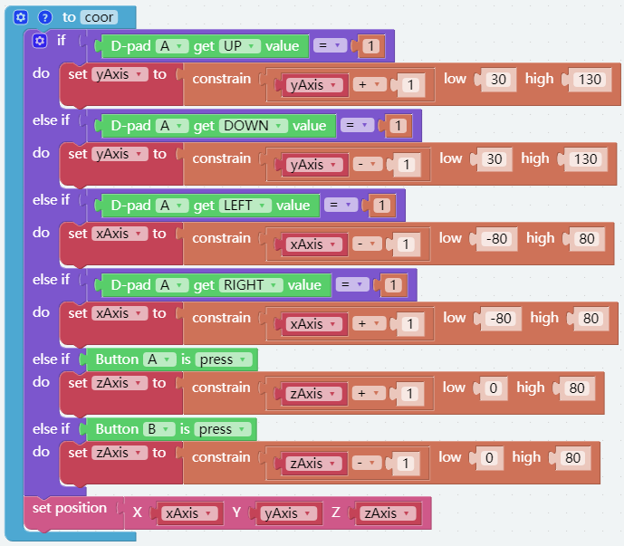
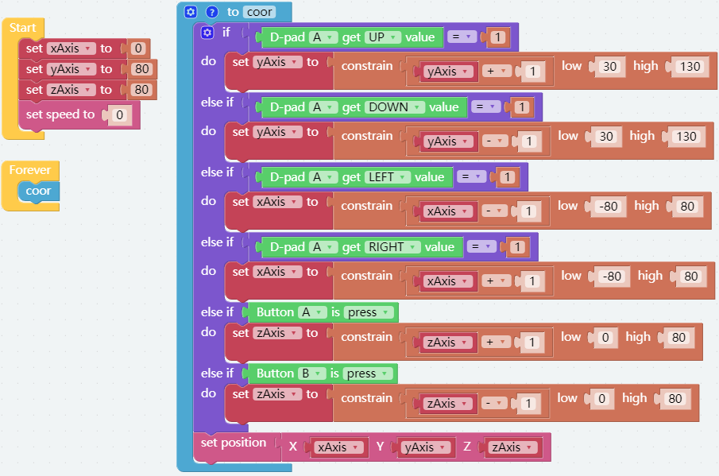

Coordinate Control
======================

The Arm of PiArm has 2 control modes: **Angle Control** and **Coordinate Control**.

* **Angle Control** mode: Write a certain angle to each of the 3 servos on the Arm to make the Arm achieve a specific position.
* **Coordinate Control** mode: Set up a spatial coordinate system for the Arm and set a control point, write 3D coordinates to this control point to make the Arm achieve a specific position.

The **Coordinate Control** mode is used here.

Tips on Coordinates of the Arm
--------------------------------

PiArm has a space rectangular coordinate system whose origin is located at the center point of the output shaft of the servos on both sides. The control point is located at the top of the arm, and the scale unit is in millimeters. In the initial state, the coordinate of the control point is (0, 80, 80).

.. image:: media/coordinate0.png

It should be noted that the arm length of PiArm is limited, and if the coordinate value is set beyond the limit of its mechanical motion, the PiArm will rotate to an unpredictable Position.

In other words, the total arm length of PiArm is 160mm, which means that the limit value of the control point moving along the Y-axis should ranges from (0,0,0) to (0,160,0). However, due to the limitations of the structure itself, the range of activities should be much smaller than this range.

* The recommended range of X coordinate is -80 ~ 80.
* The recommended range for Y coordinate is 30 ~ 130.
* The recommended range of Z coordinate is 0 ~ 80.

Programming
---------------------------

**Step 1** 

To use the remote control function, you need to enter the **Remote Control** page from the left side of main page, and then drag one D-pad and 3 buttons to the central area.

.. image:: media/control3.png

Back in the programming page, you will see an additional Remote category, and the D-pad and Button block appear in it.

* [Button () get value]: This block is used to read the value of the button, press is 1, release is 0.
* [Button () is (press/release)]: This block and ``Button () get value = (0/1)`` have the same effect and can be used directly to determine whether a button is pressed or not.
* [D-pad () get () value]: This block is used to read the up/down/left/right (selected through the drop-down menu) pad values, press for 1 and release for 0.

.. image:: media/control4.png
  :width: 500

**Step 2** 

Create three variables ([xAxis], [yAxis] and [zAxis]) to represent the PiArm control point coordinates and initialize them to (0,80,80) in the [Start] block.

.. image:: media/coor1.png

**Step 3** 

Create a function named [coor] to set the rotation effect of **PiArm** based on the D-pad and button values.

* If the **UP** button (▲) of **D-pad** is pressed, the **Y** coordinate value increases and the **Arm** will extend forward.
* If the **Down** button (▼) of **D-pad** is pressed, the **Y** coordinate value decreases and the **Arm** will retract backward.
* If the **LEFT** button (◀) of **D-pad** is pressed, the **X** coordinate value decreases and the **Arm** will turn left.
* If the **RIGHT** button (▶) of **D-pad** is pressed, the **X** coordinate value increases and the **Arm** will turn right.
* If **Button A** is pressed, the **Z** coordinate value increases and the **Arm** will raise up.
* If **Button B** is pressed, the **Z** coordinate value decreases and the **Arm** will lower down.

.. note::

    * About X, Y, Z coordinate directions, please refer to: :ref:`Tips on Coordinates of the Arm`.
    * [constrain () low () high ()]: From Math category for setting the variation of a constant to a certain range.
    * [if else]: Conditional judgment block, you can create multiple conditional judgments by clicking the set icon and dragging [else] or [else if] to the right below the [if].

**Step 4**

Put the function [coor] into [Forever] for loop execution, and finally click the **Download** button to run the code.

After that you can use the D-pad and Button A/B on the **Remote Control** page to control the movement of the Arm.

.. note::

    You can also find the code with the same name on the **Examples** page of **Ezblock Studio** and click **Run** or **Edit** directly to see the results.

What's More
-------------------

You can also add separate EoAT control code to this project, so that you can control the **Arm** and **EoAT** of the PiArm at the same time.

* If you want to control :ref:`Shovel Bucket`, please refer to :ref:`shovel_remote` to write the code.
* If you want to control :ref:`Hanging Clip`, please refer to :ref:`clip_remote` to write the code.
* If you want to control :ref:`Electromagnet`, please refer to :ref:`electro_remote` to write the code.

