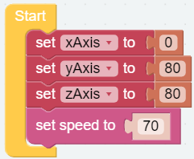
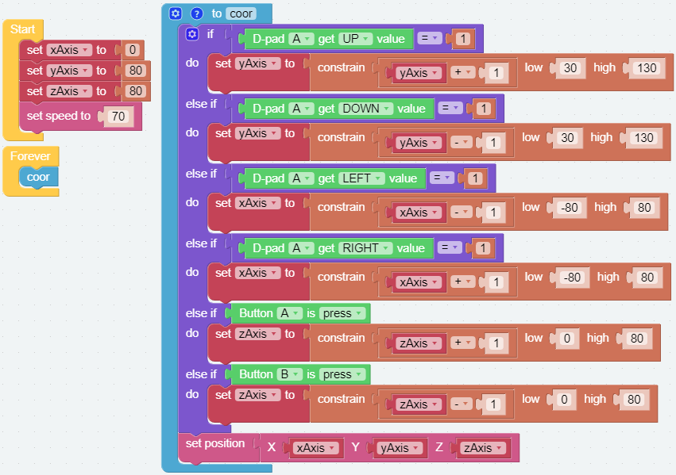

Coordinate Control
======================

In addition to the previous method of rotating the axis to control the piarm, we also control the piarm by modifying the coordinate value.

PiArm has a space rectangular coordinate system whose origin is located at the center point of the output shaft of the servos on both sides. The control point is located at the top of the arm, and the scale unit is in millimeters. In the initial state, the coordinate of the control point is (0, 80, 80).

.. image:: media/coordinate0.png

You can change the position of the control point via the following blocks.

Here, we use Button and D-pad in Ezblock's remote control, which will be used to modify the coordinate value of the control point to make PiArm move. 

It should be noted that the arm length of PiArm is limited, and if the coordinate value is set beyond the limit of its mechanical motion, the PiArm will rotate to an unpredictable Position.

In other words, the total arm length of PiArm is 160mm, which means that the limit value of the control point moving along the Y-axis should ranges from (0,0,0) to (0,160,0). However, due to the limitations of the structure itself, the range of activities should be much smaller than this range.

.. image:: media/coordinate.png

Therefore, you need to set limits on the range of each coordinate value.

How to build code blocks
---------------------------

**Step 1** 

Create three variables [xAxis][yAxis][zAxis] to represent the coordinates on the x, y, z axis of the piarm control points, and initialize them to (0,80,80) in [Start] block.

**Step 2** 

Create a function [arm control] and start combining code blocks.

* [D-pad A get UP value = 1] indicates to click the ▲ of the ezblock D-pad control.

* [D-pad A get DOWN value = 1] indicates to click the ▼ of the ezblock D-pad control.

* [D-pad A get LEFT value = 1] indicates to click the ◀ of the ezblock D-pad control.

* [D-pad A get RIGHT value = 1] indicates to click the ▶ of the ezblock D-pad control.

* [Button A is press] indicates to click button A.

* [Button B is press] indicates to click button B.

.. image:: media/remote02.png

**Step 3** 

Combine code block

* [set yAxis to constrain (yAxis+1) low 30 high 130] move the piarm control point coordinates forward.

* [set yAxis to constrain (yAxis-1) low 30 high 130] move the piarm control point coordinates backward.

* [set xAxis to constrain (xAxis-1) low -80 high 80] move the piarm control point coordinates left.

* [set xAxis to constrain (xAxis+1) low -80 high 80] move the piarm control point coordinates right.

* [set zAxis to constrain (zAxis+1) low 0 high 80] move the piarm control point coordinates upward.

* [set zAxis to constrain (zAxis-1) low 0 high 80] move the piarm control point coordinates downward.

* [set position X=xAxis Y=yAxis Z=zAxis] make the changed coordinates take effect.

.. note::   
  We generally set the range of control points on the X axis at (-80,80), the range on the Y axis at (30,130), and the range on the Z axis at (0,80).

**Step 4** 

Use [if ... do ...] to link the click of the control with the coordinate movement of the piarm control point and put it into the function [coor].

.. image:: media/coor3.png

Complete Code
--------------------

In the [Forever] block, execute the function [coor] in a loop, and click the download button to run the code. Use the ezblock control to control the piarm.

