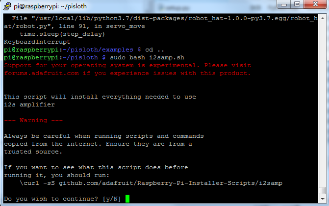
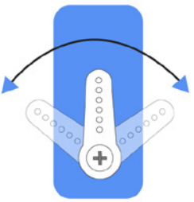
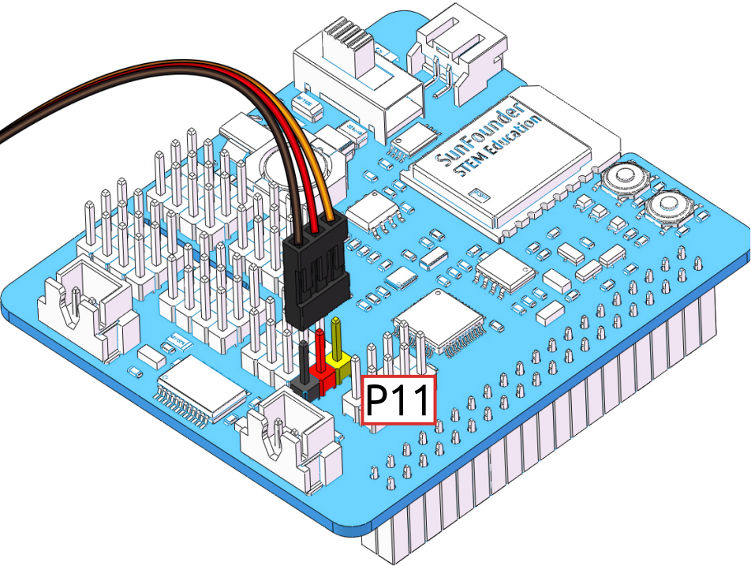

Download and Run the Code
============================

First download and run the ``robot-hat`` module.

.. raw:: html

    <run></run>

.. code-block::

    cd /home/pi/
    git clone https://github.com/sunfounder/robot-hat.git
    cd robot-hat
    sudo python3 setup.py install

.. note::
    Running ``setup.py`` will download some necessary components. Due to network problems, you may not be able to download successfully. You may need to download it again.

    In this case, type Y and press Enter.
	
	.. image:: media/dowload_code.png

Then download the code and install the ``piarm`` library.

.. raw:: html

    <run></run>

.. code-block::

    cd /home/pi/
    git clone -b 2.0.0 https://github.com/sunfounder/piarm.git
    cd piarm
    sudo python3 setup.py install

This step will take a little time, so please be patient.

Finally you need to run the script ``i2samp.sh`` to install the components needed for the i2s amplifier, otherwise it may not have sound.

.. raw:: html

    <run></run>

.. code-block::

    cd /home/pi/piarm
    sudo bash i2samp.sh
	

Type ``y`` and press ``Enter`` to continue running the script.

.. image:: media/i2s2.png

Type ``y`` and press ``Enter`` to make ``/dev/zero`` run in the background.

.. image:: media/i2s3.png

Enter ``y`` and press ``Enter`` to restart the robot.

.. note::

    If there is no sound after a restart, you may need to run the i2samp.sh script several times.

Run ``servo_zeroing.py``
--------------------------

Because the servo is powered by the power supply on the Robot HAT, the servo will not work when you are only powering the Raspberry Pi. You need to make sure that the batteries are in the battery holder and that the Robot HAT is powered up.

Now, run ``servo_zeroing.py`` in the ``examples/`` folder.

.. raw:: html

    <run></run>

.. code-block::

    cd /home/pi/piarm/examples
    sudo python3 servo_zeroing.py

.. note:: 

    If the following error occurs.

    self._smbus = SMBus(self._bus)
    FileNotFoundError: [Errno 2] No such file or directory
    
    Please refer to :ref:`I2C Configuration` to enable the I2C port of the Raspberry Pi.

To make sure you can see that the servo is set to 0°, you can insert the rocker arm in the servo shaft and then deflect the servo by an arbitrary angle.

Now insert the servo into the P11 position as shown below.

If the servo arm is deflected and fixed at an angle, the function is active. If not, check the insertion direction of the servo cable or rerun the code.

.. note::

    Before assembling each servo, you need to plug the servo pins into P11 and keep them powered on.
