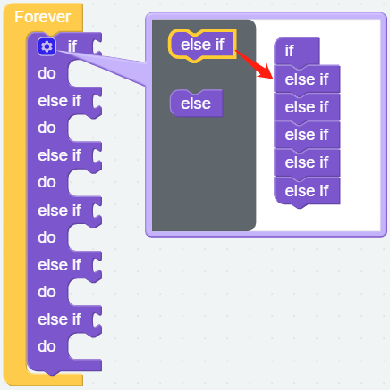

Dual Joystick Module
=======================

We can control PiArm in 2 parts, Arm and EoAT. In the first project, you have learned how to :ref:`Assemble and Test 3 EoATs` of PiArm's separately.
In this project, we will use the Dual Joystick Module that comes with the kit to control the Arm of PiArm.

Tips on Joystick Module
-------------------------------

Dual Joystick Module, as the name suggests, is composed of 2 Joysticks, each Joystick can output electrical signals in X, Y, and Z directions.

.. image:: media/joystick.png
    :width: 600
    :align: center

Before using the Dual Joystick Module, you need to connect its 8 wires to the corresponding pins of the Robot HAT, as shown in the following figure.

.. image:: media/dual_joy.png
    :width: 800

Joystick readings are in planar coordinates system ranging 0~4095, with the origin (0,0) at the bottommost left corner.

In other words, the coordinate value is (2048,2048) when the joystick is not toggled. If you toggle the joystick to the left, you get (0,2048). When you toggle the joystick straight down, you get (2048,0) as is shown in the below.

.. image:: media/joystick3.jpg

However, the electrical signal is easy to fluctuate and it is difficult to get an absolutely stable reading, so we usually set a numerical interval to judge its use.

We propose that the boundary values be 3072 and 1024. When the reading of Joystick is greater than 3072, the Joystick is considered to be toggled up (or to the right); otherwise, if the reading is less than 1024, the Joystick is considered to be toggled down (or to the left).

The Z-axis Button will output low level (0) when pressed and output high level (1) when released.

.. image:: media/joystick5.png

Tips on the Angle of the Arm
-------------------------------------

The Arm of PiArm has 2 control modes: **Angle Control** and **Coordinate Control**.

* **Angle Control** mode: Write a certain angle to each of the 3 servos on the Arm to make the Arm achieve a specific position.
* **Coordinate Control** mode: Set up a spatial coordinate system for the Arm and set a control point, write 3D coordinates to this control point to make the Arm achieve a specific position.

The **Angle Control** mode is used in this project.

There are three servos on Arm to control its up and down, left and right, front and back, and we use ``α``, ``β`` and ``γ`` to represent their rotation angles, as shown in the figure below.

* ``α``: Represents Arm's front and back rotation angle, due to the structure limitation, the recommended rotation range is: -30 ~ 60.
* ``β``: Represents the up and down rotation angle of Arm, due to the structural limitation, the recommended rotation suggested range is: -60 ~ 30.
* ``γ``: Represents the left and right rotation angle of Arm, the range is: -90 ~ 90.

.. image:: media/pi_angle.jpg
    :width: 800

Programming
--------------------------

**Step 1** 

You may want to simplify your program with variables, now click the **Create variable** button on the **Variables** category to create 5 variables (``HIGH``, ``LOW``, ``α``, ``β`` and ``γ``).

.. note::

    The created variables are also stored in the **Variables** category.

.. image:: media/sp210512_114916.png

**Step 2** 

Set the initial values for these variables and set the servo rotation speed to 70%.

.. note::

    For the reason of the values of the **HIGH** and **LOW** variables, please refer to :ref:`Tips on Joystick Module`.

.. image:: media/joystick6.png

**Step 3** 

Use [if else] block to do some conditional judgment cases (drag 5 [else if] blocks from the left to below the [if] block).

* [if else]: Conditional judgment block, you can create multiple conditional judgments by clicking the set icon and dragging [else] or [else if] to the right below the [if].

**Step 4** 

The left and right joystick connections for the dual joystick module are shown below, refer to :ref:`Tips on Joystick Module`.

* The X of the left joystick is connected to A0 and the Y is connected to A1.
* The X of the right joystick is connected to A2, and the Y is connected to A3.

Assume that the X and Y of the left joystick and the Y of the right joystick are used to control the 3 servos of PiArm respectively, now first set the judgment condition to determine whether the left and right joysticks are toggled or not.

.. image:: media/joystick.png
    :width: 400
    :align: center

* If **A0 (LX)** is greater than **HIGH (3072)**, it means that the **left joystick** is toggled to the right.
* If **A0 (LX)** is less than **LOW (1024)**, it means the **left joystick** is toggled to the left.
* If **A1 (LY)** is greater than **HIGH (3072)**, it means the **left joystick** is toggled forward.
* If **A1 (LY)** is less than **LOW (1024)**, it means the **left joystick** is toggled backward.
* If **A3 (RY)** is greater than **HIGH (3072)**, it means the **right joystick** is toggled forward.
* If **A3 (RY)** is less than **LOW (1024)**, it means the **right joystick** is toggled backward.

.. image:: media/joystick62.png

**Step 4** 

Now set the rotation effect of PiArm according to the toggle of the left and right joysticks.

* If the **left joystick** is toggled to the right, the Arm will turn right.
* If the **left joystick** is toggled to the left, the Arm will turn left.
* If the **left joystick** is toggled forward, the Arm will extend forward.
* If the **left joystick** is toggled backward, the Arm will retract backward.
* If the **right joystick** is toggled forward, the Arm will lower down.
* If the **right joystick** is toggled backward, the Arm will raise up.

.. note::

    * ``α``, ``β`` and ``γ`` represent the 3 servo rotation ranges on PiArm, refer to: :ref:`Tips on the Angle of the Arm`.
    * [constrain () low () high ()]: From Math category for setting the variation of a constant to a certain range.

.. image:: media/joystick63.png

**Step 5** 

Store the obtained ``α``, ``β`` and ``γ`` angle values into the [α () β () γ ()] block, and then use the [set positon] block to make PiArm rotate this position.

.. image:: media/joystick65.png

**Step 7** 

Once you click the download button, you can use the Dual Joystick Module to control PiArm.

* Left joystick toggle left or right, the arm will turn to the left or right.
* Left joystick toggle forward or backward, the arm will extend forward or retract backward.
* Right joystick toggle forward or backward, the arm will raise up or lower down.

.. note::

    You can also find the code with the same name on the **Examples** page of **Ezblock Studio** and click **Run** or **Edit** directly to see the results.

.. image:: media/joystick6.png

.. image:: media/joystick7.png

