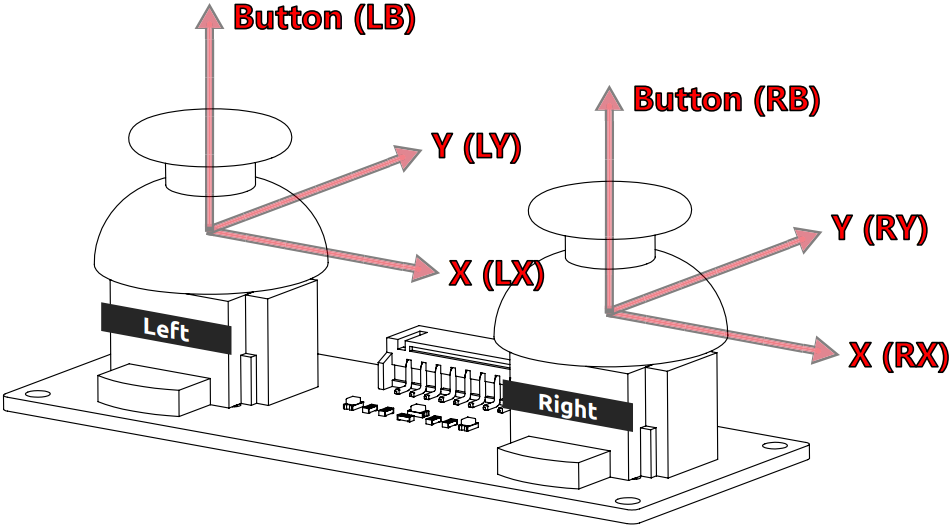
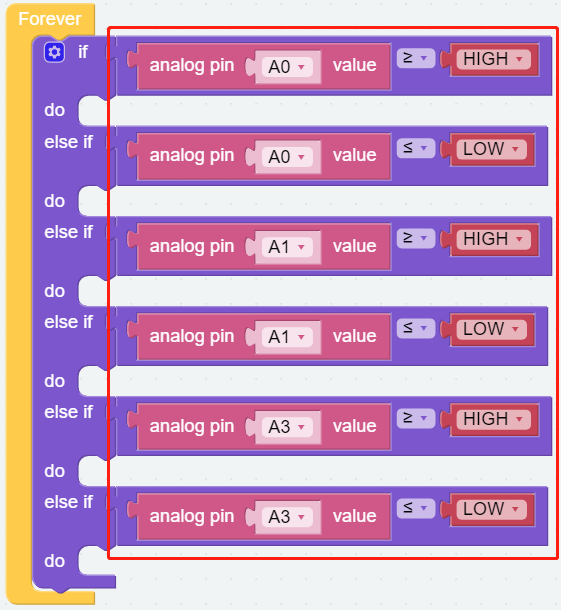

Dual Joystick Module
=======================

PiArm provides a Dual Joystick Module for you to control. Each Joystick can output electrical signals in X, Y, and Z directions.

Tips on Joystick Module
-------------------------------

Before using the Dual Joystick Module, you need to connect its 8 wires to the corresponding pins of the Robot HAT, as shown in the following figure.

.. image:: media/joystick1.png

Joystick readings are in planar coordinates system ranging 0~4095, with the origin (0,0) at the bottommost left corner.

In other words, the coordinate value is (2048,2048) when the joystick is not toggled. If you toggle the joystick to the left, you get (0,2048). When you toggle the joystick straight down, you get (2048,0) as is shown in the below.

However, the electrical signal is easy to fluctuate and it is difficult to get an absolutely stable reading, so we usually set a numerical interval to judge its use.

We propose that the boundary values be 3072 and 1024. When the reading of Joystick is greater than 3072, the Joystick is considered to be toggled up (or to the right); otherwise, if the reading is less than 1024, the Joystick is considered to be toggled down (or to the left).

The Z-axis Button will output low level (0) when pressed and output high level (1) when released.

.. image:: media/joystick5.png

Tips on PiArm Angles
-------------------------------

There are three servos on PiArm to control its up and down, left and right, front and back, and we use ``α``, ``β`` and ``γ`` to define the rotation angles of the three servo, as shown in the figure below.

.. image:: media/pi_angle.jpg

Tips on Blocks
-------------------

You may want to simplify your program with **Variable**，now click the **Create variable** button on the **Variables** category to create 5 variables (``HIGH``, ``LOW``, ``α``, ``β`` and ``γ``).

.. image:: media/sp210512_114916.png

To achieve conditional judgment of \"if\" type, you need to use an [if do] block. 

When you need to implement multiple conditional judgments, you will have to change [if do] into [if else do]. This can be achieved by clicking on the **setting** icon.

You need to use a conditional statements block in conjunction with if do. Judging conditions can be \"=\", \">\", \"<\", \"≥\", \"≤\", \"≠\".

How to build code blocks
--------------------------

**Step 1** 

Create five variables (``HIGH``, ``LOW``, ``α``, ``β`` and ``γ``) and place them in the [Start] block to initialize their values, and use [set speed to 70] to set the piarm movement speed to 70.

.. image:: media/joystick6.png

**Step 2** 

Combined code block.

* [analog pin A0 value >= HIGH] indicates that the left joystick slides to the right.

* [analog pin A0 value <= LOW] indicates that the left joystick slides to the left.

* [analog pin A1 value >= HIGH] indicates that the left joystick slides forward.

* [analog pin A1 value <= LOW] indicates that the left joystick slides backward.

* [analog pin A3 value >= HIGH] indicates that the right joystick slides forward.

* [analog pin A3 value <= LOW] indicates that the right joystick slides backward.

**Step 3** 

Combined code block

.. image:: media/joystick63.png

* [set γ to constrain(γ - 1) low -90 high 90] indicates to reduce the angle of the servo C so that it rotates clockwise.

* [set γ to constrain(γ + 1) low -90 high 90] indicates to increase the angle of the servo C so that it rotates counterclockwise.

* [set α to constrain(α + 1) low -30 high 60] indicates to increase the angle of the servo B so that it rotates counterclockwise.

* [set α to constrain(α - 1) low -30 high 60] indicates to reduce the angle of the servo B so that it rotates clockwise.

* [set β to constrain(β + 1) low -60 high 30] indicates to increase the angle of the servo A so that it rotates counterclockwise.

* [set β to constrain(β - 1) low -60 high 30] indicates to reduce the angle of the servo A so that it rotates clockwise.

.. image:: media/Servo.png

**Step 4** 

Use [if ... do ...] to link the sliding of the joystick with the movement of the piarm.

**Step 5** 

Use the code block [set position α=α β=β γ=γ] to make the changed angle of the servo take effect, where the value on the right side of the equal sign is the variable we created.

.. image:: media/joystick65.png

Complete Code
--------------------

Once you click the download button, you can use the Dual Joystick Module to control PiArm.

* Left joystick toggle left or right, the arm will turn to the left or right.

* Left joystick toggle forward or backward, the arm will extend or retract.

* Right joystick toggle forward or backward, the arm will lift up or drop down.

.. image:: media/joystick6.png

.. image:: media/joystick7.png

