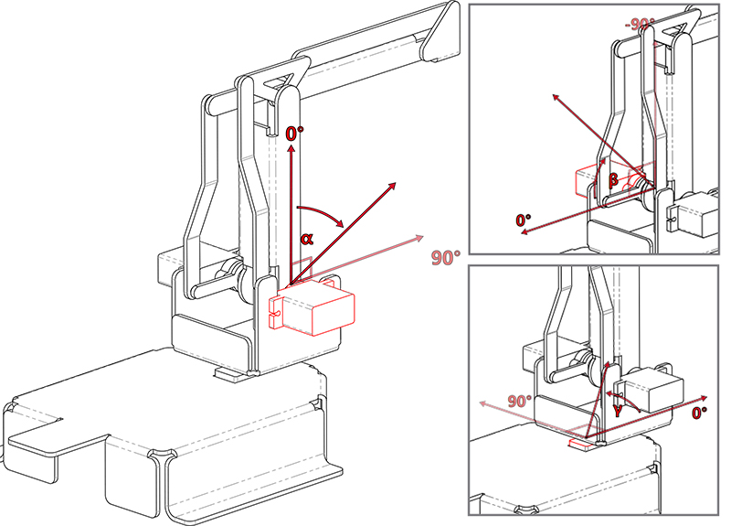

Dual Joystick Module Control
======================================

In this project, we will use the Dual Joystick Module that comes with the kit to control the PiArm.

Tips on Joystick Module
-------------------------------

Dual Joystick Module, as the name suggests, is composed of 2 Joysticks, each Joystick can output electrical signals in X, Y, and Z directions.

.. image:: media/joystick.png
    :width: 600
    :align: center

Before using the Dual Joystick Module, you need to connect its 8 wires to the corresponding pins of the Robot HAT, as shown in the following figure.

.. image:: media/dual_joy.png
    :width: 800

The Dual Joystick Module has 2 joysticks on the left and right, which are oriented up and down as shown in the following figure.

.. image:: media/joystick2.png

The Z-axis button will output low level (0) when pressed and high level (1) when released.

.. image:: media/joystick5.png

Tips on the Angle of the Arm
----------------------------------
The Arm of PiArm has 2 control modes: **Angle Control** and **Coordinate Control**.

* **Angle Control** mode: Write a certain angle to each of the 3 servos on the Arm to make the Arm achieve a specific position.
* **Coordinate Control** mode: Set up a spatial coordinate system for the Arm and set a control point, write 3D coordinates to this control point to make the Arm achieve a specific position.

The **Angle Control** mode is used in this project.

There are three servos on Arm to control its up and down, left and right, front and back, and we use ``α``, ``β`` and ``γ`` to represent their rotation angles, as shown in the figure below.

* ``α(alpha)``: Represents Arm’s front and back rotation angle, due to the structure limitation, the recommended rotation range is: -30 ~ 60.
* ``β(beta)``: Represents the up and down rotation angle of Arm, due to the structural limitation, the recommended rotation suggested range is: -60 ~ 30.
* ``γ(gamma)``: Represents the left and right rotation angle of Arm, the range is: -90 ~ 90.

.. _shovel_joystick:

Control the Shovel Bucket
-----------------------------------------

.. raw:: html

    <run></run>

.. code-block::

    cd /home/pi/piarm/examples
    sudo python3 joystick_module1.py

Once the code is run, you will be able to control the rotation of PiArm's arm by toggling the left and right joysticks, and controlling the angle of the Shovel Bucket by pressing the left and right joysticks respectively.

But you need to assemble :ref:`Shovel Bucket` to PiArm first.

**Code**

.. raw:: html

    <run></run>

.. code-block:: python

    from robot_hat import Servo,PWM,Joystick,ADC,Pin
    from robot_hat.utils import reset_mcu
    from time import sleep

    from piarm import PiArm

    reset_mcu()
    sleep(0.01)

    leftJoystick = Joystick(ADC('A0'),ADC('A1'),Pin('D0'))
    rightJoystick = Joystick(ADC('A2'),ADC('A3'),Pin('D1'))

    arm = PiArm([1,2,3])
    arm.bucket_init(PWM('P3'))
    arm.set_offset([0,0,0])

    def _angles_control():
        arm.speed = 100
        flag = False
        alpha,beta,gamma = arm.servo_positions
        bucket = arm.component_staus

        if leftJoystick.read_status() == "up":
            alpha += 1
            flag = True
        elif leftJoystick.read_status() == "down":
            alpha -= 1
            flag = True
        if leftJoystick.read_status() == "left":
            gamma += 1
            flag = True
        elif leftJoystick.read_status() == "right":
            gamma -= 1
            flag = True
        if rightJoystick.read_status() == "up":
            beta += 1
            flag = True
        elif rightJoystick.read_status() == "down":
            beta -= 1
            flag = True
        if leftJoystick.read_status() == "pressed": 	
            bucket += 2
            flag = True
        elif rightJoystick.read_status() == "pressed":
            bucket -= 2
            flag = True

        if flag == True:
            arm.set_angle([alpha,beta,gamma])
            arm.set_bucket(bucket)
            print('servo angles: %s , bucket angle: %s '%(arm.servo_positions,arm.component_staus))

    if __name__ == "__main__":
        while True:
            _angles_control()
            sleep(0.01)

**How it works?**

.. code-block:: python

    leftJoystick = Joystick(ADC('A0'),ADC('A1'),Pin('D0'))
    rightJoystick = Joystick(ADC('A2'),ADC('A3'),Pin('D1'))

Define the X,Y and Z pin connections for the left and right joysticks.

.. code-block:: python

    def _angles_control():
        arm.speed = 100
        flag = False
        alpha,beta,gamma = arm.servo_positions
        bucket = arm.component_staus

        if leftJoystick.read_status() == "up":
            alpha += 1
            flag = True
        elif leftJoystick.read_status() == "down":
            alpha -= 1
            flag = True
        if leftJoystick.read_status() == "left":
            gamma += 1
            flag = True
        elif leftJoystick.read_status() == "right":
            gamma -= 1
            flag = True
        if rightJoystick.read_status() == "up":
            beta += 1
            flag = True
        elif rightJoystick.read_status() == "down":
            beta -= 1
            flag = True
        if leftJoystick.read_status() == "pressed": 	
            bucket += 2
            flag = True
        elif rightJoystick.read_status() == "pressed":
            bucket -= 2
            flag = True

        if flag == True:
            arm.set_angle([alpha,beta,gamma])
            arm.set_bucket(bucket)
            print('servo angles: %s , bucket angle: %s '%(arm.servo_positions,arm.component_staus))

In this code, the ``_angles_control()`` function is created to control the PiArm.

* ``alpha``, ``beta`` and ``gamma`` refer to the angles of the 3 servos on the Arm respectively, refer to: :ref:`Tips on the Angle of the Arm`.
* If the **left** joystick is toggled up, ``alpha`` increases and the Arm will extend forward.
* If the **left** joystick is toggled down, ``alpha`` decreases and the Arm will retract backward.
* If the **left** joystick is toggled to the left, ``gamma`` increases and the Arm will turn left.
* If the **left** joystick is toggled to the right, ``gamma`` decreases and the Arm will turn right.
* If the **right** joystick is toggled up, ``beta`` increases and the Arm will raise up.
* If the **right** joystick is toggled down, ``beta`` decreases and the Arm will lower down.
* Finally, use the left and right joystick buttons to control the angle of the Shovel Bucket respectively.

.. _clip_joystick:

Control the Hanging Clip
---------------------------------

**Run the code**

.. raw:: html

    <run></run>

.. code-block::

    cd /home/pi/piarm/examples
    sudo python3 joystick_module2.py

Once the code is running, you will be able to control the rotation of PiArm's arm by toggling the left and right joysticks, and control the opening/closing of the Hanging Clip by pressing the left and right joysticks respectively.

But you need to assemble :ref:`Hanging Clip` to PiArm first.

**Code**

.. raw:: html

    <run></run>

.. code-block:: python

    from robot_hat import Servo,PWM,Joystick,ADC,Pin
    from robot_hat.utils import reset_mcu
    from time import sleep

    from piarm import PiArm

    reset_mcu()
    sleep(0.01)

    leftJoystick = Joystick(ADC('A0'),ADC('A1'),Pin('D0'))
    rightJoystick = Joystick(ADC('A2'),ADC('A3'),Pin('D1'))

    arm = PiArm([1,2,3])
    arm.hanging_clip_init(PWM('P3'))
    arm.set_offset([0,0,0])

    def _angles_control():
        arm.speed = 100
        flag = False
        alpha,beta,gamma = arm.servo_positions
        clip = arm.component_staus

        if leftJoystick.read_status() == "up":
            alpha += 1
            flag = True
        elif leftJoystick.read_status() == "down":
            alpha -= 1
            flag = True
        if leftJoystick.read_status() == "left":
            gamma += 1
            flag = True
        elif leftJoystick.read_status() == "right":
            gamma -= 1
            flag = True
        if rightJoystick.read_status() == "up":
            beta += 1
            flag = True
        elif rightJoystick.read_status() == "down":
            beta -= 1
            flag = True
            
        if leftJoystick.read_status() == "pressed": 	
            clip += 2
            flag = True
        elif rightJoystick.read_status() == "pressed":	
            clip -= 2
            flag = True

        if flag == True:
            arm.set_angle([alpha,beta,gamma])
            arm.set_hanging_clip(clip)
            print('servo angles: %s , clip angle: %s '%(arm.servo_positions,arm.component_staus))

    if __name__ == "__main__":
        while True:
            _angles_control()
            sleep(0.01)

In this code, the ``_angles_control()`` function is created to control the PiArm.

* ``alpha``, ``beta`` and ``gamma`` refer to the angles of the 3 servos on the Arm respectively, refer to: :ref:`Tips on the Angle of the Arm`.
* If the **left** joystick is toggled up, ``alpha`` increases and the Arm will extend forward.
* If the **left** joystick is toggled down, ``alpha`` decreases and the Arm will retract backward.
* If the **left** joystick is toggled to the left, ``gamma`` increases and the Arm will turn left.
* If the **left** joystick is toggled to the right, ``gamma`` decreases and the Arm will turn right.
* If the **right** joystick is toggled up, ``beta`` increases and the Arm will raise up.
* If the **right** joystick is toggled down, ``beta`` decreases and the Arm will lower down.
* Finally, use the left and right joystick buttons to control the angles of the Hanging Clip respectively.

.. _elec_joystick:

Control the Electromagnet
-----------------------------

**Run the code**

.. raw:: html

    <run></run>

.. code-block::

    cd /home/pi/piarm/examples
    sudo python3 joystick_module3.py

Once the code is run, you will be able to control the rotation of PiArm's arm by toggling the left and right joysticks, and controlling the on/off of the Electromagnet by pressing the left and right joysticks respectively.

But you need to assemble :ref:`Electromagnet` to PiArm first.

**Code**

.. raw:: html

    <run></run>

.. code-block:: python

    from robot_hat import Servo,PWM,Joystick,ADC,Pin
    from robot_hat.utils import reset_mcu
    from time import sleep

    from piarm import PiArm

    reset_mcu()
    sleep(0.01)

    leftJoystick = Joystick(ADC('A0'),ADC('A1'),Pin('D0'))
    rightJoystick = Joystick(ADC('A2'),ADC('A3'),Pin('D1'))

    arm = PiArm([1,2,3])
    arm.electromagnet_init(PWM('P3'))
    arm.set_offset([0,0,0])

    def _angles_control():
        arm.speed = 100
        flag = False
        alpha,beta,gamma = arm.servo_positions
        status = ""
        
        if leftJoystick.read_status() == "up":
            alpha += 1
            flag = True
        elif leftJoystick.read_status() == "down":
            alpha -= 1
            flag = True                        
        if leftJoystick.read_status() == "left":
            gamma += 1
            flag = True
        elif leftJoystick.read_status() == "right":
            gamma -= 1
            flag = True
        if rightJoystick.read_status() == "up":
            beta += 1
            flag = True
        elif rightJoystick.read_status() == "down":
            beta -= 1
            flag = True
        if leftJoystick.read_status() == "pressed": 
            arm.set_electromagnet('on')
            status = "electromagnet is on" 	
        elif rightJoystick.read_status() == "pressed":
            arm.set_electromagnet('off')
            status = "electromagnet is off"	

        if flag == True:
            arm.set_angle([alpha,beta,gamma])
            print('servo angles: %s , electromagnet status: %s '%(arm.servo_positions,status))

    if __name__ == "__main__":
        while True:
            _angles_control()
            sleep(0.01)
            
In this code, the ``_angles_control()`` function is created to control the PiArm.

* ``alpha``, ``beta`` and ``gamma`` refer to the angles of the 3 servos on the Arm respectively, refer to: :ref:`Tips on the Angle of the Arm`.
* If the **left** joystick is toggled up, ``alpha`` increases and the Arm will extend forward.
* If the **left** joystick is toggled down, ``alpha`` decreases and the Arm will retract backward.
* If the **left** joystick is toggled to the left, ``gamma`` increases and the Arm will turn left.
* If the **left** joystick is toggled to the right, ``gamma`` decreases and the Arm will turn right.
* If the **right** joystick is toggled up, ``beta`` increases and the Arm will raise up.
* If the **right** joystick is toggled down, ``beta`` decreases and the Arm will lower down.
* Finally, use the left and right joystick buttons to control the on/off of the Electromagnet respectively.
