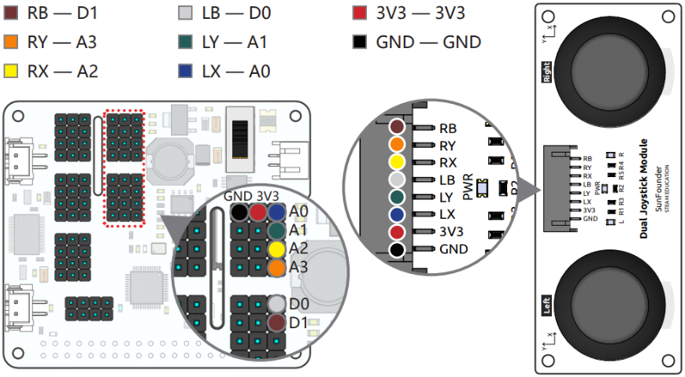

Dual Joystick Module
=======================

PiArm provides a Dual Joystick Module for you to control. Each Joystick can output electrical signals in X, Y, and Z directions.

.. image:: media/joystick.png

**Joystick**

Before use, you need to correctly wire the Dual Joystick Module according to the marks in the picture below so that the main control board can receive the corresponding electrical signals.

The corresponding functions are encapsulated in the joystick module for us to read whether the current state of the left and right joysticks is up or down or left or right.

The Z-axis Button will output low level (0) when pressed and output high level (1) when released.We can also use the encapsulated function to determine whether the button is pressed.

.. image:: media/joystick5.png

**Play Shovel Bucket**

.. raw:: html

    <run></run>

.. code-block::

    cd /home/pi/piarm/examples
    sudo python3 joystick_module1.py

After running the code, you can use the joystick to control the piarm and the bucket, the left joystick controls the rotation angles ``angle1`` and ``angle3`` of the two servos on the right and below, so that the piarm can move forward, backward, left, and right.
The right joystick controls the rotation angle ``angle2`` of the left servo, so that the robotic arm can move up and down. The joystick button controls the rotation angle ``angle4`` of the head accessory servo.

.. image:: media/angle.png

**Code**

.. note::
    You can **Modify/Reset/Copy/Run/Stop** the code below. But before that, you need to go to source code path like ``piarm\examples``. After modifying the code, you can run it directly to see the effect.

.. raw:: html

    <run></run>

.. code-block:: python

    from robot_hat import Servo,PWM,Joystick,ADC,Pin
    from robot_hat.utils import reset_mcu
    from time import sleep
    from robot_hat import TTS

    from piarm import PiArm

    reset_mcu()
    sleep(0.01)
    t = TTS()

    leftJoystick = Joystick(ADC('A0'),ADC('A1'),Pin('D0'))
    rightJoystick = Joystick(ADC('A2'),ADC('A3'),Pin('D1'))

    arm = PiArm([1,2,3])
    arm.bucket_init('P3')
    arm.set_offset([0,0,0])

    def _angles_control():
        arm.speed = 100
        flag = False
        angle1,angle2,angle3 = arm.servo_positions
        angle4 = arm.component_staus

        if leftJoystick.read_status() == "up":
            angle1 += 1
            flag = True
        elif leftJoystick.read_status() == "down":
            angle1 -= 1
            flag = True
        if leftJoystick.read_status() == "pressed": 	
            angle4 += 2
            flag = True
        elif rightJoystick.read_status() == "pressed":	
            angle4 -= 2
            flag = True
        if leftJoystick.read_status() == "left":
            angle3 += 1
            flag = True
        elif leftJoystick.read_status() == "right":
            angle3 -= 1
            flag = True
        if rightJoystick.read_status() == "up":
            angle2 += 1
            flag = True
        elif rightJoystick.read_status() == "down":
            angle2 -= 1
            flag = True

        if flag == True:
            arm.set_angle([angle1,angle2,angle3])
            arm.set_bucket(angle4)
            print('servo angles: %s , bucket angle: %s '%(arm.servo_positions,arm.component_staus))

    if __name__ == "__main__":
        while True:
            _angles_control()
            sleep(0.01)

**Play Hanging Clip**

.. raw:: html

    <run></run>

.. code-block::

    cd /home/pi/piarm/examples
    sudo python3 joystick_module2.py

After running the code, you can use the joystick to control the piarm and clip, and the left joystick to control the rotation angles ``angle1`` and ``angle3`` of the two servos on the right and below, so that the piarm can move forward, backward, left, and right.
The right joystick controls the rotation angle ``angle2`` of the left servo, so that the piarm can move up and down. The joystick button controls the rotation angle ``angle4`` of the head accessory servo.

**Code**

.. note::
    You can **Modify/Reset/Copy/Run/Stop** the code below. But before that, you need to go to source code path like ``piarm\examples``. After modifying the code, you can run it directly to see the effect.

.. raw:: html

    <run></run>

.. code-block:: python

    from robot_hat import Servo,PWM,Joystick,ADC,Pin
    from robot_hat.utils import reset_mcu
    from time import sleep
    from robot_hat import TTS

    from piarm import PiArm

    reset_mcu()
    sleep(0.01)
    t = TTS()

    leftJoystick = Joystick(ADC('A0'),ADC('A1'),Pin('D0'))
    rightJoystick = Joystick(ADC('A2'),ADC('A3'),Pin('D1'))

    arm = PiArm([1,2,3])
    arm.hanging_clip_init('P3')
    arm.set_offset([0,0,0])

    def _angles_control():
        arm.speed = 100
        flag = False
        angle1,angle2,angle3 = arm.servo_positions
        angle4 = arm.component_staus

        if leftJoystick.read_status() == "up":
            angle1 += 1
            flag = True
        elif leftJoystick.read_status() == "down":
            angle1 -= 1
            flag = True
        if leftJoystick.read_status() == "pressed": 	
            angle4 += 2
            flag = True
        elif rightJoystick.read_status() == "pressed":	
            angle4 -= 2
            flag = True
        if leftJoystick.read_status() == "left":
            angle3 += 1
            flag = True
        elif leftJoystick.read_status() == "right":
            angle3 -= 1
            flag = True
        if rightJoystick.read_status() == "up":
            angle2 += 1
            flag = True
        elif rightJoystick.read_status() == "down":
            angle2 -= 1
            flag = True

        if flag == True:
            arm.set_angle([angle1,angle2,angle3])
            arm.set_hanging_clip(angle4)
            print('servo angles: %s , clip angle: %s '%(arm.servo_positions,arm.component_staus))

    if __name__ == "__main__":
        while True:
            _angles_control()
            sleep(0.01)

**Play Electromagnet**

.. raw:: html

    <run></run>

.. code-block::

    cd /home/pi/piarm/examples
    sudo python3 joystick_module3.py

After running the code, you can use the joystick to control the piarm and the electromagnet, and the left joystick controls the rotation angles ``angle1`` and ``angle3`` of the two servos on the right and below, so that the piarm can move forward, backward, left, and right.
The right joystick controls the rotation angle ``angle2`` of the left servo, so that the piarm can move up and down. The joystick button controls the operation of the electromagnet.

**Code**

.. note::
    You can **Modify/Reset/Copy/Run/Stop** the code below. But before that, you need to go to source code path like ``piarm\examples``. After modifying the code, you can run it directly to see the effect.

.. raw:: html

    <run></run>

.. code-block:: python

    from robot_hat import Servo,PWM,Joystick,ADC,Pin
    from robot_hat.utils import reset_mcu
    from time import sleep
    from robot_hat import TTS

    from piarm import PiArm

    reset_mcu()
    sleep(0.01)
    t = TTS()

    leftJoystick = Joystick(ADC('A0'),ADC('A1'),Pin('D0'))
    rightJoystick = Joystick(ADC('A2'),ADC('A3'),Pin('D1'))

    arm = PiArm([1,2,3])
    arm.electromagnet_init('P3')
    arm.set_offset([0,0,0])

    def _angles_control():
        arm.speed = 100
        flag = False
        angle1,angle2,angle3 = arm.servo_positions
        status = ""

        if leftJoystick.read_status() == "up":
            angle1 += 1
            flag = True
        elif leftJoystick.read_status() == "down":
            angle1 -= 1
            flag = True
        if leftJoystick.read_status() == "pressed": 
            arm.set_electromagnet('on')
            status = "electromagnet is on" 	
        elif rightJoystick.read_status() == "pressed":
            arm.set_electromagnet('off')
            status = "electromagnet is off"	                        
        if leftJoystick.read_status() == "left":
            angle3 += 1
            flag = True
        elif leftJoystick.read_status() == "right":
            angle3 -= 1
            flag = True
        if rightJoystick.read_status() == "up":
            angle2 += 1
            flag = True
        elif rightJoystick.read_status() == "down":
            angle2 -= 1
            flag = True

        if flag == True:
            arm.set_angle([angle1,angle2,angle3])
            print('servo angles: %s , electromagnet status: %s '%(arm.servo_positions,status))

    if __name__ == "__main__":
        while True:
            _angles_control()
            sleep(0.01)

**How it works?**

.. code-block::

    leftJoystick = Joystick(ADC('A0'),ADC('A1'),Pin('D0'))
    rightJoystick = Joystick(ADC('A2'),ADC('A3'),Pin('D1'))

Create ``Joystick`` class objects ``leftJoystick`` and ``rightJoystick`` so that we can receive the value passed from the joystick to the computer

.. code-block::

    arm.speed = 100
    flag = False
    angle1,angle2,angle3 = arm.servo_positions
    angle4 = arm.component_staus

There is a speed attribute in the PiArm class that represents the moving speed of the piarm. We set the moving speed to 100.

``flag`` is a custom flag. When it is False, it means that the joystick is not operated, and when it is True, it means that the joystick is operated.

In addition, the ``servo_positions`` attribute in the PiArm class represents the current rotation angle ``angle1``, ``angle2``, and ``angle3`` of the piarm servo.

The ``component_staus`` attribute represents the rotation angle ``angle4`` of the servo on the head accessory.

.. code-block::

    if leftJoystick.read_status() == "up":
        angle1 += 1
        flag = True
    elif leftJoystick.read_status() == "down":
        angle1 -= 1
        flag = True
    if leftJoystick.read_status() == "pressed": 	
        angle4 += 2
        flag = True
    elif rightJoystick.read_status() == "pressed":	
        angle4 -= 2
        flag = True

We can read the current state of the joystick through the ``read_status()`` function in the Joystick class, and then increase or decrease the rotation angle of the corresponding servo, and set the ``flag`` to ``True``.

.. code-block::

    if flag == True:
        arm.set_angle([angle1,angle2,angle3])
        arm.set_bucket(angle4)
        print('servo angles: %s , bucket angle: %s '%(arm.servo_positions,staarm.component_staustus))

Then when the ``flag`` is ``True``, call the ``set_angle([angle1,angle2,angle3])`` method in the PiArm class to rotate the three servos to control the movement of the piarm.

The ``print`` function is used to print servo angles and bucket angles to the terminal. ``%s`` means that the first variable is assigned by ``arm.servo_positions``, and the second is assigned by ``arm.component_staustus``.

