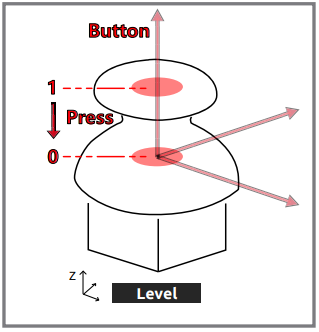

双摇杆模块
=======================

在这个项目中，我们将用双摇杆模块来控制PiArm。

关于双摇杆模块的提示
-------------------------------

双摇杆模块，顾名思义，由两个摇杆组成，每个摇杆可以在X、Y和Z方向输出电信号。

.. image:: media/joystick.png
    :width: 600
    :align: center

在使用双摇杆模块之前，你需要把它的8根线连接到Robot HAT的相应引脚上，如下图所示。

.. image:: media/dual_joy.png
    :width: 800

双摇杆模块上有左右2个摇杆，它们的上下左右方向如下图所示：

.. image:: media/joystick2.png

Z轴按钮按下时将输出低电平（0），松开时输出高电平（1）。

关于手臂的转动角度提示
-------------------------------------

PiArm的手臂有2种控制模式： **角度控制** 和 **坐标控制**。

* **角度控制** 模式： 将一定的角度写入手臂的3个舵机，使手臂达到一个特定的位置。
* **坐标控制** 模式： 为手臂建立一个空间坐标系，并设置一个控制点，向这个控制点写入三维坐标，使手臂达到一个特定的位置。

本项目中使用了 **角度控制** 模式。

手臂上有三个舵机控制它的上下、左右、前后，我们用 ``α``、 ``β`` 和 ``γ`` 来表示它们的旋转角度，如下图所示。

* ``α(alpha)``： 代表手臂的前后旋转角度，由于结构的限制，建议旋转范围为：-30 ~ 60。
* ``β(beta)``: 代表手臂的上下旋转角度，由于结构的限制，建议的旋转范围是：-60 ~ 30。
* ``γ(gamma)``: 代表手臂的左右旋转角度，范围是：-90 ~ 90。

.. image:: media/pi_angle.jpg
    :width: 800

用摇杆控制铲斗
-----------------------------------------

.. raw:: html

    <run></run>

.. code-block::

    cd /home/pi/piarm/examples
    sudo python3 joystick_module1.py

代码运行后，你就能用拨动左右摇杆来控制PiArm的手臂的转动，分别按下左右摇杆来控制铲斗的开/合。

但你需要先将 :ref:`铲斗` 安装到PiArm上。

**代码**

.. raw:: html

    <run></run>

.. code-block:: python

    from robot_hat import Servo,PWM,Joystick,ADC,Pin
    from robot_hat.utils import reset_mcu
    from time import sleep

    from piarm import PiArm

    reset_mcu()
    sleep(0.01)

    leftJoystick = Joystick(ADC('A0'),ADC('A1'),Pin('D0'))
    rightJoystick = Joystick(ADC('A2'),ADC('A3'),Pin('D1'))

    arm = PiArm([1,2,3])
    arm.bucket_init(PWM('P3'))
    arm.set_offset([0,0,0])

    def _angles_control():
        arm.speed = 100
        flag = False
        alpha,beta,gamma = arm.servo_positions
        bucket = arm.component_staus

        if leftJoystick.read_status() == "up":
            alpha += 1
            flag = True
        elif leftJoystick.read_status() == "down":
            alpha -= 1
            flag = True
        if leftJoystick.read_status() == "left":
            gamma += 1
            flag = True
        elif leftJoystick.read_status() == "right":
            gamma -= 1
            flag = True
        if rightJoystick.read_status() == "up":
            beta += 1
            flag = True
        elif rightJoystick.read_status() == "down":
            beta -= 1
            flag = True
        if leftJoystick.read_status() == "pressed": 	
            bucket += 2
            flag = True
        elif rightJoystick.read_status() == "pressed":
            bucket -= 2
            flag = True

        if flag == True:
            arm.set_angle([alpha,beta,gamma])
            arm.set_bucket(bucket)
            print('servo angles: %s , bucket angle: %s '%(arm.servo_positions,arm.component_staus))

    if __name__ == "__main__":
        while True:
            _angles_control()
            sleep(0.01)

**它是如何工作的？**

.. code-block:: python

    leftJoystick = Joystick(ADC('A0'),ADC('A1'),Pin('D0'))
    rightJoystick = Joystick(ADC('A2'),ADC('A3'),Pin('D1'))

定义左右摇杆的X,Y和Z的引脚连接。

.. code-block:: python

    def _angles_control():
        arm.speed = 100
        flag = False
        alpha,beta,gamma = arm.servo_positions
        bucket = arm.component_staus

        if leftJoystick.read_status() == "up":
            alpha += 1
            flag = True
        elif leftJoystick.read_status() == "down":
            alpha -= 1
            flag = True
        if leftJoystick.read_status() == "left":
            gamma += 1
            flag = True
        elif leftJoystick.read_status() == "right":
            gamma -= 1
            flag = True
        if rightJoystick.read_status() == "up":
            beta += 1
            flag = True
        elif rightJoystick.read_status() == "down":
            beta -= 1
            flag = True
        if leftJoystick.read_status() == "pressed": 	
            bucket += 2
            flag = True
        elif rightJoystick.read_status() == "pressed":
            bucket -= 2
            flag = True

        if flag == True:
            arm.set_angle([alpha,beta,gamma])
            arm.set_bucket(bucket)
            print('servo angles: %s , bucket angle: %s '%(arm.servo_positions,arm.component_staus))

在这个代码中，创建了 ``_angles_control()`` 函数用来控制PiArm。

* ``alpha``, ``beta`` 和 ``gamma`` 分别指的是手臂上的3个舵机的角度，参考： :ref:`关于手臂的转动角度提示`。
* 左摇杆向上拨动， ``alpha`` 角度增加，让手臂向前伸。
* 左摇杆向下拨动， ``alpha`` 角度减小，让手臂向里缩。
* 左摇杆向左拨动， ``gamma`` 角度增加，让手臂向左转动。
* 左摇杆向右拨动， ``gamma`` 角度减小，让手臂向右转动。
* 右摇杆向上拨动， ``beta`` 角度增加，让手臂向上。
* 右摇杆向下拨动， ``beta`` 角度减小，让手臂向下。
* 最后，分别用左右摇杆的按键来控制铲斗的开合。

用摇杆控制竖直夹
-------------------

**运行代码**

.. raw:: html

    <run></run>

.. code-block::

    cd /home/pi/piarm/examples
    sudo python3 joystick_module2.py

代码运行后，你就能用拨动左右摇杆来控制PiArm的手臂的转动，分别按下左右摇杆来控制竖直夹的开/合。

但你需要先将 :ref:`竖直夹` 安装到PiArm上。

**代码**

.. raw:: html

    <run></run>

.. code-block:: python

    from robot_hat import Servo,PWM,Joystick,ADC,Pin
    from robot_hat.utils import reset_mcu
    from time import sleep

    from piarm import PiArm

    reset_mcu()
    sleep(0.01)

    leftJoystick = Joystick(ADC('A0'),ADC('A1'),Pin('D0'))
    rightJoystick = Joystick(ADC('A2'),ADC('A3'),Pin('D1'))

    arm = PiArm([1,2,3])
    arm.hanging_clip_init(PWM('P3'))
    arm.set_offset([0,0,0])

    def _angles_control():
        arm.speed = 100
        flag = False
        alpha,beta,gamma = arm.servo_positions
        clip = arm.component_staus

        if leftJoystick.read_status() == "up":
            alpha += 1
            flag = True
        elif leftJoystick.read_status() == "down":
            alpha -= 1
            flag = True
        if leftJoystick.read_status() == "left":
            gamma += 1
            flag = True
        elif leftJoystick.read_status() == "right":
            gamma -= 1
            flag = True
        if rightJoystick.read_status() == "up":
            beta += 1
            flag = True
        elif rightJoystick.read_status() == "down":
            beta -= 1
            flag = True
            
        if leftJoystick.read_status() == "pressed": 	
            clip += 2
            flag = True
        elif rightJoystick.read_status() == "pressed":	
            clip -= 2
            flag = True

        if flag == True:
            arm.set_angle([alpha,beta,gamma])
            arm.set_hanging_clip(clip)
            print('servo angles: %s , clip angle: %s '%(arm.servo_positions,arm.component_staus))

    if __name__ == "__main__":
        while True:
            _angles_control()
            sleep(0.01)

在这个代码中，创建了 ``_angles_control()`` 函数用来控制PiArm。

* ``alpha``, ``beta`` 和 ``gamma`` 分别指的是手臂上的3个舵机的角度，参考： :ref:`关于手臂的转动角度提示`。
* 左摇杆向上拨动， ``alpha`` 角度增加，让手臂向前伸。
* 左摇杆向下拨动， ``alpha`` 角度减小，让手臂向里缩。
* 左摇杆向左拨动， ``gamma`` 角度增加，让手臂向左转动。
* 左摇杆向右拨动， ``gamma`` 角度减小，让手臂向右转动。
* 右摇杆向上拨动， ``beta`` 角度增加，让手臂向上。
* 右摇杆向下拨动， ``beta`` 角度减小，让手臂向下。
* 最后，分别用左右摇杆的按键来控制竖直夹的角度。

用摇杆控制电磁铁
----------------

**运行代码**

.. raw:: html

    <run></run>

.. code-block::

    cd /home/pi/piarm/examples
    sudo python3 joystick_module3.py

代码运行后，你就能用拨动左右摇杆来控制PiArm的手臂的转动，分别按下左右摇杆来控制电磁铁的开/关。

但你需要先将 :ref:`电磁铁` 安装到PiArm上。

**代码**

.. raw:: html

    <run></run>

.. code-block:: python

    from robot_hat import Servo,PWM,Joystick,ADC,Pin
    from robot_hat.utils import reset_mcu
    from time import sleep

    from piarm import PiArm

    reset_mcu()
    sleep(0.01)

    leftJoystick = Joystick(ADC('A0'),ADC('A1'),Pin('D0'))
    rightJoystick = Joystick(ADC('A2'),ADC('A3'),Pin('D1'))

    arm = PiArm([1,2,3])
    arm.electromagnet_init(PWM('P3'))
    arm.set_offset([0,0,0])

    def _angles_control():
        arm.speed = 100
        flag = False
        alpha,beta,gamma = arm.servo_positions
        status = ""
        
        if leftJoystick.read_status() == "up":
            alpha += 1
            flag = True
        elif leftJoystick.read_status() == "down":
            alpha -= 1
            flag = True                        
        if leftJoystick.read_status() == "left":
            gamma += 1
            flag = True
        elif leftJoystick.read_status() == "right":
            gamma -= 1
            flag = True
        if rightJoystick.read_status() == "up":
            beta += 1
            flag = True
        elif rightJoystick.read_status() == "down":
            beta -= 1
            flag = True
        if leftJoystick.read_status() == "pressed": 
            arm.set_electromagnet('on')
            status = "electromagnet is on" 	
        elif rightJoystick.read_status() == "pressed":
            arm.set_electromagnet('off')
            status = "electromagnet is off"	

        if flag == True:
            arm.set_angle([alpha,beta,gamma])
            print('servo angles: %s , electromagnet status: %s '%(arm.servo_positions,status))

    if __name__ == "__main__":
        while True:
            _angles_control()
            sleep(0.01)

在这个代码中，创建了 ``_angles_control()`` 函数用来控制PiArm。

* ``alpha``, ``beta`` 和 ``gamma`` 分别指的是手臂上的3个舵机的角度，参考： :ref:`关于手臂的转动角度提示`。
* 左摇杆向上拨动， ``alpha`` 角度增加，让手臂向前伸。
* 左摇杆向下拨动， ``alpha`` 角度减小，让手臂向里缩。
* 左摇杆向左拨动， ``gamma`` 角度增加，让手臂向左转动。
* 左摇杆向右拨动， ``gamma`` 角度减小，让手臂向右转动。
* 右摇杆向上拨动， ``beta`` 角度增加，让手臂向上。
* 右摇杆向下拨动， ``beta`` 角度减小，让手臂向下。
* 最后，分别用左右摇杆的按键来控制电磁铁的开/关。