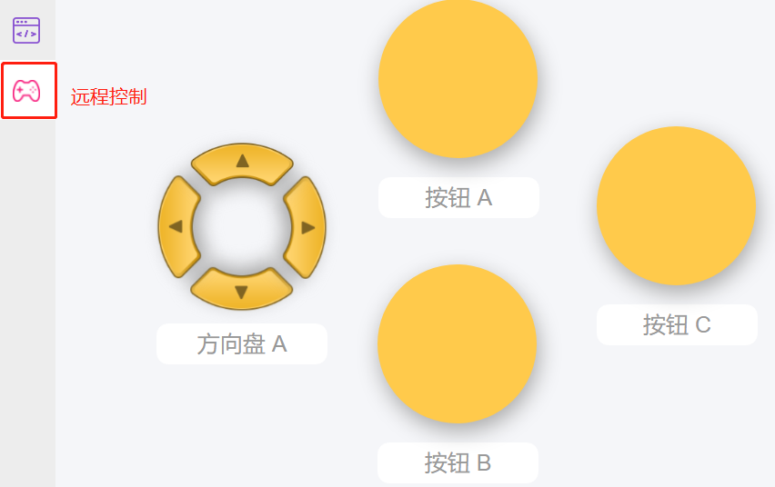

坐标控制
======================

PiArm 的手臂有 2 种控制模式: **角度控制** 和 **坐标控制**。

* **角度控制** 模式: 向 PiArm 手臂上的3个舵机写入一定的角度，使其到达特定位置。
* **坐标控制** 模式: 为 PiArm 建立空间坐标系并设置控制点，将空间坐标写入该控制点，使其达到特定位置。

本项目用的是 **坐标控制** 模式。

手臂坐标小提示
--------------------------------

PiArm 有一个空间直角坐标系，其原点位于两侧舵机输出轴的中心点。控制点位于手臂顶部，刻度单位为毫米。初始状态下，控制点的坐标为(0, 80, 80)。

需要注意的是，PiArm 的臂长是有限的，如果设置的坐标值超出其机械运动的限制，PiArm 将旋转到不可预测的位置。

换句话说，PiArm 的总臂长为 160mm，这意味着沿 Y 轴移动的控制点的极限值应在 (0,0,0) 到 (0,160,0) 之间。但是由于结构本身的限制，活动范围应该远小于这个范围。

* X 坐标的推荐范围为 -80 ~ 80.
* Y 坐标的推荐范围为 30 ~ 130.
* Z 坐标的推荐范围为 0 ~ 80.

编程
---------------------------

**第一步** 

要使用遥控功能，您需要从主页面左侧进入遥控页面，然后拖出一个方向盘和三个按钮到中央区域。

回到编程页面，您将看到一个附加的 **远程遥控** 类别，其中出现方向盘和按钮块。

* [按键 () 获取值]: 这个代码块用于读取按钮的值，按下时为1，送开时为0。
* [按键 () 被 (按下/松开)]: 这个代码块和 [按键 () 获取值 (0/1)] 有着相似的效果，可以直接判断按钮是否被按下。
* [方向盘 () 获取 () 值]: 这个代码块用于读取方向盘各个方向上的值，按下时为1，松开为0。

.. image:: media/control4.png
  :width: 500

**第二步** 

创建三个变量 ([xAxis], [yAxis] and [zAxis]) 来表示 PiArm 控制点坐标，并在 [开始] 块中将它们初始化为 (0,80,80)。

**第三步** 

创建一个名为 [coor] 的函数，根据方向键和按钮值设置PiArm的旋转方向。

* 如果按下方向盘的上按钮 (▲), Y坐标值增大，PiArm 向前伸长。
* 如果按下方向盘的下按钮 (▼), Y坐标值减小，PiArm 向后缩回。
* 如果按下方向盘的左按钮 (◀), X坐标值减小，PiArm 向左转动。
* 如果按下方向盘的右按钮 (▶), X坐标值增加，PiArm 向右转动。
* 如果按下按钮 A, Z坐标值增加，PiArm 上升。
* 如果按下按钮 B, Z坐标值减小，PiArm 下降。

.. note::

    * 关于X、Y、Z坐标方向, 请参考: :ref:`手臂坐标小提示`。
    * [限制数字...介于（低）...到（高）...]: 可以在数学类中找到，用于设置一个变量的变化范围。
    * [否则如果]: 用于条件判断的代码块, 可以点击设置图标将 [否则] 或 [否则如果] 拖拽到 [如果] 下方来创建多个条件判断。

**第四步**

将函数 [coor] 放入 [循环] 块中循环执行，最后点击下载按钮运行代码。

之后，您可以使用远程遥控页面上的方向键和按钮A/B来控制 PiArm 的移动。

.. note::

    您也可以在EzBlock Studio的示例页面找到同名的代码，直接点击运行或编辑查看代码块。

.. image:: media/coordinate1.png
    :width: 800

拓展
-------------------

你也可以在这个项目中添加单独的头部配件控制代码，这样你就可以同时控制PiArm的手臂和头部配件了。

* 如果想要控制铲斗, 请参考 :ref:`铲斗 - 远程遥控` 来搭建代码。
* 如果想要控制竖直夹, 请参考 :ref:`竖直夹 - 远程遥控` 来搭建代码。
* 如果想要控制电磁铁, 请参考 :ref:`电磁铁 - 远程遥控` 来搭建代码。

