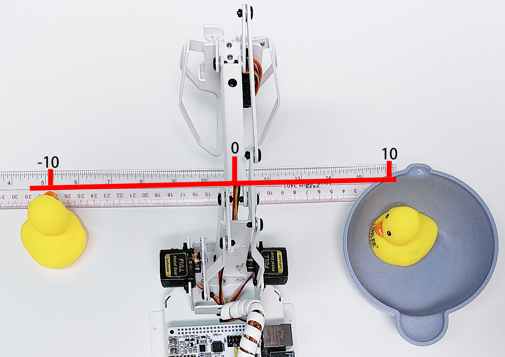

Coordinate Mode
======================

PiArm's arm can be controlled in two ways: :ref:`arm_angle` and :ref:`arm_coor`.

* :ref:`arm_angle`: Writes a certain angle to the three servos on the arm, thus rotating the arm to a specific position.
* :ref:`arm_coor`: Create a spatial right-angle coordinate system for the arm and set the control point. Set the coordinates of the control point so that the arm can reach a specific position.

This project sets 2 coordinate points by coordinate mode, and let the PiArm clip the rubber duck on the left to the bowl on the right. But you need to mount :ref:`clip` to the PiArm first.

Programming
---------------------------

**Step 1** 

Initialize the pin of the Hanging Clip and set the speed of the robot arm to 60%.

.. image:: img/coor1.png

**Step 2**

Set the coordinates of the 2 points. Since the rubber duck on the left and the bowl on the right are on the same line, you will find that their Y coordinate values are the same.

* [start_coord]: The coordinates of the left rubber duck.
* [start_coord_up]: The coordinate of straight above the left rubber duck.
* [end_coord]: The coordinates of the bowl.
* [end_coord_up]: The coordinates straight above the bowl.

.. note::

    * All coordinates here refer to the coordinates of the control points, but the actual distance between the X and Y coordinates is a little larger when the end-of-arm tool is mounted.
    * The tolerance distance is different for each end of arm tool. For example, 3-4cm for Hanging Clip and Electromagnet, 6-7cm for Shovel Bucket.
    * For example, here the X coordinate is written as 100, but the actual distance is 13-14cm.
    * It is generally recommended that the X coordinate is -80 ~ 80, but since the Y coordinate value here is small (the recommended range is 30~130), it is possible to reach to 100. However, if you increase the Y coordinate value, the X coordinate value needs to be reduced according to the actual situation due to the linkage action.

.. image:: img/coor2.png

**Step 3**

In the [loop] block, let PiArm do the following.

* PiArm opens the Hanging Clip (20°), then rotates to the left rubber duck position (start_coord), then closes the Hanging Clip (90°).
* PiArm raises his head (start_coord_up) and then turns to the right side above the bowl (end_coord_up).
* PiArm lowers his head (end_coord_up), then opens the Hanging Clip (20°) to let the rubber duck fall into the bowl, and finally raises his head again (end_coord_up).

.. image:: img/coor3.png

**Step 4**

Click on the **Download** button in the bottom right corner and you will see PiArm repeating the actions described above.

.. note::

    You can also find the code with the same name on the **Examples** page of Ezblock Studio and click Run or Edit directly to view the code.

.. image:: img/coordinate1.png
    :width: 800

