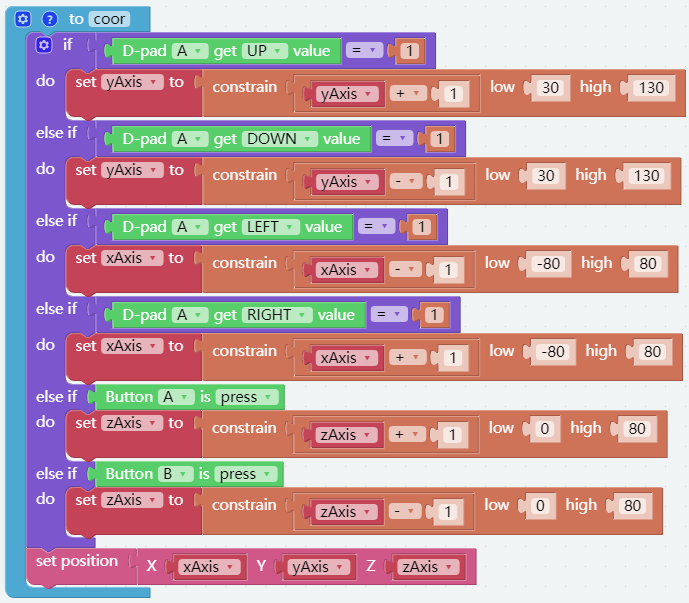

坐标模式
======================

PiArm 的手臂有 2 种控制模式: **角度** 和 **坐标**。

* :ref:`arm_angle`: 向 PiArm 手臂上的3个舵机写入一定的角度，使其到达特定位置。
* :ref:`arm_coor`: 为 PiArm 建立空间坐标系并设置控制点，将空间坐标写入该控制点，使其达到特定位置。

本项目通过坐标模式，设定2个坐标点，让机械臂将左边的橡皮鸭夹到右边的碗里。但你需要先将 :ref:`clip` 装到PiArm上。

编程
---------------------------

**第一步** 

初始化竖直夹的引脚及设置机械臂的速度为60%。

.. image:: img/coor1.png

**第二步**

设置2个点的坐标。由于左边橡皮鸭和右边的碗在同一条线上，你会发现它们的Y坐标值是一样的。

* [start_coord]: 左边橡皮鸭的坐标。
* [start_coord_up]: 左边橡皮鸭的正上方坐标。
* [end_coord]: 碗的坐标。
* [end_coord_up]：碗的正上方坐标。

.. note::

    * 这里的坐标都是指的控制点的坐标，但是装好臂端工具后，X和Y坐标的实际距离大一点。
    * 不同的臂端工具，误差距离不一样。比如竖直夹和电磁铁为3-4cm, 铲斗为6-7cm。
    * 比如在这里X坐标写的是100，但实际距离是13-14cm。
    * 一般建议X的坐标是-80 ~ 80，但由于这里Y坐标值较小（建议范围是30~130），所以设置为100也是能到的。但如果你增大了Y坐标值，由于连杆作用，X坐标值需要根据实际情况调小一点。

.. image:: img/coor2.png

**第三步**

在[循环] 块中，让PiArm完成以下动作。

* PiArm先张开竖直夹（20°），然后转动到左边橡皮鸭的位置（start_coord），再合拢竖直夹（90°）。
* PiArm抬起头（start_coord_up），再转动到右边的碗的正上方（end_coord_up）。
* PiArm低头（end_coord_up），再张开竖直夹（20°）让橡皮鸭掉落到碗里，最后再抬起头（end_coord_up）。

**第四步**

点击右下角的 **下载** 按钮，你就能看到PiArm重复上面描述的动作。

.. note::

    您也可以在EzBlock Studio的示例页面找到同名的代码，直接点击运行或编辑查看代码块。

.. image:: img/coordinate1.png
    :width: 800

