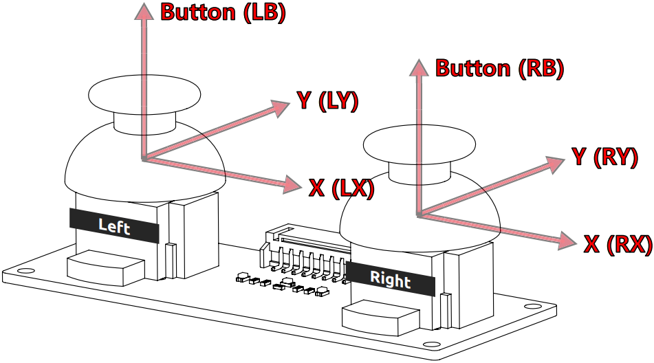
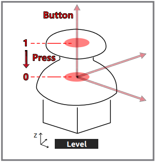
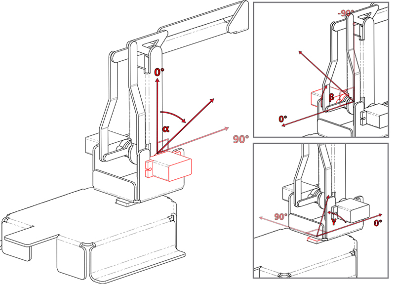
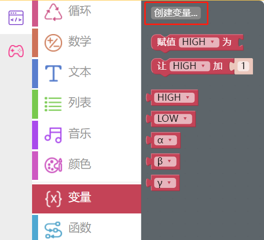
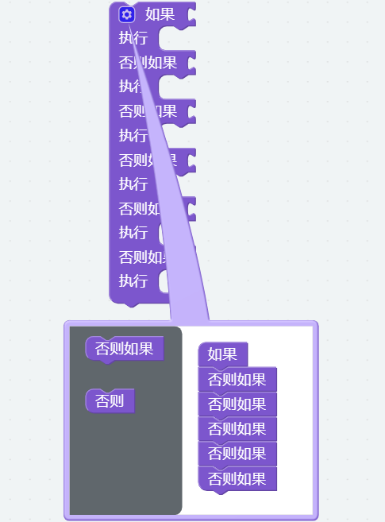
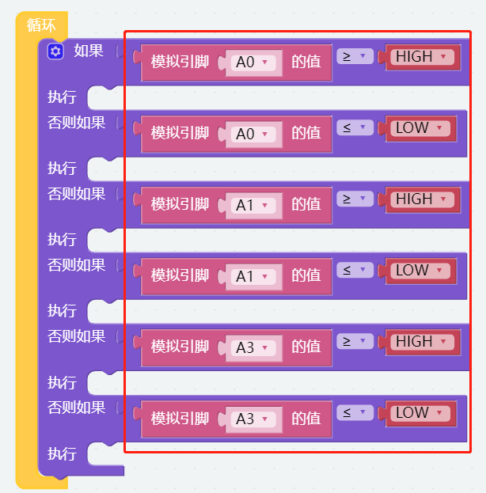
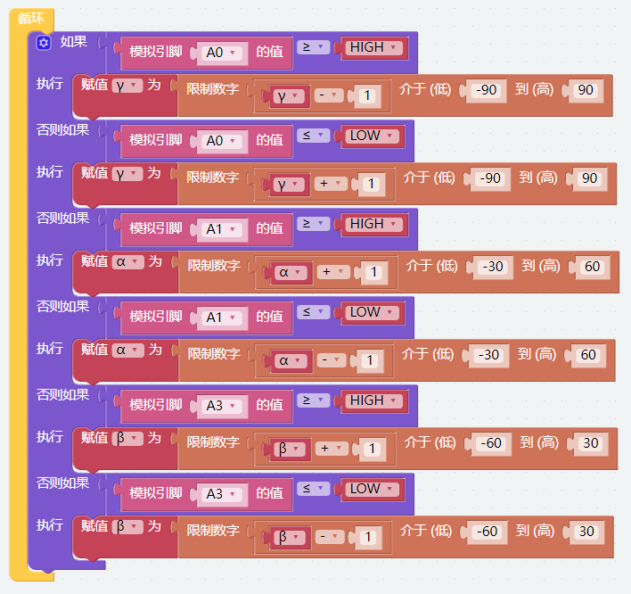
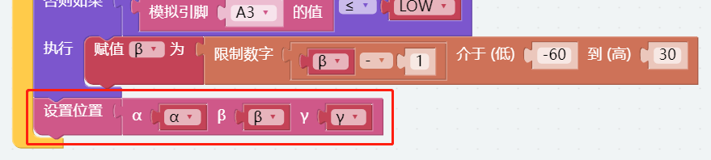
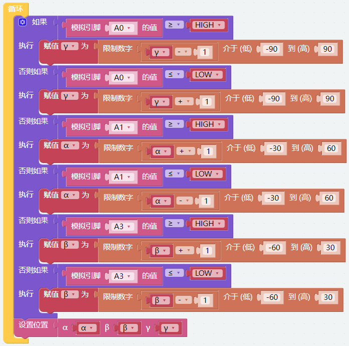

双操纵杆模块
=======================

我们可以分两部分控制 PiArm，手臂和臂端工具。在第一个项目中，您已经学习了如何组装和测试PiArm的3个头部配件。在这个项目中，我们将使用套件附带的双操纵杆模块来控制 PiArm 的手臂。

关于双摇杆模块的提示
-------------------------------

双摇杆模块由2个摇杆组成，每个摇杆可以输出X、Y、Z方向的电信号。

使用双操纵杆模块前，需要将其8根线连接到Robot HAT对应的引脚上，如下图所示。

.. image:: media/dual_joy.png
    :width: 800

操纵杆读数范围在0~4095的平面坐标系中，原点(0,0)在左下角。

举个例子，不推动摇杆时的坐标值为（2048,2048）。如果将操纵杆向左推动，坐标为 (0,2048)。当向下推动摇杆时，坐标为 (2048,0)，如下所示。

.. image:: media/joystick3.jpg

但是电信号容易波动，很难得到绝对稳定的读数，所以我们通常会设置一个数值区间来判断摇杆目前所处位置。

建议边界值设为3072和1024。当摇杆的读数大于3072时，认为摇杆是向上（或向右）推动；如果读数小于 1024，则认为摇杆杆向下（或向左）推动。

Z轴按钮按下时输出低电平（0），松开时输出高电平（1）。

关于手臂的转动角度提示
-------------------------------------

PiArm 的手臂有两种方法可以控制: **通过角度控制** 和 **通过坐标控制** 。

* **角度控制** 模式: 向手臂上的三个舵机写入一定的角度，从而使手臂转动到特定的位置。
* **坐标控制** 模式: 为手臂建立空间直角坐标系并设置控制点，写入控制点的空间坐标，从而让手臂达到特定的位置。

在这个项目中使用的是 **角度控制** 模式。

PiArm的手臂由三个舵机驱动，使其可以前后左右上下移动，我们用 ``α`` ， ``β`` ， ``γ`` 表示三个舵机的旋转角度，如下图所示。

* ``α``: 可以控制机械臂前后移动的角度, 由于结构限制, 推荐角度范围为: -30 ~ 60.
* ``β``: 可以控制机械臂上下移动的角度, 由于结构限制, 推荐角度范围为: -60 ~ 30.
* ``γ``: 可以控制机械臂左右移动的角度, 角度范围为: -90 ~ 90.

编程
--------------------------

**第一步** 

在编程的时候常常用变量来简化程序, 点击 **变量** 类别中的 **创建变量** 来创建出五个变量 (``HIGH``, ``LOW``, ``α``, ``β`` and ``γ``)。

.. note::

    已经创建好的变量也会存放在 **变量** 类别中。

**第二步** 

为这些变量设置初始值并将舵机的转动速度设置为70%。

.. note::

    变量 **HIGH** 和 **LOW** 如何取值请参考 :ref:`关于双摇杆模块的提示`。

**第三步** 

用 [如果...执行...] 代码块来做条件判断。

* [否则如果]: 用于条件判断的代码块, 可以点击设置图标将 [否则] 或 [否则如果] 拖拽到 [如果] 下方来创建多个条件判断。

**第四步** 

双操纵杆模块左右连接如下图所示也可以参考 :ref:`关于双摇杆模块的提示`。

* 左摇杆的X轴连接到A0，Y轴连接到A1。
* 右摇杆的X轴连接到A2，Y轴连接到A3。

假定用左摇杆的XY轴和右摇杆的Y轴来控制机械臂的三个舵机，首先要设置判断条件来判断左右摇杆是否被推动。

* 如果 **A0 (LX)** 大于 **HIGH (3072)**, 则可以确定 **左摇杆** 向右边推动。
* 如果 **A0 (LX)** 小于 **LOW (1024)**, 则可以确定 **左摇杆** 向左边推动。
* 如果 **A1 (LY)** 大于 **HIGH (3072)**, 则可以确定 **左摇杆** 向前推动。
* 如果 **A1 (LY)** 小于 **LOW (1024)**, 则可以确定 **左摇杆** 向后推动。
* 如果 **A3 (RY)** 大于 **HIGH (3072)**, 则可以确定 **右摇杆** 向前推动。
* 如果 **A3 (RY)** 小于 **LOW (1024)**, 则可以确定 **右摇杆** 向后推动。

**第五步** 

然后根据左右摇杆的推动方向来设置机械臂移动方向。

* 如果 **左摇杆** 向右推动, 则让 PiArm 向右转动。
* 如果 **左摇杆** 向左推动, 则让 PiArm 向左转动。
* 如果 **左摇杆** 向前推动, 则让 PiArm 向前伸长。
* 如果 **左摇杆** 向后推动, 则让 PiArm 向后缩回。
* 如果 **右摇杆** 向前推动, 则让 PiArm 向上抬高。
* 如果 **右摇杆** 向后推动, 则让 PiArm 向下降低。

.. note::

    * ``α``, ``β`` 和 ``γ`` 表示 PiArm 上三个舵机的旋转范围, 参考: :ref:`关于手臂的转动角度提示`。
    * [限制数字...介于（低）...到（高）...]: 可以在数学类中找到，用于设置一个变量的变化范围。

**第六步** 

将获取到的 ``α``, ``β`` 和 ``γ`` 角度值放入 [α () β () γ ()] 代码块中, 然后用 [设置位置] 代码块使 PiArm 旋转到该位置。

**第七步** 

单击下载按钮后，便可以用双操纵模块来控制 PiArm 了。

* 左摇杆向左或向右推动, 机械臂将向左或向右转动。
* 左摇杆向前或向后推动, 机械臂会伸出或者缩回。
* 右摇杆向前或向后推动, 机械臂会抬高或降低。

.. note::

    您也可以在Ezblock Studio的示例页面找到同名的代码，直接点击运行或编辑查看代码块。

