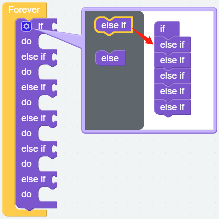
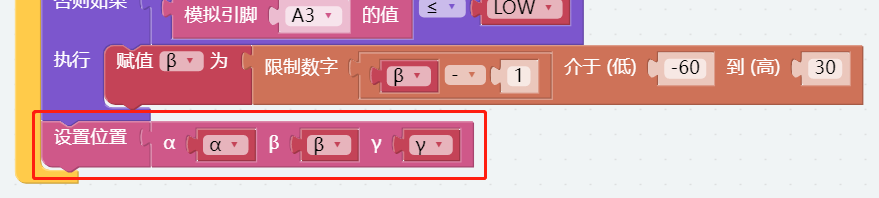

双摇杆控制
=======================

我们可以分两部分控制 PiArm，手臂和臂端工具。在第一个项目中，您已经学习了如何组装和测试PiArm的3个臂端工具。在这个项目中，我们将使用套件附带的双摇杆模块来控制 PiArm 的手臂。

在本项目中，用 :ref:`arm_angle` 和双操作感模块操控机械臂, 后面的项目也是在此基础上增添了三个臂端工具的控制代码，达到用双摇杆 PiArm 的手臂和臂端工具部分。

* :ref:`ezb_arm_joystick`
* :ref:`ezb_shovel_joystick`
* :ref:`ezb_clip_joystick`
* :ref:`ezb_electro_joystick`

.. image:: img/joystick_control.jpg
    :width: 500
    :align: center

.. _ezb_arm_joystick:

手臂 - 摇杆控制
--------------------------

**第一步** 

在编程的时候常常用变量来简化程序, 点击 **变量** 类别中的 **创建变量** 来创建出五个变量 (``HIGH``, ``LOW``, ``α``, ``β`` and ``γ``)。

.. note::

    已经创建好的变量也会存放在 **变量** 类别中。

.. image:: img/sp210512_114916.png

**第二步** 

为这些变量设置初始值并将舵机的转动速度设置为70%。

.. note::

    变量 **HIGH** 和 **LOW** 如何取值请参考 :ref:`dual_joystick`。

.. image:: img/joystick6.png

**第三步** 

用 [如果...执行...] 代码块来做条件判断。

* [否则如果]: 用于条件判断的代码块, 可以点击设置图标将 [否则] 或 [否则如果] 拖拽到 [如果] 下方来创建多个条件判断。

**第四步** 

双摇杆模块左右连接如下图所示也可以参考 :ref:`dual_joystick`。

* 左摇杆的X轴连接到A0，Y轴连接到A1。
* 右摇杆的X轴连接到A2，Y轴连接到A3。

假定用左摇杆的XY轴和右摇杆的Y轴来控制机械臂的三个舵机，首先要设置判断条件来判断左右摇杆是否被推动。

.. image:: img/joystick.png
    :width: 400
    :align: center

* 如果 **A0 (LX)** 大于 **HIGH (3072)**, 则可以确定 **左摇杆** 向右边推动。
* 如果 **A0 (LX)** 小于 **LOW (1024)**, 则可以确定 **左摇杆** 向左边推动。
* 如果 **A1 (LY)** 大于 **HIGH (3072)**, 则可以确定 **左摇杆** 向前推动。
* 如果 **A1 (LY)** 小于 **LOW (1024)**, 则可以确定 **左摇杆** 向后推动。
* 如果 **A3 (RY)** 大于 **HIGH (3072)**, 则可以确定 **右摇杆** 向前推动。
* 如果 **A3 (RY)** 小于 **LOW (1024)**, 则可以确定 **右摇杆** 向后推动。

.. image:: img/joystick62.png

**第五步** 

然后根据左右摇杆的推动方向来设置机械臂移动方向。

* 如果 **左摇杆** 向右推动, 则让 PiArm 向右转动。
* 如果 **左摇杆** 向左推动, 则让 PiArm 向左转动。
* 如果 **左摇杆** 向前推动, 则让 PiArm 向前伸长。
* 如果 **左摇杆** 向后推动, 则让 PiArm 向后缩回。
* 如果 **右摇杆** 向前推动, 则让 PiArm 向上抬高。
* 如果 **右摇杆** 向后推动, 则让 PiArm 向下降低。

.. note::

    * ``α``, ``β`` 和 ``γ`` 表示 PiArm 上三个舵机的旋转范围, 参考: :ref:`arm_angle`。
    * [限制数字...介于（低）...到（高）...]: 可以在数学类中找到，用于设置一个变量的变化范围。

.. image:: img/joystick63.png

**第六步** 

将获取到的 ``α``, ``β`` 和 ``γ`` 角度值放入 [α () β () γ ()] 代码块中, 然后用 [设置位置] 代码块使 PiArm 旋转到该位置。

**第七步** 

单击下载按钮后，便可以用双摇杆模块来控制 PiArm 了。

* 左摇杆向左或向右推动, 机械臂将向左或向右转动。
* 左摇杆向前或向后推动, 机械臂会伸出或者缩回。
* 右摇杆向前或向后推动, 机械臂会抬高或降低。

.. note::

    您也可以在Ezblock Studio的 **示例** 页面找到同名的代码，直接点击运行或编辑查看代码块。

.. image:: img/joystick6.png

.. image:: img/joystick7.png

.. _ezb_shovel_joystick:

铲斗 - 摇杆控制
--------------------

现在在控制手臂的代码基础上加上铲斗的控制代码。

.. note::

    您也可以在Ezblock Studio的 **示例** 页面找到同名的代码，直接点击运行或编辑查看代码块。

.. image:: img/shovel_joystick.png
    :width: 800

代码运行后，你可以用双摇杆模块同时控制PiArm的手臂和铲斗。但你需要先将 :ref:`shovel` 安装到PiArm上。

* 左摇杆向左或向右推动, 机械臂将向左或向右转动。
* 左摇杆向前或向后推动, 机械臂会伸出或者缩回。
* 右摇杆向前或向后推动, 机械臂会抬高或降低。
* 按下左摇杆，铲斗向内回卷。
* 按下右摇杆，铲斗向外伸展。

.. _ezb_clip_joystick:

竖直夹 - 摇杆控制
--------------------

现在在控制手臂的代码基础上加上竖直夹的控制代码。

.. note::

    您也可以在Ezblock Studio的 **示例** 页面找到同名的代码，直接点击运行或编辑查看代码块。

.. image:: img/clip_joystick.png
    :width: 800

代码运行后，你可以用双摇杆模块同时控制PiArm的手臂和竖直夹。但你需要先将 :ref:`clip` 安装到PiArm上。

* 左摇杆向左或向右推动, 机械臂将向左或向右转动。
* 左摇杆向前或向后推动, 机械臂会伸出或者缩回。
* 右摇杆向前或向后推动, 机械臂会抬高或降低。
* 按下左摇杆，竖直夹合拢。
* 按下右摇杆，竖直夹张开。

.. _ezb_electro_joystick:

电磁铁 - 摇杆控制
--------------------

现在在控制手臂的代码基础上加上电磁铁的控制代码。

.. note::

    您也可以在Ezblock Studio的 **示例** 页面找到同名的代码，直接点击运行或编辑查看代码块。

.. image:: img/electro_joystick.png
    :width: 800

代码运行后，你可以用双摇杆模块同时控制PiArm的手臂和电磁铁。但你需要先将 :ref:`electro` 安装到PiArm上。

* 左摇杆向左或向右推动, 机械臂将向左或向右转动。
* 左摇杆向前或向后推动, 机械臂会伸出或者缩回。
* 右摇杆向前或向后推动, 机械臂会抬高或降低。
* 按下左摇杆，电磁铁开启。
* 按下右摇杆，电磁铁关闭。