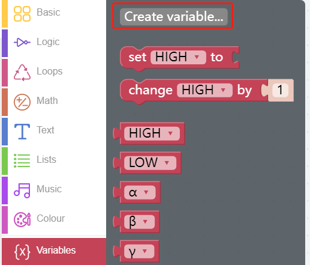
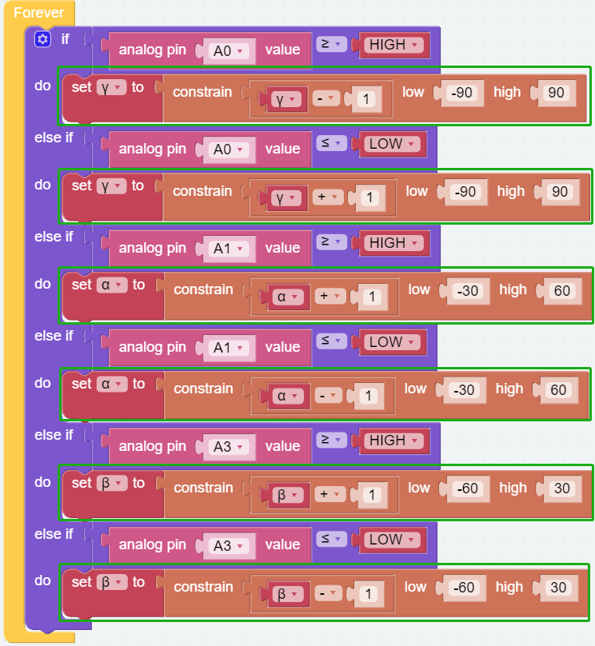
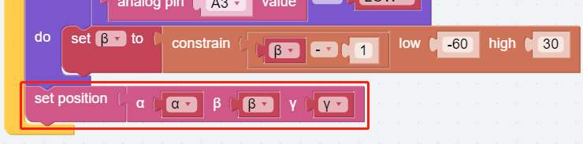
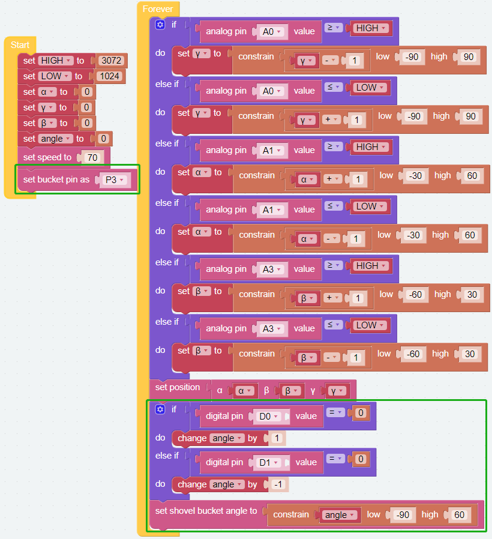
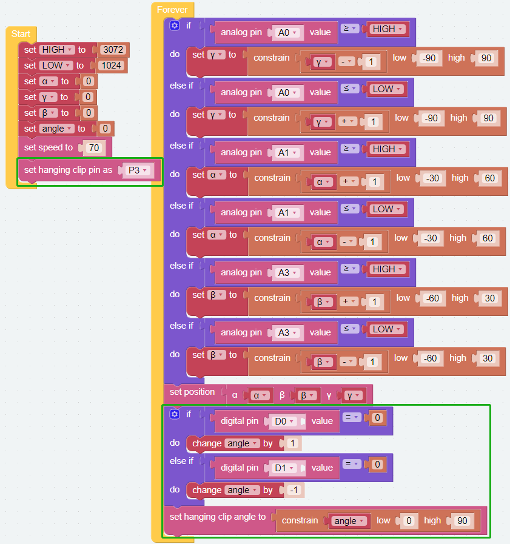

Dual Joystick Module
=======================

We can control PiArm in 2 parts, Arm and EoAT. In the first project, you have learned how to :ref:`test_eoat` of PiArm's separately.

In this project, first the arm is controlled by :ref:`arm_angle` and dual joystick module. Then the control code for the three EoATs was added to this so that the dual joystick module can control both arm and EoAT.

* :ref:`ezb_arm_joystick`
* :ref:`ezb_shovel_joystick`
* :ref:`ezb_clip_joystick`
* :ref:`ezb_electro_joystick`

.. image:: img/joystick_control.jpg
    :width: 500
    :align: center

.. _ezb_arm_joystick:

Arm - Joystick Control
--------------------------

PiArm's arm can be controlled in two ways: :ref:`arm_angle` and :ref:`arm_coor`.

* :ref:`arm_angle`: Writes a certain angle to the three servos on the arm, thus rotating the arm to a specific position.
* :ref:`arm_coor`: Create a spatial right-angle coordinate system for the arm and set the control point. Set the coordinates of the control point so that the arm can reach a specific position.

**Step 1** 

You may want to simplify your program with variables, now click the **Create variable** button on the **Variables** category to create 5 variables (``HIGH``, ``LOW``, ``α``, ``β`` and ``γ``).

.. note::

    The created variables are also stored in the **Variables** category.

**Step 2** 

Set the initial values for these variables and set the servo rotation speed to 70%.

.. note::

    For the reason of the values of the **HIGH** and **LOW** variables, please refer to :ref:`dual_joystick`.

.. image:: img/joystick6.png

**Step 3** 

Use [if else] block to do some conditional judgment cases (drag 5 [else if] blocks from the left to below the [if] block).

* [if else]: Conditional judgment block, you can create multiple conditional judgments by clicking the set icon and dragging [else] or [else if] to the right below the [if].

**Step 4** 

The left and right joystick connections for the dual joystick module are shown below, refer to :ref:`dual_joystick`.

* The X of the left joystick is connected to A0 and the Y is connected to A1.
* The X of the right joystick is connected to A2, and the Y is connected to A3.

Assume that the X and Y of the left joystick and the Y of the right joystick are used to control the 3 servos of PiArm respectively, now first set the judgment condition to determine whether the left and right joysticks are toggled or not.

.. image:: img/joystick.png
    :width: 400
    :align: center

* If **A0 (LX)** is greater than **HIGH (3072)**, it means that the **left joystick** is toggled to the right.
* If **A0 (LX)** is less than **LOW (1024)**, it means the **left joystick** is toggled to the left.
* If **A1 (LY)** is greater than **HIGH (3072)**, it means the **left joystick** is toggled forward.
* If **A1 (LY)** is less than **LOW (1024)**, it means the **left joystick** is toggled backward.
* If **A3 (RY)** is greater than **HIGH (3072)**, it means the **right joystick** is toggled forward.
* If **A3 (RY)** is less than **LOW (1024)**, it means the **right joystick** is toggled backward.

.. image:: img/joystick62.png

**Step 4** 

Now set the rotation effect of PiArm according to the toggle of the left and right joysticks.

* If the **left joystick** is toggled to the right, the Arm will turn right.
* If the **left joystick** is toggled to the left, the Arm will turn left.
* If the **left joystick** is toggled forward, the Arm will extend forward.
* If the **left joystick** is toggled backward, the Arm will retract backward.
* If the **right joystick** is toggled forward, the Arm will lower down.
* If the **right joystick** is toggled backward, the Arm will raise up.

.. note::

    * ``α``, ``β`` and ``γ`` represent the 3 servo rotation ranges on PiArm, refer to: :ref:`arm_angle`.
    * [constrain () low () high ()]: From Math category for setting the variation of a constant to a certain range.

**Step 5** 

Store the obtained ``α``, ``β`` and ``γ`` angle values into the [α () β () γ ()] block, and then use the [set positon] block to make PiArm rotate this position.

**Step 7** 

Once you click the download button, you can use the Dual Joystick Module to control PiArm.

* Left joystick toggle left or right, the arm will turn to the left or right.
* Left joystick toggle forward or backward, the arm will extend forward or retract backward.
* Right joystick toggle forward or backward, the arm will raise up or lower down.

.. note::

    You can also find the code with the same name on the **Examples** page of **Ezblock Studio** and click **Run** or **Edit** directly to see the results.

.. image:: img/joystick6.png

.. image:: img/joystick7.png

.. _ezb_shovel_joystick:

Shovel Bucket - Joystick Control
----------------------------------------

Now add the control code for the Shovel Bucket.

.. note::

    You can also find the code with the same name on the **Examples** page of Ezblock Studio and click Run or Edit directly to view the code.

Once the code is run, you can control both the PiArm's arm and Shovel Bucket with the dual joystick module. But you need to install :ref:`shovel` to the PiArm first.

* Push the left joystick to the left or right, the arm will turn to the left or right.
* Push the left joystick forward or backward, the arm will extend or retract.
* Push the right joystick forward or backward, the arm will be raised or lowered.
* Push the left joystick to rewind the Shovel Bucket inward.
* Press the right joystick to extend the Shovel Bucket outward.

.. _ezb_clip_joystick:

Hanging Clip - Joystick Control
--------------------------------------------

Now add the control code for the Hanging Clip to the code for the control arm.

.. note::

    You can also find the code with the same name on the **Examples** page of Ezblock Studio and click Run or Edit directly to view the block.

After the code is run, you can use the dual joystick module to control PiArm's arms and vertical clips at the same time. But you need to install :ref:`clip` to PiArm first.

* Push the left Joystick to the left or right, the arm will turn to the left or right.
* Push the left Joystick forward or backward, the arm will extend or retract.
* Push the right Joystick forward or backward, the arm will be raised or lowered.
* Press the left Joystick to close the Hanging Clip.
* Press the right Joystick to open the Hanging Clip.

.. _ezb_electro_joystick:

Electromagnet - Joystick Control
--------------------------------------

Now add the control code for the Electromagnet to the code for the control arm.

.. note::

    You can also find the code with the same name on the **Examples** page of Ezblock Studio and click Run or Edit directly to view the block.

.. image:: img/electro_joystick.png
    :width: 800

After the code is run, you can use the dual joystick module to control both PiArm's arm and the Electromagnet. But you need to install :ref:`electro` to PiArm first.

* Push the left joystick to the left or right, the arm will turn to the left or right.
* Push the left joystick forward or backward, the arm will extend or retract.
* Push the right joystick forward or backward, the arm will be raised or lowered.
* Press the left joystick to turn on the Electromagnet.
* Press the right joystick to turn the Electromagnet off.

