游戏 - 收集铁片
==============================

在这个项目中，准备好3种不同形状的铁片，PiArm会随机说一种形状，你需要控制PiArm将相应形状的铁片放入各自的盒子里面。

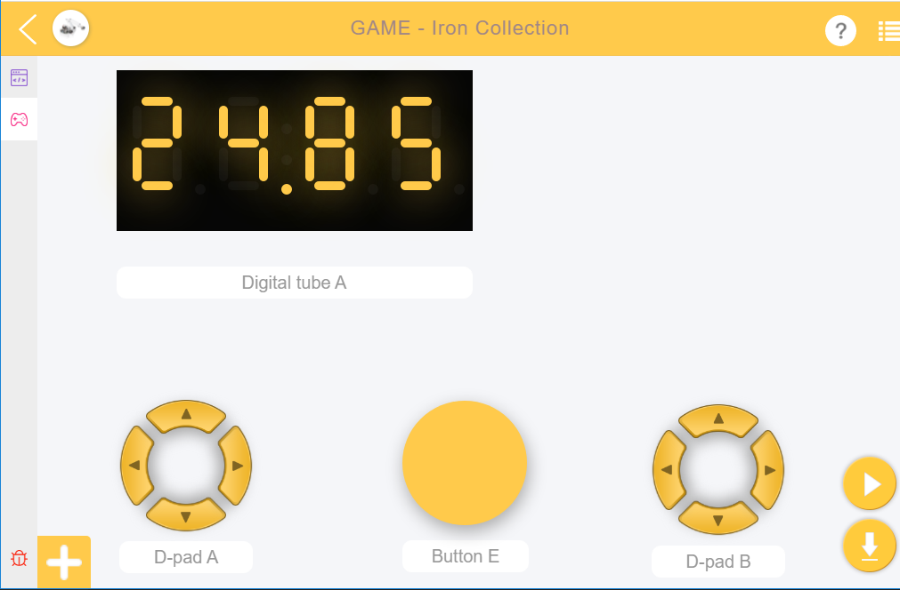

编程
-----------------

**第一步**

创建五个变量 (``α``, ``β``, ``γ``, ``flag``, ``shape``) 并为它们设置初始值。 然后初始化 PiArm 的旋转速度和 **电磁铁** 的引脚

.. note::

    * ``α``, ``β`` and ``γ`` 表示 PiArm 手臂上三个舵机的旋转角度范围, 可参考: :ref:`关于手臂的转动角度提示`.

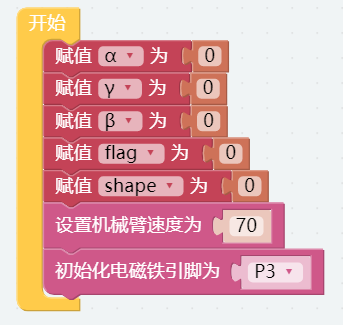

**第二步**

从远程控制界面拖2个D-pad用来控制PiArm，一个按键来启动游戏，以及一个数码管来显示时间。

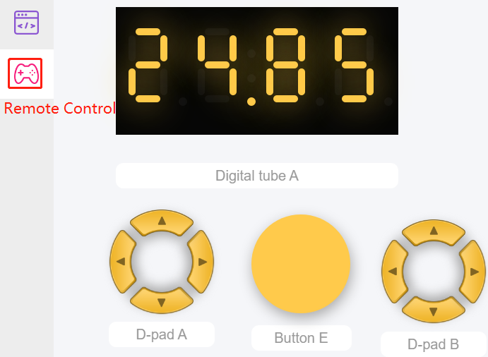

**第三步** 

创建一个叫做 [magnet] 的函数用来实现让D-pad B左右方向的按钮控制电磁铁的开和关。

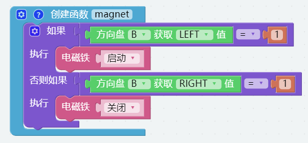

**第四步**

创建一个叫做 [control] 函数用来实现让D-pad A和D-pad B的上下来控制Arm of PiArm。

* 如果按下方向盘 **A** 的上按钮 (▲)，则让 PiArm 向前伸长。
* 如果按下方向盘 **A** 的下按钮 (▼)，则让 PiArm 向后缩回。
* 如果按下方向盘 **A** 的左按钮 (◀)，则让 PiArm 向左转动。
* 如果按下方向盘 **A** 的右按钮 (▶)，则让 PiArm 向右转动。
* 如果按下方向盘 **B** 的上按钮 (▲)，则让 PiArm 向上抬起。
* 如果按下方向盘 **B** 的下按钮 (▼)，则让 PiArm 向下降低。

.. note::

    * ``α``, ``β`` and ``γ`` 表示 PiArm 手臂上三个舵机的旋转角度范围, 可参考: :ref:`关于手臂的转动角度提示`.
    * [限制数字...介于（低）...到（高）...]: 可以在数学类中找到，用于设置一个变量的变化范围。
    * [否则如果]: 用于条件判断的代码块, 可以点击设置图标将 [否则] 或 [否则如果] 拖拽到 [如果] 下方来创建多个条件判断。

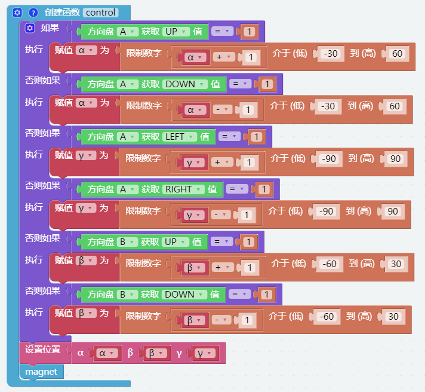

**第五步**

创建函数 [say_shape]，让PiArm随机说一个形状。

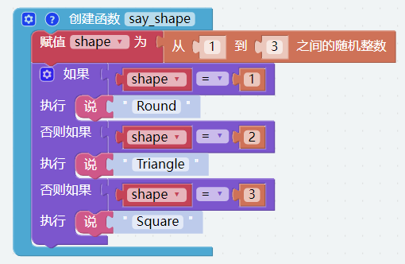

**第六步**

设置代码的主要流程：当按键 E 按下时，开始计时，此时PiArm会随机说一个形状。变量 ``flag`` 等于一时表示开始计时并可以控制PiArm了。

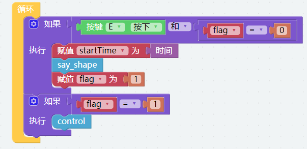

**第七步**

创建一个名为 [timing] 的函数以用于计时。游戏时间设定为 60 秒，时间到了之后，PiArm 将用语音播报游戏结束，并且你将无法再控制它。

这里的 [timing] 函数不同于上一个项目，我们在这里用到了 [时间] 模块来进行计时，在循环里面当判断出按键E被按下时，计时开始，[时间 - startTime] 代码块表示从计时开始到现在过去了多少秒。 

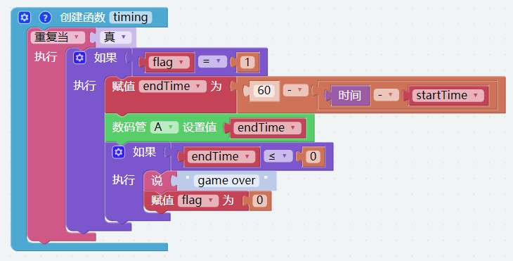

**第八步**

让 [timing] 函数在单独的线程中运行。这可以让您在计时的同时控制 PiArm。

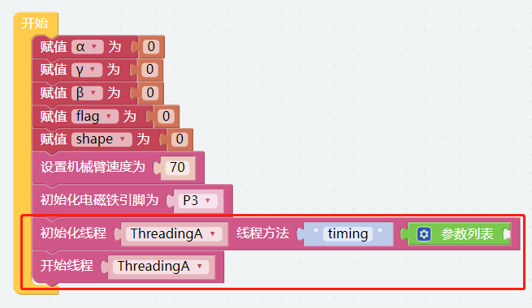

完整代码如下:

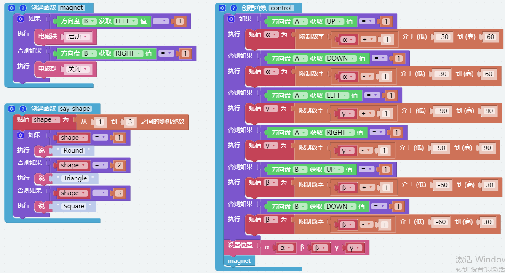

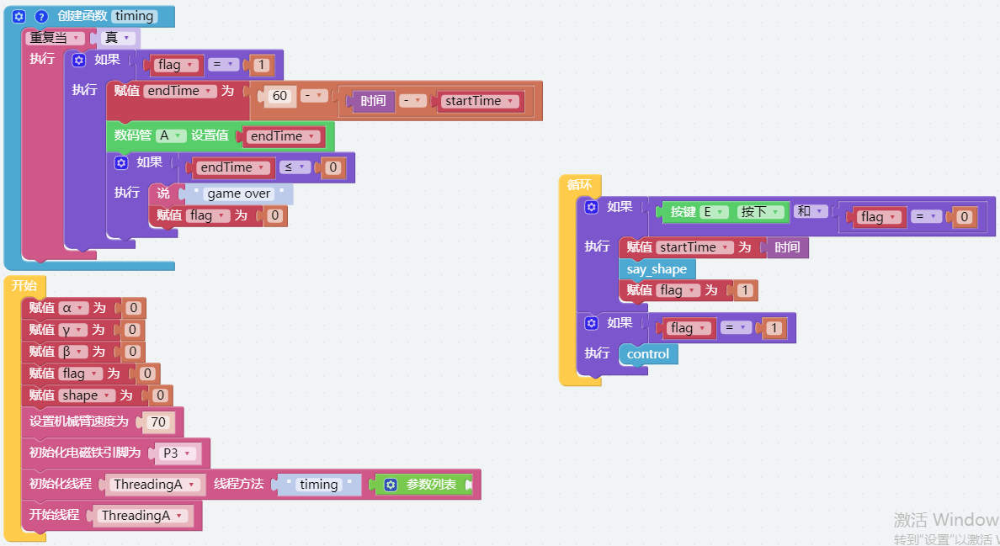

