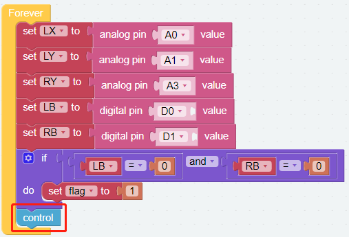
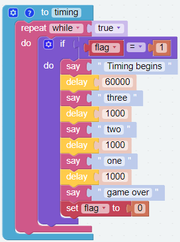

GAME - Catching Dolls
==============================

Now let's play a game of catching dolls and see who can catch more dolls with PiArm in the given time.
In order to play this game, we need to implement two functions, the first one is to control PiArm with the dual joystick module, and the second one is to timing, when the countdown is over, we can't control PiArm anymore. These two parts must be executed simultaneously.

Programming
----------------

**Step 1**

Create five variables (``HIGH``, ``LOW``, ``α``, ``β``, ``γ``, ``flag``, ``angle``) and and set initial values for them. Then initialize the PiArm rotation speed and **Hanging Clip** pin.

.. note::

    * For the reason of the values of the ``HIGH`` and ``LOW`` variables, please refer to :ref:`dual_joystick`.
    * ``α``, ``β`` and ``γ`` represent the 3 servo rotation ranges on PiArm, refer to: :ref:`arm_angle`.

.. image:: img/doll1.png

**Step 2**

Create another 5 variables (``LX``, ``LY``, ``RY``, ``LB``, ``RB``) to read the X, Y and pressed values of the Dual Joystick Module respectively.

.. image:: img/joystick.png
    :width: 400
    :align: center

.. image:: img/doll2.png

**Step 3**

Set pressing the left and right joysticks at the same time as the game start action, so if ``LB`` and ``RB`` are read as 0 at the same time, it means the left and right joysticks are pressed, then the timing starts and the flag is set to 1.

.. image:: img/doll3.png

**Step 4**

Create a function named [clip] to control the Hanging Clip.

* When the left joystick is pressed and the right joystick is released, the :ref:`clip` will slowly closed.
* When the left joystick is released and the right joystick is pressed, the :ref:`clip` will  slowly opened.

.. image:: img/doll4.png

**Step 5**

Create a function [control] to set the rotation effect of PiArm based on the Dual Joystick Module.

* When flag is 1, it means the game starts. At this time you can start to control PiArm.

* If the left joystick (``LX``) is toggled to the right, the Arm will turn right.
* If the left joystick (``LX``) is toggled to the left, the Arm will turn left.
* If the left joystick (``LY``) is toggled forward, the Arm will extend forward.
* If the left joystick (``LY``) is toggled backward, the Arm will retract backward.
* If the right joystick (``RY``) is toggled forward, the Arm will lower down.
* If the right joystick (``RY``) is toggled backward, the Arm will raise up.

* The Hanging Clip control function is also called here. This allows you to control both the Arm and Hanging Clip of the PiArm.

**Step 6**

Put the [control] function into the [Forever] block.

**Step 7**

Create a function named [timing] to use for timing. The game time is set to 60 seconds (60000), and a countdown will chime in the last 3 seconds to let you know that time is almost up.

**Step 8**

Let the [timing] function run in a separate thread. This allows you to control PiArm while counting down.

.. image:: img/doll7.png
    :width: 800

The complete code is as follows:

.. image:: img/doll.png
    :width: 800

.. image:: img/doll0.png
    :width: 800