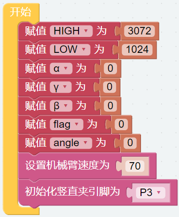
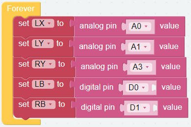
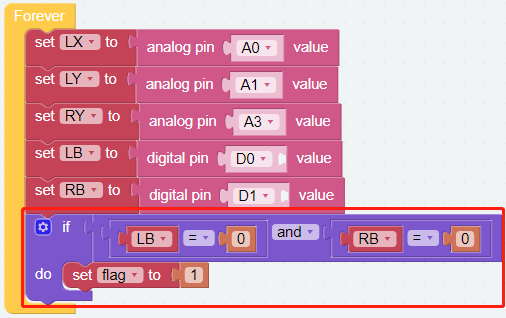
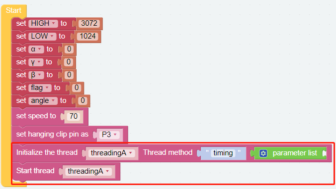
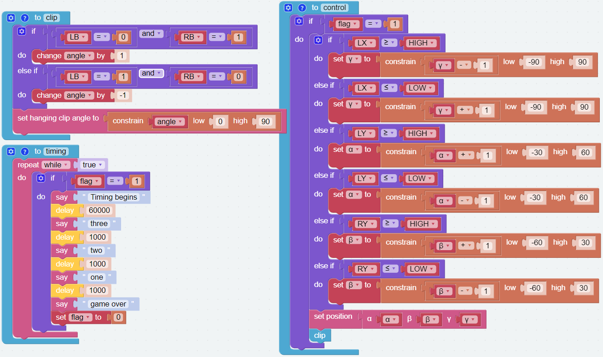
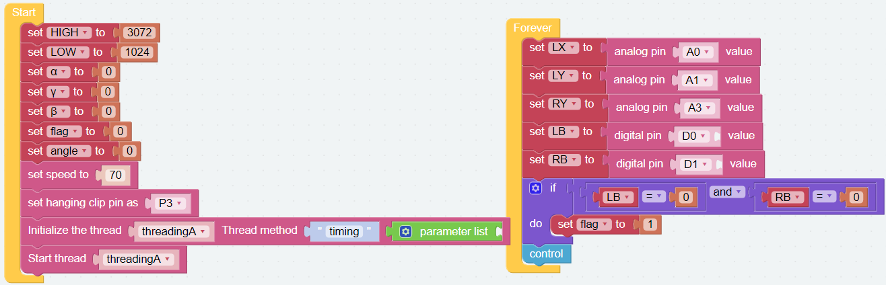

游戏 - 抓娃娃
==============================

现在让我们玩一个抓娃娃的游戏，看看谁能在给定的时间内用 PiArm 抓到更多的娃娃。为了玩这个游戏，我们需要实现两个功能，第一个是用双摇杆模块控制PiArm，第二个是计时，当倒计时结束时，我们便不能继续PiArm了。这两部分必须同时进行。

编程
------------

**第一步**

创建变量 (``HIGH``, ``LOW``, ``α``, ``β``, ``γ``, ``flag``, ``angle``) 并为它们设置初始值。然后初始化 PiArm 旋转速度和竖直夹的引脚。

.. note::

    * 变量 ``HIGH`` 和 ``LOW`` 的取值参考 :ref:`关于双摇杆模块的提示`.
    * ``α``, ``β`` and ``γ`` 表示 PiArm 手臂上三个舵机的旋转角度范围, 可参考: :ref:`关于手臂的转动角度提示`.

**第二步**

创建另外五个变量 (``LX``, ``LY``, ``RY``, ``LB``, ``RB``) 来分别读取双操纵杆模块的 X、Y 轴和按下的值。

.. image:: img/joystick.png
    :width: 400
    :align: center

**第三步**

当LB和RB同时读取为0，表示左右摇杆被按下，此时游戏开始，同时计时并设置flag为1。

**第四步**

创建一个名为 [clip] 的函数来控制 竖直夹。

* 当按下左摇杆时，竖直夹会慢慢夹紧。
* 当按下右摇杆时，竖直夹会慢慢松开。

.. image:: img/doll4.png

**第五步**

参考双操纵杆模块创建一个函数 [control] 来设置PiArm的移动方向。

* 当flag为1时，表示游戏开始。这时候就可以开始控制PiArm了。
* 如果 **左摇杆** (``LX``)向右推动, 则让 PiArm 向右转动。
* 如果 **左摇杆** (``LX``)向左推动, 则让 PiArm 向左转动。
* 如果 **左摇杆** (``LY``)向前推动, 则让 PiArm 向前伸长。
* 如果 **左摇杆** (``LY``)向后推动, 则让 PiArm 向后缩回。
* 如果 **右摇杆** (``RX``)向前推动, 则让 PiArm 向上抬高。
* 如果 **右摇杆** (``RY``)向后推动, 则让 PiArm 向下降低。

* 竖直夹的控制代码也在这里被调用。这可以让您同时控制 PiArm 的手臂和竖直夹部分

.. image:: img/doll5.png

**第六步**

将 [control] 函数块放入 [循环] 代码块中。

.. image:: img/doll55.png

**第七步**

创建一个名为 [timing] 的函数以用于计时。游戏时间设置为60秒（60000），最后3秒会响起倒计时，让你知道时间快到了。

.. image:: img/doll6.png

**第八步**

让 [timing] 函数在单独的线程中运行。这可以让您在记时的同时控制 PiArm。

完整代码如下：

