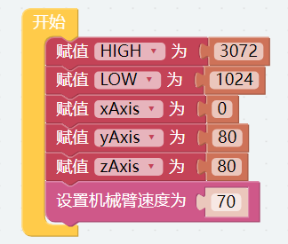
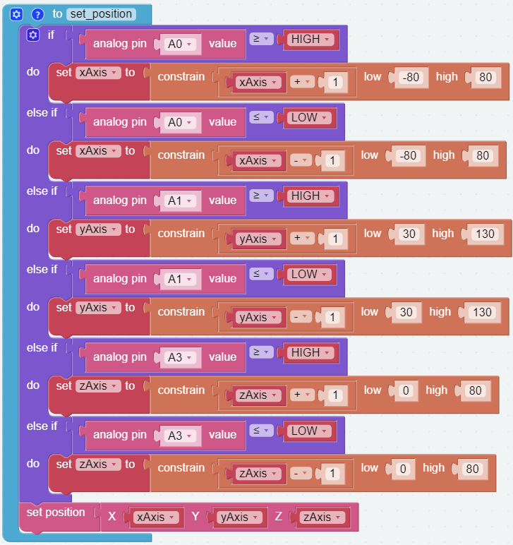
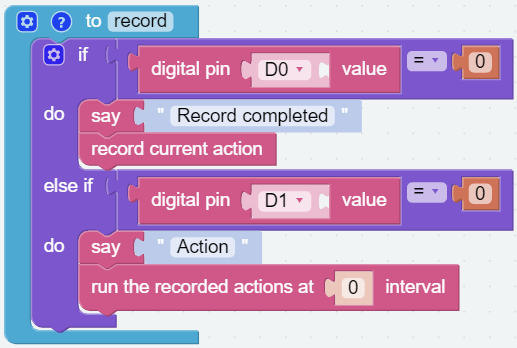
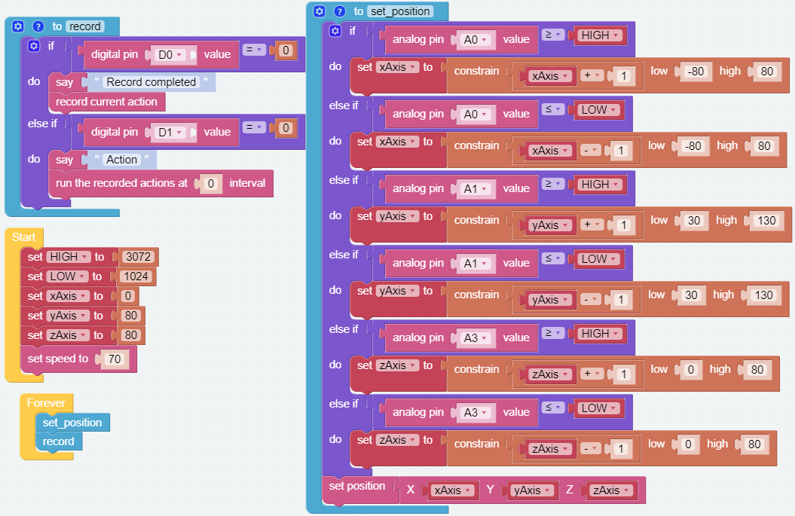

记录功能
===================

Piarm 提供了记录动作的功能，可以用来记录 Piarm 做过的动作。

在本项目中，我们将使用双摇杆模块在坐标控制模式下控制 PiArm 移动，并通过摇杆按钮记录其移动轨迹，以便 PiArm 可以沿着记录的轨迹重复移动。

.. image:: img/joystick.png
    :width: 600
    :align: center

编程
--------------------------

**第一步** 

创建五个变量 (``HIGH``, ``LOW``, ``xAxis``, ``yAxis`` 和 ``zAxis``) 并为它们设置初始值。

**第二步** 

创建一个名为 [set_position] 的函数，用双操纵杆模块在坐标控制模式下操纵 PiArm 。

* 如果 **左摇杆** 向右推动, 则让 PiArm 向右转动。
* 如果 **左摇杆** 向左推动, 则让 PiArm 向左转动。
* 如果 **左摇杆** 向前推动, 则让 PiArm 向前伸长。
* 如果 **左摇杆** 向后推动, 则让 PiArm 向后缩回。
* 如果 **右摇杆** 向前推动, 则让 PiArm 向上抬高。
* 如果 **右摇杆** 向后推动, 则让 PiArm 向下降低。

.. note::
    * 关于X、Y、Z坐标方向, 请参考: :ref:`手臂坐标小提示`。
    * 双摇杆的连接和方向请参考 :ref:`关于双摇杆模块的提示`。
    * [限制数字...介于（低）...到（高）...]: 可以在数学类中找到，用于设置一个变量的变化范围。
    * [否则如果]: 用于条件判断的代码块, 可以点击设置图标将 [否则] 或 [否则如果] 拖拽到 [如果] 下方来创建多个条件判断。

**第三步** 

创建了一个新函数 [record] 来记录当前动作并允许 PiArm 重现它们。

* 双摇杆模块的左右按钮分别连接到D0（左按钮）、D1（右按钮）。
* 按键按下时输出低电平（0），松开时输出高电平（1）。
* 当按下左摇杆的按钮时，此时会记录PiArm的动作，并有语音提示，表示记录完成。
* 当按下右操纵杆的按钮时，PiArm 会重复已经记录好的动作。

.. note::

    * 代码块 [如果...执行...], [...和...] 以及 [=] 都来自 **逻辑** 类别。
    * 右键单击代码块 [...和...] 并选择 **外部输入** 使其并行排列节省空间。

    .. image:: img/and.png

    * [运行动作集 (0) 设置延迟]: 该代码块用于设置记录好的每组动作的时间间隔，如果为0则表示没有间隔时间连续重复之前的动作。

**第四步** 

将 [set_position] 和 [record] 函数放入 [循环] 块中依次执行，最后点击下载按钮运行代码。

现在你可以使用摇杆来控制PiArm，按下左摇杆的按钮记录需要的动作，记录几组后，按下右摇杆的按钮，让PiArm复现这些动作。

.. note::

    您也可以在EzBlock Studio的示例页面找到同名的代码，直接点击运行或编辑查看代码块。

拓展
-------------------

你也可以在这个项目中添加单独的头部配件控制代码，这样你就可以同时控制PiArm的手臂和头部配件了。

* 如果想要控制铲斗, 请参考 :ref:`铲斗 - 远程遥控` 来搭建代码。
* 如果想要控制竖直夹, 请参考 :ref:`竖直夹 - 远程遥控` 来搭建代码。
* 如果想要控制电磁铁, 请参考 :ref:`电磁铁 - 远程遥控` 来搭建代码。

