远程遥控
==================

除了双操纵杆模块，我们还可以用 **EzBlock Studio** 里 **远程遥控** 页面上的小部件来控制 **PiArm** 移动。

在本项目中，用 **角度控制** 模式和远程遥控的小部件操控机械臂, 后面的项目也是在此基础上增添了三个头部配件的控制代码，达到用远程部件遥控 **PiArm** 的手臂和头部配件部分。

* :ref:`手臂 - 远程遥控`
* :ref:`创建库`
* :ref:`铲斗 - 远程遥控`
* :ref:`竖直夹 - 远程遥控`
* :ref:`电磁铁 - 远程遥控`

.. _arm_remote:

手臂 - 远程遥控
---------------------------------------

PiArm 的手臂有两种控制模式: **角度控制** 和 **坐标控制**。

* **角度控制** 模式: 向手臂上的3个舵机写入一定的角度，使PiArm到达特定位置。
* **坐标控制** 模式: 为手臂建立空间坐标系并设置控制点，将空间坐标写入该控制点，使PiArm达到特定位置。

这个项目用的是 **角度控制** 模式。

**第一步** 

要使用遥控功能，您需要从主页面左侧进入遥控页面，然后拖动一个方向键和三个按钮到中央区域。

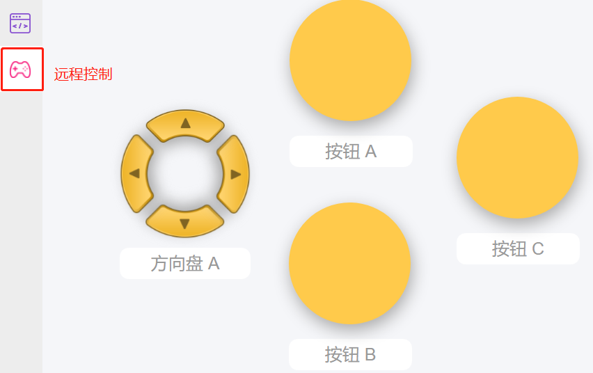

回到编程页面，您将看到一个附加的远程遥控类别，其中出现方向盘和按键代码块。

* [按键 () 获取值]: 这个代码块用于读取按钮的值，按下时为1，送开时为0。
* [按键 () 被 (按下/松开)]: 这个代码块和 ``按键 () 获取值 (0/1)`` 有着相似的效果，可以直接判断按钮是否被按下。
* [方向盘 () 获取 () 值]: 这个代码块用于读取方向盘各个方向上的值，按下时为1，松开为0。

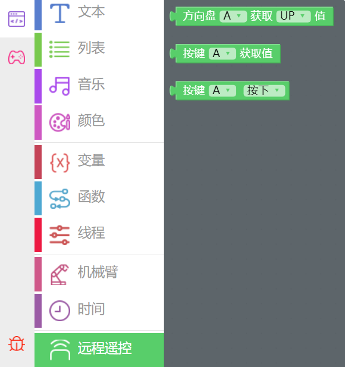

**第二步** 

创建3个变量 (``α``, ``β`` and ``γ``) 并设置初始值, 并将PiArm的旋转速度设置为70%。

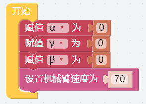

**第三步** 

创建一个名为 [arm_control] 的函数，根据方向键和按钮值设置PiArm的旋转方向。

.. note::

    函数名不能包含空格，两个单词之间可以用 ``_`` 连接。

* 如果按下方向盘的上按钮 (▲), 则让 PiArm 向前伸长。
* 如果按下方向盘的下按钮 (▼), 则让 PiArm 向后缩回。
* 如果按下方向盘的左按钮 (◀), 则让 PiArm 向左转动。
* 如果按下方向盘的右按钮 (▶), 则让 PiArm 向右转动。
* 如果按下按钮 A, 则让 PiArm 下降。
* 如果按下按钮 B, 则让 PiArm 上升。

.. note::

    * ``α``, ``β`` 和 ``γ`` 表示PiArm手臂上三个舵机的旋转范围, 可参考: :ref:`关于手臂的转动角度提示`。
    * [限制数字...介于（低）...到（高）...]: 可以在数学类中找到，用于设置一个变量的变化范围。
    * [否则如果]: 用于条件判断的代码块, 可以点击设置图标将 [否则] 或 [否则如果] 拖拽到 [如果] 下方来创建多个条件判断。

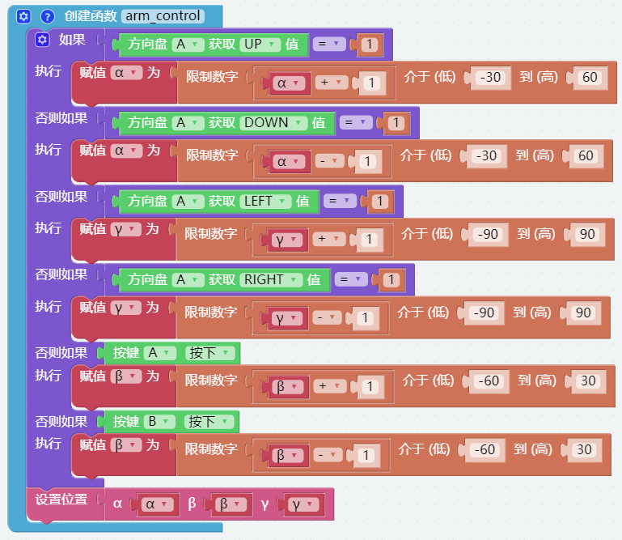

**第四步** 

将函数 [arm_control] 放在 [循环] 块中循环执行, 然后点击 **下载** 按钮来运行代码。

在这之后就可以用 **远程遥控** 页面上的方向盘和按钮A/B来控制机械臂的移动了。

.. note::

    * 放置这些函数块时，函数必须放在 [开始] 和 [循环] 块之前。    
    * 您也可以在EzBlock Studio的示例页面找到同名的代码，直接点击运行或编辑查看代码块。

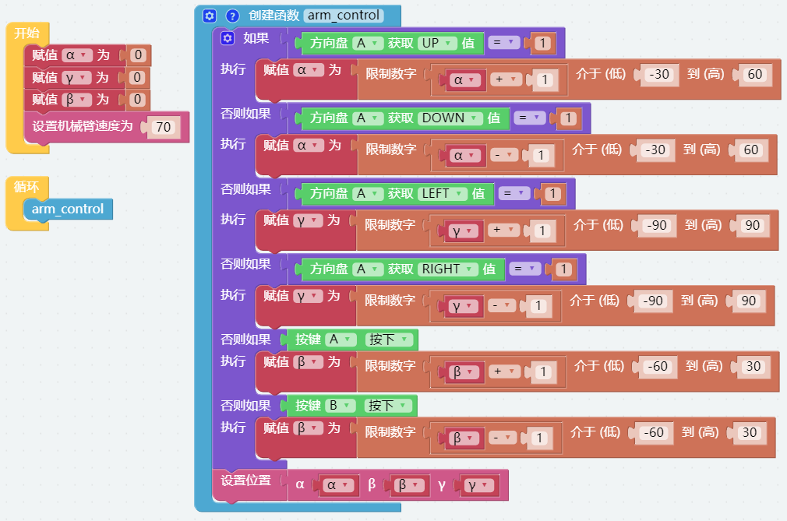

创建库
-------------------------

为了方便以后能在其他代码中使用 [arm_control] 函数，可以将其创建为库，并在需要使用时导入。

**第一步**

打开右上角的菜单图标，然后选择 **创建库** 。

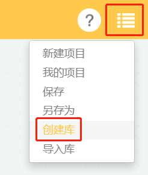

**第二步**

选择函数，我们这里只创建了一个函数，所以默认选择 ``arm_control`` 。

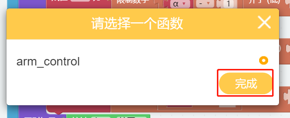

**第三步**

为库命名并填写描述，一边以后更好地区分。

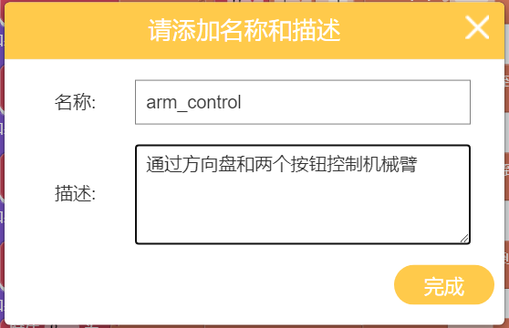

**第四步**

等待提示保存成功，然后该库将保存在您个人页面的 **我的库** 里面。 随后便可以在导入库的时候看见它了。

.. image:: media/import.png

.. _shovel_remote:

铲斗 - 远程遥控
-----------------------------------

创建一个新项目并为其搭建代码块，然后我们就可以在控制手臂的同时控制铲斗了。

**第一步** 

导入 [arm_control] 库, 如果之前没有创建过这个库， 请参考: :ref:`创建库`。

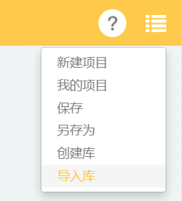

在 **我的库** 页面中, 选择您创建的库并单击 **导入**。

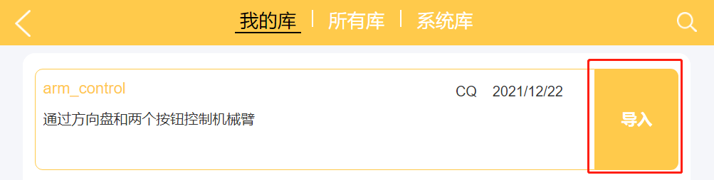

导入后，库为折叠样式。您可以右键单击它然后选择 **展开块**，这样就可以看到它的内部代码。

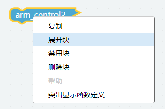

**第二步** 

创建变量 (``α``, ``β``, ``γ`` 和 ``angle``) 并设置初始值为0, 然后初始化PiArm的旋转速度和铲斗的引脚。

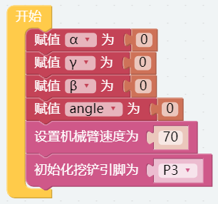

**第三步** 

新建一个函数 [shovel], 按如下步骤编写代码, 即可通过按钮来控制铲斗了。

* 从 **远程遥控** 页面添加一个按钮C。
* 使用 [如果...执行...] 代码块作判断条件。如果按下按钮C，则让变量 ``angle`` 加5；如果松开按钮C，则让变量 ``angle`` 减5。
* 用 [限制数字 angle 介于（低）0 到（高）90] 将变量 ``angle`` 的值限制为0-90，因为铲斗的移动范围时0-90。
* 根据变量 ``angle`` 设置铲斗的角度。

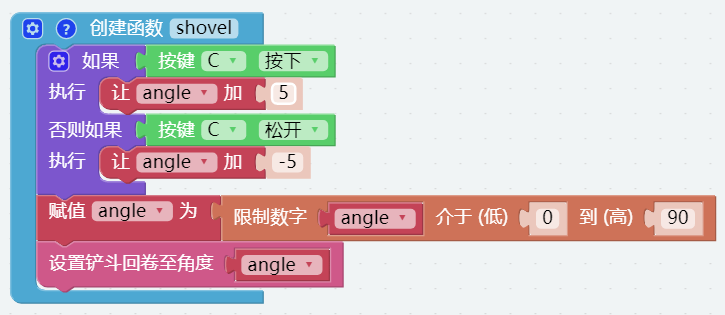

**第四步** 

将 [arm_control] 和 [shovel] 函数分别从 **函数** 类别中拖到 [循环] 块里。

点击下载按钮后，按住按钮C，铲斗慢慢向里挖，松开按钮C后，铲斗也会随之松开。同时还可以用远程遥控页面上的方向盘和按钮A/B来控制机械臂的移动。

.. note::
    您也可以在EzBlock Studio的示例页面找到名称为Shovel Bucket - Remote Control，直接点击运行或编辑查看代码块。

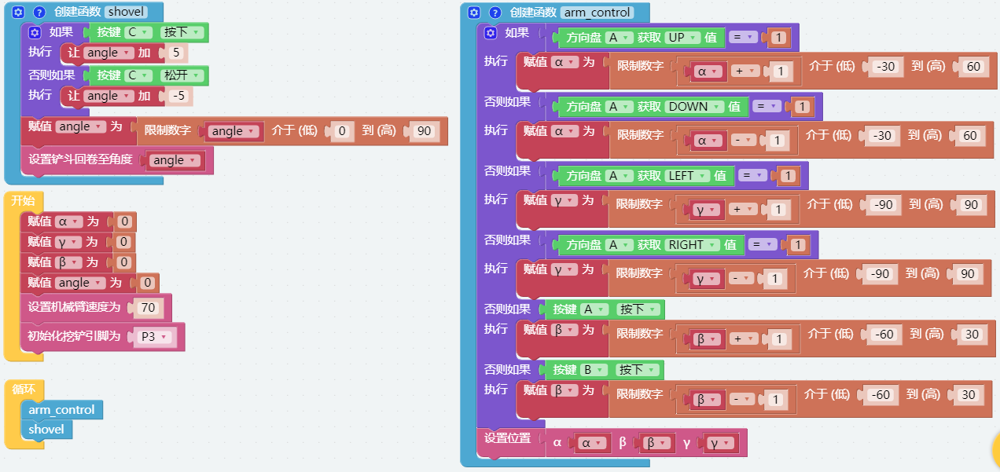

.. _clip_remote:

竖直夹 - 远程遥控
-------------------------------

创建一个新项目并为其编写代码，这样我们就可以在控制机械臂的同时控制竖直夹。

**第一步** 

导入 [arm_control] 库，如果之前没有创建过这个库，请参考: :ref:`创建库`。

在 **我的库** 页面, 选择您创建的库并单击 **导入**.

导入后，此库为折叠样式。您可以右键单击它并单击 **展开块** ，这样您就可以看到它的内部代码。

**第二步** 

创建变量 (``α``, ``β``, ``γ`` 和 ``angle``) 设置初始值为0, 然后初始化 PiArm 的转速和竖直夹引脚。

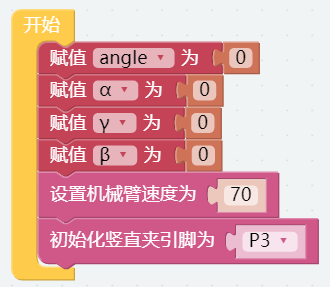

**第三步** 

新建一个函数 [clip]，按如下步骤编写代码，即可通过按钮控制竖直夹。

* 从 **远程遥控** 页面添加一个按钮C。
* 使用 [如果...执行...] 代码块作判断条件。如果按下按钮C，则让变量 ``angle`` 加5；如果松开按钮C，则让变量 ``angle`` 减5。
* 用 [限制数字 angle 介于（低）0 到（高）90] 将变量 ``angle`` 的值限制为0-90，因为竖直夹的活动范围时0-90。
* 根据变量 ``angle`` 设置竖直夹活动的角度。

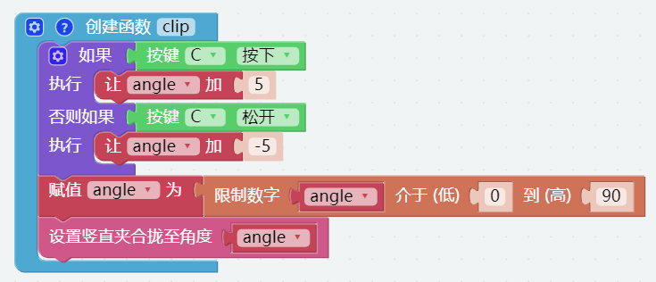

**第四步** 

将 [arm_control] 和 [clip] 函数分别从 **函数** 类别拖到 [循环] 块。

点击下载按钮后，按住按钮C，竖直夹慢慢夹紧；当你松开按钮时，竖直夹会慢慢张开。同时，您可以使用远程遥控页面上的方向键和按钮A/B来控制机械臂的移动。

.. note::
    您也可以在EzBlock Studio的示例页面找到名称为Hanging Clip - Remote Control，直接点击运行或编辑查看代码块。

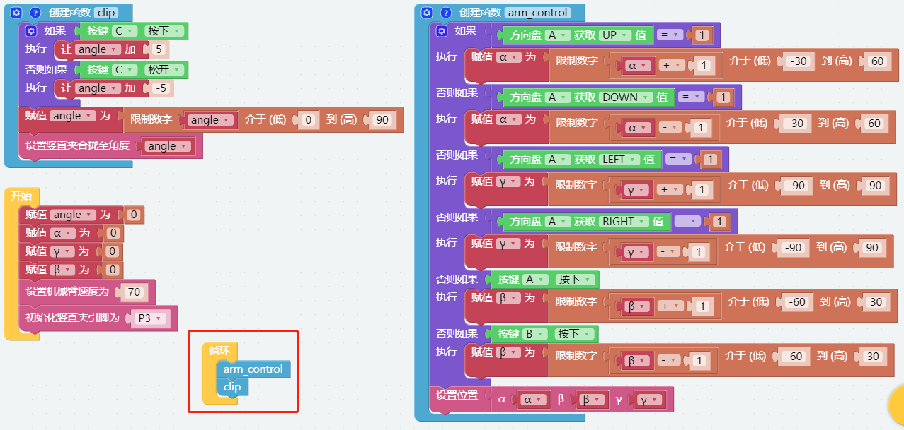

.. _electro_remote:

电磁铁 - 远程遥控
--------------------------------------

创建一个新项目并为其编写代码，这样我们就可以在控制机械臂的同时控制电磁铁。

**第一步** 

导入 [arm_control] 库, 如果之前没有创建过这个库, 请参考: :ref:`创建库`。

在 **我的库** 页面, 选择您创建的库并单击 **导入**。

导入后，此库为折叠样式。您可以右键单击它并选择 **展开块** ，这样您就可以看到它的内部代码。

**第二步** 

创建变量 (``α``, ``β`` and ``γ``) 并将初始值设置为0, 然后初始化 PiArm 的旋转速度和电磁铁的引脚。

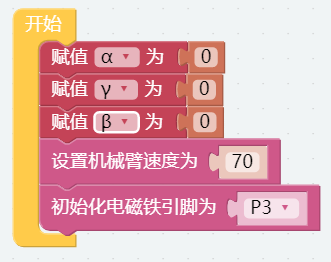

**第三步** 

创建一个新的函数 [electromagnet]，按照如下步骤编写代码，这样就可以通过按钮控制电磁铁了。

* 从远程控制页面再添加一个按钮C
* 使用 [如果...执行...] 块作为判断条件。如果按下按钮C，打开电磁铁；否则，让电磁铁关闭。

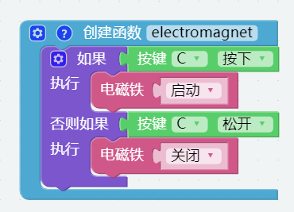

**第四步** 

将 [arm_control] 和 [electromagnet] 函数分别从 **函数** 类别拖到 [循环] 块。

点击下载按钮后，当按下按钮C时，电磁铁开启（此时是磁性的，可以用铁吸附材料）；松开按钮 C 时，电磁铁关闭。同时，您可以使用遥控器页面上的方向键和按钮 A/B来控制手臂的移动。

.. note::
    您也可以在EzBlock Studio的示例页面找到名称为Electromagnet - Remote Control，直接点击运行或编辑查看代码块。

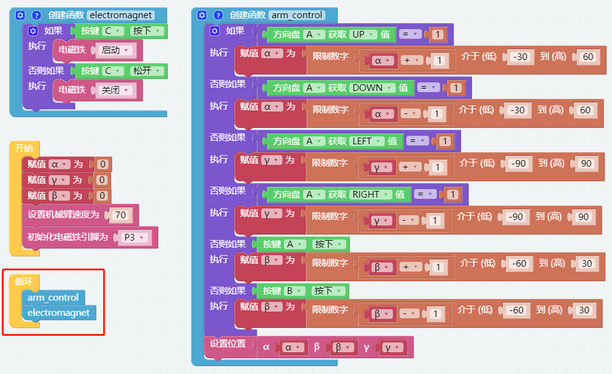

