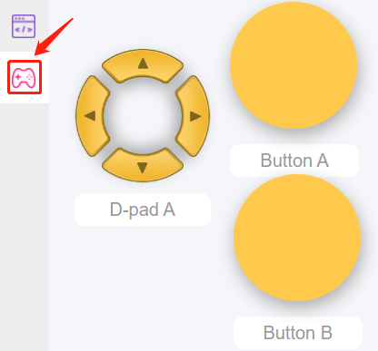
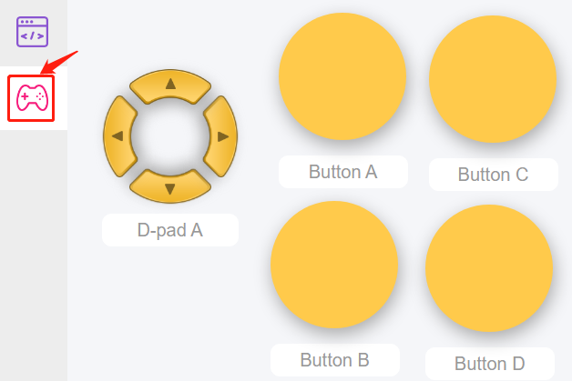
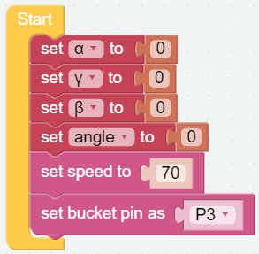
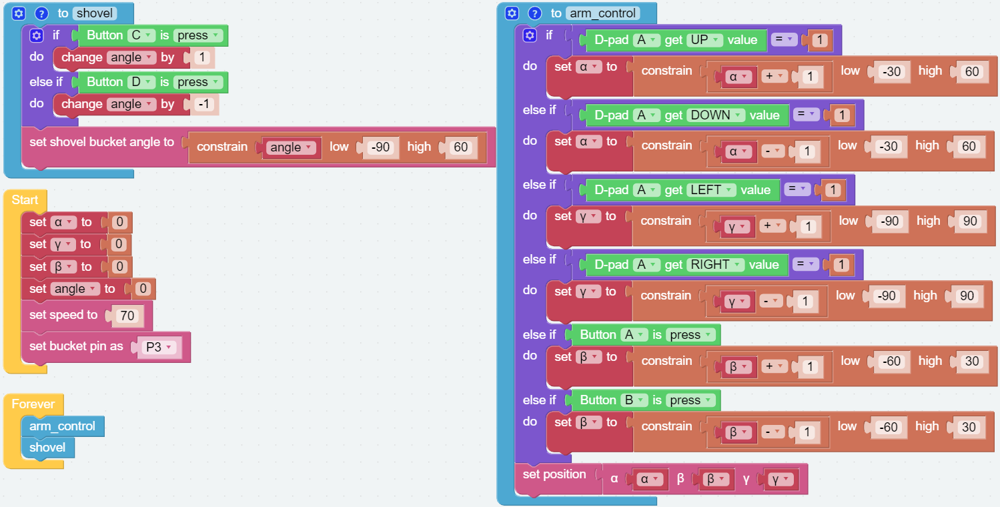
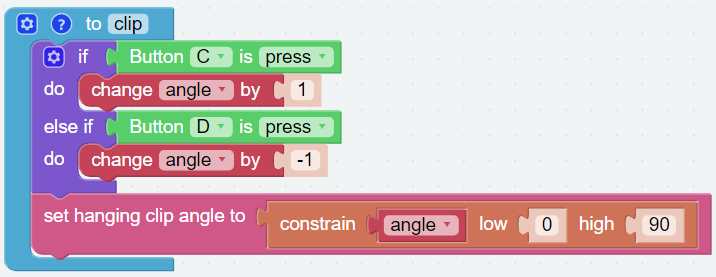
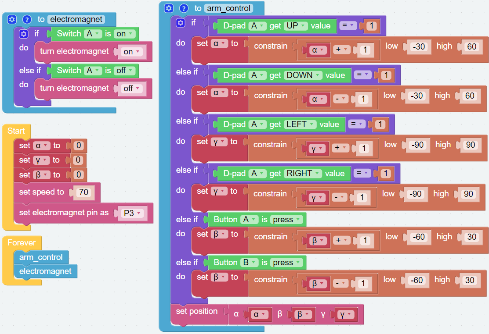

Remote Control
==================

In addition to the dual joystick module, we can also use the widgets on the `Remote Control <https://docs.sunfounder.com/projects/ezblock3/en/latest/remote.html>`_ page in **EzBlock Studio** to control **PiArm** movement.

* :ref:`ezb_arm_remote`
* :ref:`ezb_create_library`
* :ref:`ezb_shovel_remote`
* :ref:`ezb_clip_remote`
* :ref:`ezb_electro_remote`

.. _ezb_arm_remote:

Arm - Remote Control
---------------------------------------

PiArm's arm can be controlled in two ways: :ref:`arm_angle` and :ref:`arm_coor`.

* :ref:`arm_angle`: Writes a certain angle to the three servos on the arm, thus rotating the arm to a specific position.
* :ref:`arm_coor`: Create a spatial right-angle coordinate system for the arm and set the control point. Set the coordinates of the control point so that the arm can reach a specific position.

The :ref:`arm_angle` is used here.

**Step 1** 

To use the remote control function, you need to enter the **Remote Control** page from the left side of main page, and then drag one D-pad and 3 buttons to the central area.

Back in the programming page, you will see an additional Remote category, and the D-pad and Button block appear in it.

* [Button () get value]: This block is used to read the value of the button, press is 1, release is 0.
* [Button () is (press/release)]: This block and ``Button () get value = (0/1)`` have the same effect and can be used directly to determine whether a button is pressed or not.
* [D-pad () get () value]: This block is used to read the up/down/left/right (selected through the drop-down menu) pad values, press for 1 and release for 0.

.. image:: img/control4.png
  :width: 500

**Step 2** 

Create 3 variables (``α``, ``β`` and ``γ``) and set the initial values, and set the rotation speed of PiArm to 70%.

.. image:: img/remote01.png

**Step 3** 

Create a function called [arm_control] to set the rotation direction of the PiArm based on the arrow keys and button values.

.. note::

    The function name cannot contain spaces, and two words can be connected by ``_``.

.. note::

    * ``α``, ``β`` and ``γ`` represent the 3 servo rotation ranges on PiArm, refer to: :ref:`arm_angle`.
    * [constrain () low () high ()]: From Math category for setting the variation of a constant to a certain range.
    * [if else]: Conditional judgment block, you can create multiple conditional judgments by clicking the set icon and dragging [else] or [else if] to the right below the [if].

* If the UP button (▲) of D-pad is pressed, the Arm will extend forward.
* If the Down button (▼) of D-pad is pressed, the Arm will retract backward.
* If the LEFT button (◀) of D-pad is pressed, the Arm will turn left.
* If the RIGHT button (▶) of D-pad is pressed, the Arm will turn right.
* If Button A is pressed, the Arm will lower down.
* If Button B is pressed, the Arm will raise up.

**Step 4** 

Put the function [arm_control] into [Forever] for loop execution, and finally click the **Download** button to run the code.

After that you can use the D-pad and Button A/B on the **Remote Control** page to control the movement of the Arm.

.. note::

    * The functions must be placed before the [start] and [Forever] blocks.    
    * You can also find the code with the same name on the EzBlock Studio **Examples** page and click Run or Edit directly to view the result.

.. _ezb_create_library:

Create a Library
-------------------------

To be able to use the function - [arm_control] in other code later, you can create it as a library and import it when you need to use it.

**Step 1**

Open the menu icon in the upper right corner and select **Create Library**.

.. image:: img/create_libr.png

**Step 2**

Select the function, there is only one function here, so **arm_control** is selected by default.

**Step 3**

Name the library and fill in the description so that it can be better distinguished later.

.. image:: img/name_libr.png

**Step 4**

Wait for the prompt to save successfully and the library will be saved in **My Library** on your personal page. You can also see it when you click **Import Library**.

.. _ezb_shovel_remote:

Shovel Bucket - Remote Control
-----------------------------------

Create a new project and write code for it so that we can control the :ref:`shovel` while controlling the arm.

**Step 1** 

Import [arm_control] library, if you have not created this library before, please refer to: :ref:`ezb_create_library`.

.. image:: img/remote12.png

In the **Mylib** page, select the library you created and click **Import**.

.. image:: img/remote12ii.png

After importing, this library is in a collapsed style. You can right-click on it and click **Expand Block**, so that you can see its internal code.

.. image:: img/arm_import.png

**Step 2**

Go to the remote control page and drag a D-pad and two buttons out again, because the import library will not import the widgets, so you need to drag them in again. Add two more buttons to control the angle of the Shovel Bucket.

**Step 3** 

Create the variables (``α``, ``β``, ``γ`` and ``angle``) and set the initial values to 0, then initialize the PiArm rotation speed and the pin of Shovel Bucket.

**Step 4** 

Create a new function [shovel], and write the code as follows to control :ref:`shovel` with two buttons.

* Use [if () else ()] block as a judgment condition. If button C is pressed, the variable ``angle`` is added by 1; if button D is pressed, the variable ``angle`` is subtracted by 1.
* Constrain the value of variable ``angle`` to -90 ~ 60 with [constrain () low() high ()] block.
* Set the angle of :ref:`shovel` according to the variable ``angle``.

**Step 5** 

Drag the [arm_control] and [shovel] functions from the **Functions** category to the [Forever] block respectively.

After clicking the download button, use the D-pad and buttons A/B on the remote control page to control the movement of the arm, and then use buttons C/D to control the addition/decrease of the bucket angle.

.. note::

    * The functions must be placed before the [start] and [Forever] blocks.    
    * You can also find the code with the same name on the EzBlock Studio **Examples** page and click Run or Edit directly to view the result.

.. _ezb_clip_remote:

Hanging Clip - Remote Control
-------------------------------

Create a new project and write code for it so that we can control the :ref:`Hanging Clip` while controlling the arm.

**Step 1** 

Import [arm_control] library, if you have not created this library before, please refer to: :ref:`Create a Library`.

.. image:: img/remote12.png

In the **Mylib** page, select the library you created and click **Import**.

.. image:: img/remote12ii.png

After importing, this library is in a collapsed style. You can right-click on it and click **Expand Block**, so that you can see its internal code.

.. image:: img/arm_import.png

**Step 2**

Go to the remote control page and drag a D-pad and two buttons out again, because the import library will not import the widgets, so you need to drag them in again. Add two more buttons to control the angle of the Hanging Clip.

**Step 3** 

Create the variables (``α``, ``β``, ``γ`` and ``angle``) and set the initial values to 0, then initialize the PiArm rotation speed and the pin of Hanging Clip.

**Step 4** 

Create a new function [clip], and write the code as follows to control :ref:`clip` with two buttons.

* Use [if () else ()] block as a judgment condition. If button C is pressed, the variable ``angle`` is added by 1; if button D is pressed, the variable ``angle`` is subtracted by 1.
* Constrain the value of variable ``angle`` to 0 ~ 90 with [constrain () low() high ()] block.
* Set the angle of :ref:`clip` according to the variable ``angle``.

**Step 5** 

Drag the [arm_control] and [clip] functions from the **Functions** category to the [Forever] block respectively.

After clicking the download button, use the D-pad and buttons A/B on the remote control page to control the movement of the arm, and then use buttons C/D to control the opening and closing of the Hanging Clip.

.. note::

    * The functions must be placed before the [start] and [Forever] blocks.    
    * You can also find the code with the same name on the EzBlock Studio **Examples** page and click Run or Edit directly to view the result.

.. _ezb_electro_remote:

Electromagnet - Remote Control
--------------------------------------

Create a new project and write code for it so that we can control the :ref:`Electromagnet` while controlling the arm.

**Step 1** 

Import [arm_control] library, if you have not created this library before, please refer to: :ref:`Create a Library`.

.. image:: img/remote12.png

In the **Mylib** page, select the library you created and click **Import**.

.. image:: img/remote12ii.png

After importing, this library is in a collapsed style. You can right-click on it and click **Expand Block**, so that you can see its internal code.

.. image:: img/arm_import.png

**Step 2** 

Go to the remote control page and drag a D-pad and two buttons out again, because the import library will not import the widgets, so you need to drag them in again. In addition, add a **switch** widget to turn the Electromaget on/off.

**Step 3**

Create the variables (``α``, ``β``, and ``γ``) and set the initial values to 0, then initialize the PiArm rotation speed and the pin of Electromaget.

**Step 4** 

Create a new function [electromagnet], and write code for it as the following steps, so that you can control :ref:`electro` by the **Switch** widget.

* Use [if () else ()] block as a judgment condition. If the switch is on, the Electromaget is activated; if the switch is off, the Electromaget is turned off.

**Step 5** 

Drag the [arm_control] and [electromaget] functions from the **Functions** category to the [Forever] block respectively.

After clicking the download button, when the switch toggles to on, the electromagnet turns on (it is magnetic at this time, you can use iron adsorption material); when the switch toggles to off, the electromagnet turns off. At the same time, you can use the D-pad and buttons A/B on the remote control page to control the movement of the arm.

.. note::

    * The functions must be placed before the [start] and [Forever] blocks.    
    * You can also find the code with the same name on the EzBlock Studio **Examples** page and click Run or Edit directly to view the result.

