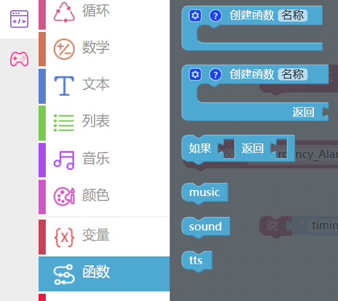
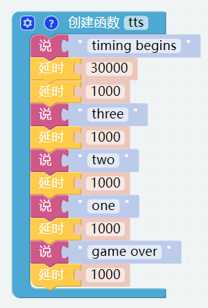
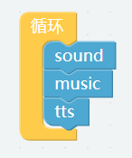
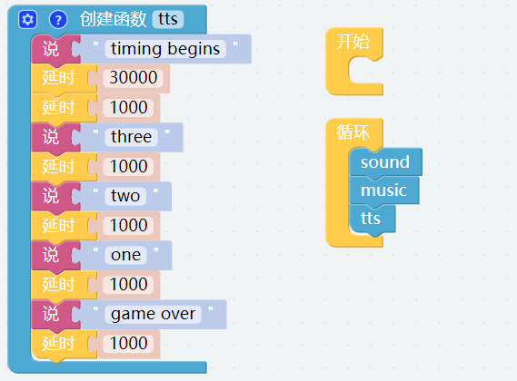

声音效果
================

Robot HAT内置扬声器，可以播放一些音乐和音效，也可以实现TTS语音功能​​。

代码块小提示
-------------------

* 这个代码块是一个单独的线程，可以播放一些内置的背景音乐。

* 这个代码块可以播放一些内置的声音效果。

* 这个代码块可以输入一些文字然后让 PiArm 用语音讲出来。

.. image:: media/sound3.png

编程
--------------------------

**第一步**

构建 **函数** 是编程里很重要的一部分, 尤其是当执行多次相同的操作时，把这些操作放到一个新声明的函数中，可以极大的简化代码。

点击 **函数** 类别并选择相应的代码块，已经创建好的函数也会出现在这个部分。

我们在这里使用没有返回结果的 **函数** 块。

**第二步**

创建一个名为 [music] 的函数，创建好之后可以在 **函数** 的类别中找到它。

函数 [music] 实现的功能为以50%的音量播放背景音乐 peace.mp3。

* [设置背景音乐音量为()]: 用于设置背景音乐的音量，范围为0%-100%。
* [播放背景音乐()]: 这个代码块是一个单独的线程，可以播放一些内置的背景音乐。

**第三步**

创建一个名为 [sound] 的函数，让 PiArm 播放音效。

* [播放音效 () 音量为 () %]: 这个代码块可以播放一些内置的音效，音量范围为0%-100%。

**第四步**

和上面类似，创建一个名为 [tts] 的函数，功能是让 PiArm 用语言说话。

* [说 ()]: 这个代码块可以将您输入的文字转化成语音，并由 PiArm 读出来。

**第五步**

在 **函数** 类别中, 将刚刚创建的三个函数拖拽到 [循环] 块中以便按顺序执行它们。

**第六步**

搭建完代码后，单击右下角的 **下载** 按钮将其下载到 PiArm。

现在你会发现 PiArm 先在 [sound] 函数中播放音效，然后在 [music] 函数中播放背景音乐。播放背景音乐时，运行 [tts] 功能进行计时，然后在30秒后用语音播报倒计时。

.. note::

    您也可以在Ezblock Studio的示例页面找到同名的代码，直接点击运行或编辑查看代码块。

