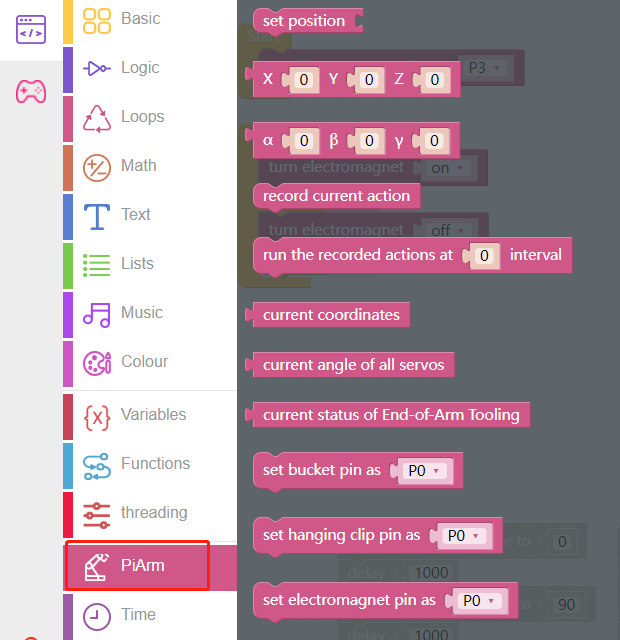

安装并测试三个臂端工具
================================

这是第一个项目，将教会您如何组装和使用 PiArm 的三个臂端工具。

基本代码块提示
----------------------------

* 程序的基本结构由下面两个代码块构成, [开始] 代码块用于做一些初始化(里面没有放置代码块也不能删除)) 而 [循环] 顾名思义是一个连续的循环从而保证程序一直响应。

* 下面这个代码块用于设置程序的间隔时间，单位为毫秒。

PiArm代码块提示
----------------------

在这里可以找到一些PiArm专用的代码块。

.. _ezb_shovel:

铲斗
--------------------------

#. 组装 :ref:`shovel`。

#. 开始编写代码来使铲斗动起来。

    把 [初始化铲斗引脚为P3] 代码块放入 [开始] 块中从而将铲斗的引脚初始化为P3。

    .. note::
        因为在组装图中，臂端工具的舵机是连接的P3引脚，当然你也可以自己接到其它的备用引脚。

    .. image:: img/bucket31.png

#. 每隔一秒钟将铲斗从-60转动到90°，再往复。

    * [设置铲斗回卷至角度 ()]: 用于设置铲斗角度，舵机本身的旋转角度是-90 ~ 90，但由于结构限制，最终的角度范围是-90 ~ 60。
    * [延时 ()]: 从 **基本** 类别中可以找到, 用于设置两个代码块之间的运行间隔时间，单位为毫秒。

    .. image:: img/bucket32.png

#. 搭建完代码之后，单击右下角的 **下载** 按钮将其下载到 PiArm 中。然后你就可以看见铲斗在来回移动，可以单击运行按钮来停止运行代码。

    .. note::
        如果你发现舵机为0时，铲斗不是垂直向下的，需要松开舵机螺钉，再重新将铲斗以垂直向下的角度安装一遍。

    .. image:: img/bucket3.png

.. _ezb_clip:

竖直夹
------------------------

#. 组装 :ref:`clip`。

#. 然后搭建代码块来让竖直夹动起来。

    将 [初始化竖直夹引脚为P3] 代码块放到 [开始] 块中使竖直夹的引脚初始化为P3.

    .. note::
        因为在组装图中，臂端工具的舵机是连接的P3引脚，当然你也可以自己接到其它的备用引脚。

    .. image:: img/clip31.png

#. 每隔一秒让竖直夹在0°到90°的范围里来回移动。

    * [设置数值夹合拢至角度()]: 用于设置竖直夹的角度，范围0-90度。
    * [延时()]: 从 **基本** 类别中可以找到, 用于设置两个代码块之间的运行间隔时间，单位为毫秒。

    .. image:: img/clip32.png

#. 搭建完代码之后，单击右下角的 **下载** 按钮将其下载到 PiArm 中。然后你就可以看见竖直夹在不断张合，可以单击运行按钮来停止运行代码。

    .. note::
        如果你发现竖直夹在90°时，不是垂直向下并合拢。需要将竖直夹的固定螺钉取下，重新再安装一遍。

    .. image:: img/clip3.png

.. _ezb_electro:

电磁铁
-------------------------

#. 组装 :ref:`electro`。

#. 然后搭建代码块让电磁铁工作。

    将 [初始化电磁铁引脚为P3] 代码块放入 [开始] 块中使电磁铁的引脚初始化为P3.

    .. note::
        因为在组装图中，臂端工具的舵机是连接的P3引脚，当然你也可以自己接到其它的备用引脚。

    .. image:: img/electromagnet21.png

#. 每隔一秒让电磁铁反复的通电和断电。

    * [电磁铁 (启动/关闭)]: 用于让电磁铁通电和断电。
    * [延时()]: 从 **基本** 类别中可以找到, 用于设置两个代码块之间的运行间隔时间，单位为毫秒。

    .. image:: img/electromagnet22.png

#. 搭建完代码之后，单击右下角的 **下载** 按钮将其下载到 PiArm 中。然后你会发现电磁铁每秒通电一次，电磁铁上的LED（D2）亮起，表示它已通电，此时可以用来吸附一些铁制品。

    .. image:: img/electromagnet2.png
