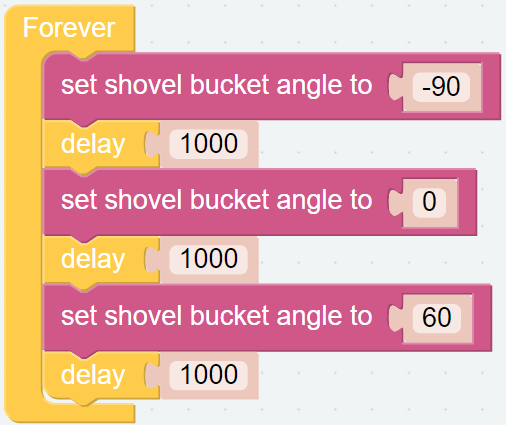
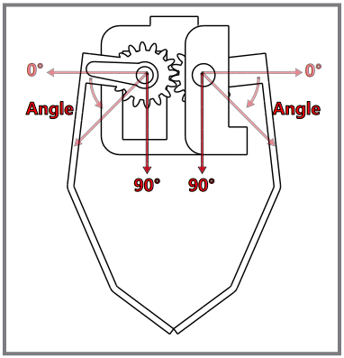
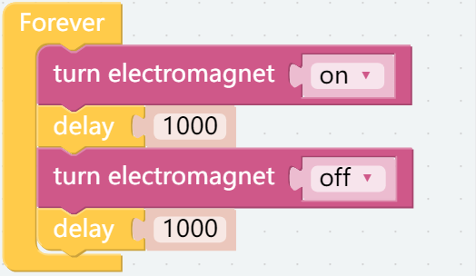

安装并测试三个头部配件
================================

这是第一个项目，将教会您如何组装和使用 PiArm 的三个头部配件。

基本代码块提示
----------------------------

* 程序的基本结构由下面两个代码块构成, [开始] 代码块用于做一些初始化(里面没有放置代码块也不能删除)) 而 [循环] 顾名思义是一个连续的循环从而保证程序一直响应。

.. image:: img/move8.png

* 下面这个代码块用于设置程序的间隔时间，单位为毫秒。

PiArm代码块提示
----------------------

在这里可以找到一些PiArm专用的代码块。

.. image:: img/piarm_block.png

铲斗
--------------------------

**第一步**

将铲斗组装到 **PiArm** 的末端.

铲斗的旋转范围如下。

.. image:: img/bucket2.png

**第二步**

开始编写代码来使铲斗动起来。

把 [初始化铲斗引脚为P3] 代码块放入 [开始] 块中从而将铲斗的引脚初始化为P3。

.. note::
    因为在组装图中，头部配件的舵机是连接的P3引脚，当然你也可以自己接到其它的备用引脚。

.. image:: img/bucket31.png

**第三步**

每隔一秒钟将铲斗从0°转动到90°。

* [设置铲斗回卷至角度 ()]: 用于设置铲斗角度，范围0-90度。
* [延时 ()]: 从 **基本** 类别中可以找到, 用于设置两个代码块之间的运行间隔时间，单位为毫秒。

**第四步**

搭建完代码之后，单击右下角的 **下载** 按钮将其下载到 PiArm 中。

然后你就可以看见铲斗在来回移动，可以单击运行按钮来停止运行代码。

竖直夹
------------------------

**第一步**

将竖直夹组装到 **PiArm** 末端。

.. image:: img/clip.png

竖直夹的工作范围如下。

**第二步**

然后搭建代码块来让竖直夹动起来。

将 [初始化竖直夹引脚为P3] 代码块放到 [开始] 块中使竖直夹的引脚初始化为P3.

.. note::
    因为在组装图中，头部配件的舵机是连接的P3引脚，当然你也可以自己接到其它的备用引脚。

.. image:: img/clip31.png

**第三步**

每隔一秒让竖直夹在0°到90°的范围里来回移动。

* [设置数值夹合拢至角度()]: 用于设置竖直夹的角度，范围0-90度。
* [延时()]: 从 **基本** 类别中可以找到, 用于设置两个代码块之间的运行间隔时间，单位为毫秒。

.. image:: img/clip32.png

**第四步**

搭建完代码之后，单击右下角的 **下载** 按钮将其下载到 PiArm 中。

然后你就可以看见竖直夹在不断张合，可以单击运行按钮来停止运行代码。

.. image:: img/clip3.png

电磁铁
-------------------------

**第一步**

将电磁铁组装到 **PiArm** 的末端。

.. image:: img/electromagnet.png

**第二步**

然后搭建代码块让电磁铁工作。

将 [初始化电磁铁引脚为P3] 代码块放入 [开始] 块中使电磁铁的引脚初始化为P3.

.. note::
    因为在组装图中，头部配件的舵机是连接的P3引脚，当然你也可以自己接到其它的备用引脚。

.. image:: img/electromagnet21.png

**第三步**

每隔一秒让电磁铁反复的通电和断电。

* [电磁铁 (启动/关闭)]: 用于让电磁铁通电和断电。
* [延时()]: 从 **基本** 类别中可以找到, 用于设置两个代码块之间的运行间隔时间，单位为毫秒。

**第四步**

搭建完代码之后，单击右下角的 **下载** 按钮将其下载到 PiArm 中。

然后你会发现电磁铁每秒通电一次，电磁铁上的LED（D2）亮起，表示它已通电，此时可以用来吸附一些铁制品。

.. image:: img/electromagnet2.png
