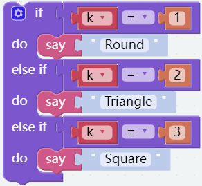
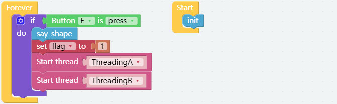

GAME Ball Collection
==============================

For this project, we plan to make another game, using electromagnets to suck small iron pieces into the corresponding box within the specified time.

To implement this game, we only need to replace the clip with an electromagnet on the basis of the previous game, change the remote sensing operation to ezblock remote control and add a function ``say_shape()`` to randomly broadcast the shape of the iron piece.

**TIPS**

The following block can randomly return a number from 1 to 3, and then assign it to the variable ``k``.

Then judge when k is 1, 2, 3, respectively broadcast the three shapes of the iron sheet, so that the expected effect can be achieved.

**EXAMPLE**

The complete code is shown below.

.. image:: media/gameII1.png

.. image:: media/gameII2.png

.. image:: media/gameII3v2.png

.. image:: media/gameII0.png

