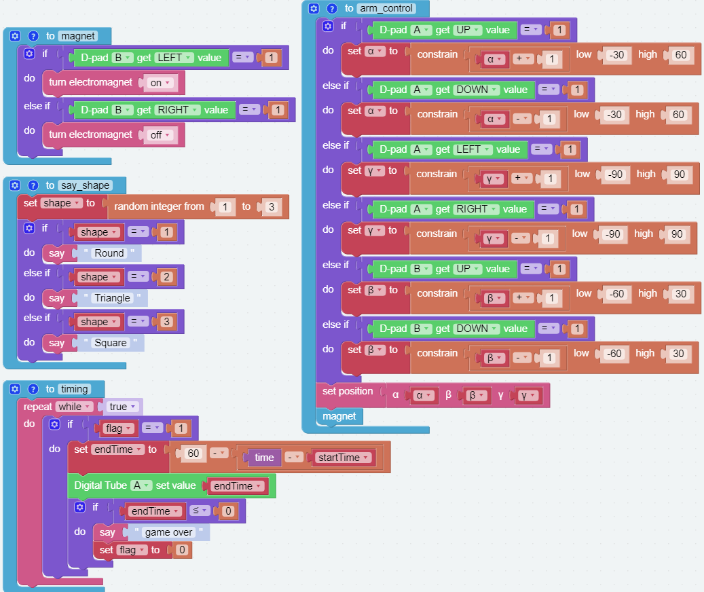

GAME - Iron Collection
==============================

In this project, prepare 3 shapes of iron pieces: triangle, circle and square, PiArm will randomly say a shape, you need to control PiArm to put the corresponding shape of iron pieces into the corresponding box in the specified time, you will not be able to control PiArm when the time is over.

.. image:: media/iron1.png
    :width: 800

Programming
-----------------

**Step 1**

Create five variables (``α``, ``β``, ``γ``, ``flag``, ``shape``) and and set initial values for them. Then initialize the PiArm rotation speed and **Electromagnet** pin.

.. note::

    * ``α``, ``β`` and ``γ`` represent the 3 servo rotation ranges on PiArm, refer to: :ref:`Tips on the Angle of the Arm`.

**Step 2**

Drag 2 D-pads from the remote control page to control PiArm, a button to start the game, and a Digital Tube to display the time.

.. image:: media/iron3.png

**Step 3** 

Create a function named [magnet] to enable the left and right control of the D-pad B to turn the electromagnet on and off.

**Step 4**

Create a function named [control] to implement the Arm of PiArm to be controlled by the D-pad A and D-pad B.

* If the UP button (▲) of D-pad **A** is pressed, the Arm will extend forward.
* If the Down button (▼) of D-pad **A** is pressed, the Arm will retract backward.
* If the LEFT button (◀) of D-pad **A** is pressed, the Arm will turn left.
* If the RIGHT button (▶) of D-pad **A** is pressed, the Arm will turn right.
* If the UP button (▲) of D-pad **B** is pressed, the Arm will raise up.
* If the Down button (▼) of D-pad **B** is pressed, the Arm will lower down.

.. note::

    * ``α``, ``β`` and ``γ`` represent the 3 servo rotation ranges on PiArm, refer to: :ref:`Tips on the Angle of the Arm`.
    * [constrain () low () high ()]: From Math category for setting the variation of a constant to a certain range.
    * [if else]: Conditional judgment block, you can create multiple conditional judgments by clicking the set icon and dragging [else] or [else if] to the right below the [if].

**Step 5**

Create the function [say_shape] to have PiArm speak a random shape.

**Step 6**

The main flow of the code: when **button E** is pressed, the timer starts and PiArm will say a random shape. ``flag`` is used to represent the start of the countdown and you can control PiArm.

**Step 7**

Create a function named [timing] to use for timing. The game time is set to 60 seconds, after the time is up, PiArm will say Game over and you will no longer be able to control it.

Here the [time] block is used for timing, in Forever, when button E is pressed, the timing starts and [time - startTime] represents how many seconds have passed since then. 

**Step 8**

Let the [timing] function run in a separate thread. This allows you to control PiArm while counting down.

The complete code is as follows:

