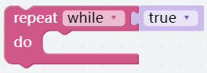
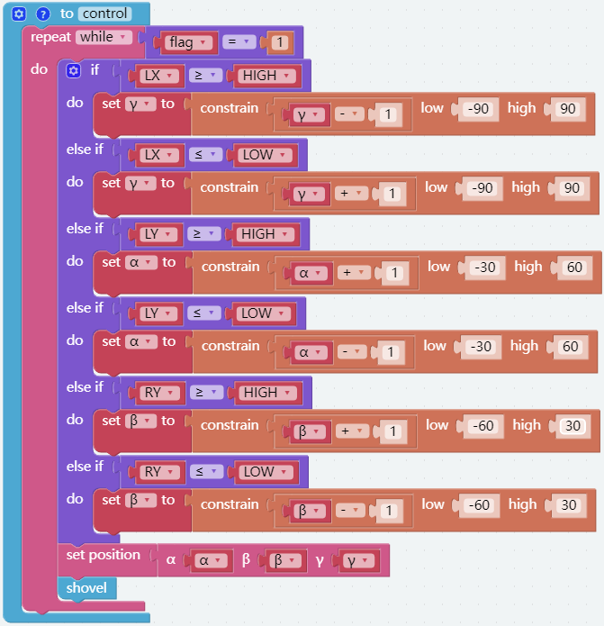
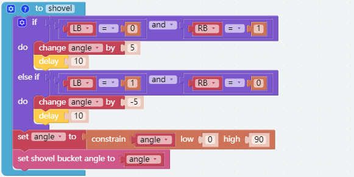
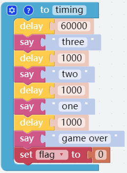
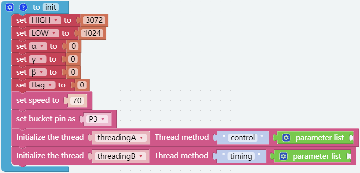
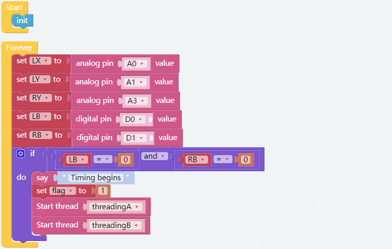

GAME Rubber Duck Collection
==============================

In this project, we plan to use the joystick module, TTS module and clip to make a game of catching dolls at a time, catching more dolls within the specified time.

To implement this game, we need to implement two functions, the first is to control the piarm with a joystick, and the second is the timing part. When the specified time is reached, the piarm can no longer be controlled,
Both parts must be executed simultaneously.

**TIPS**

In ezblock, blocks are generally executed sequentially, and the next function can only be run after one function is finished. We can use multi-thread processing to make two functions execute at the same time.

The following block can assign a function to a thread, create a variable ``threadingA`` to represent the thread name, ``function`` represents the name of the function to be assigned to the thread, ``parameter list`` is input parameters of ``function``.

The following block is used to start the thread.

The following block can be used to loop, ``true`` means always loop.

**Step 1:**

Implement a function ``control()`` to control the piarm and clip. The implementation principle is similar to the previous project. In addition, we added a ``flag``, when ``flag = 1``, the piarm is controllable, and when ``flag=0``, the piarm is out of control.

**Step 2:**

Implement function ``timing()`` for timing and voice broadcast.
Running this function will delay 60 seconds and count down to 321 and then announce ``game over``, and set the flag to 0 to make the piarm lose control.

**Step 3:**

Implement a function ``init()``, which is used to initialize the variables and the threads ``TreadingA`` and ``TreadingB``.

**Step 4:**

Finally, call ``init()`` to initialize, read the value of the joystick and judge that when the left and right joystick buttons are pressed at the same time, start two threads and execute the function ``control()``  and ``timing()``.

.. note::
    If the start block contains a function, the start block needs to be executed after the defined function block(put the start block on the left or above the init block), otherwise there may be an error that the function is not defined.

