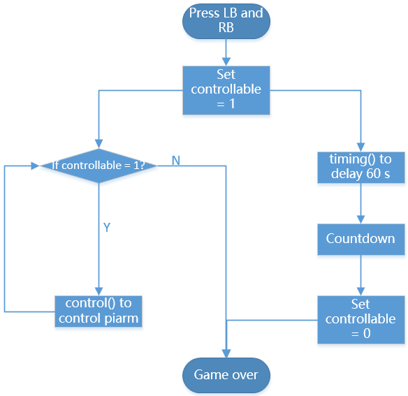

GAME Rubber Duck Collection
==============================

In this project, we plan to use the joystick module, TTS module and clip to make a game of catching dolls at a time, catching more dolls within the specified time.

To implement this game, we need to implement two functions, the first is to control the piarm with a joystick, and the second is the timing part. When the specified time is reached, the piarm can no longer be controlled,
Both parts must be executed simultaneously.

**Run the Code**

.. raw:: html

    <run></run>

.. code-block::

    cd /home/pi/piarm/examples
    sudo python3 game_rubber_duck_collection.py

After running the code, Press the left and right buttons of the joystick together to start the game. After 60 seconds, the countdown will start and the game will end when the countdown is over.

**Code**

.. note::
    You can **Modify/Reset/Copy/Run/Stop** the code below. But before that, you need to go to source code path like ``piarm\examples``. After modifying the code, you can run it directly to see the effect.

.. raw:: html

    <run></run>

.. code-block:: python 

    from robot_hat import Servo,PWM,Joystick,ADC,Pin
    from robot_hat.utils import reset_mcu
    from time import sleep
    from robot_hat import TTS
    import threading

    from piarm import PiArm

    reset_mcu()
    sleep(0.01)
    t = TTS()

    leftJoystick = Joystick(ADC('A0'),ADC('A1'),Pin('D0'))
    rightJoystick = Joystick(ADC('A2'),ADC('A3'),Pin('D1'))

    arm = PiArm([1,2,3])
    arm.hanging_clip_init('P3')
    arm.set_offset([0,0,0])
    controllable = 0

    def control():
        while controllable == 1:	
            arm.speed = 100
            flag = False
            angle1,angle2,angle3 = arm.servo_positions
            angle4 = arm.component_staus

            if leftJoystick.read_status() == "up":
                angle1 += 1
                flag = True
            elif leftJoystick.read_status() == "down":
                angle1 -= 1
                flag = True
            if leftJoystick.read_status() == "pressed":  	
                angle4 += 1
                flag = True
            elif rightJoystick.read_status() == "pressed":	
                angle4 -= 1
                flag = True
            if leftJoystick.read_status() == "left":
                angle3 += 1
                flag = True
            elif leftJoystick.read_status() == "right":
                angle3 -= 1
                flag = True
            if rightJoystick.read_status() == "up":
                angle2 += 1
                flag = True
            elif rightJoystick.read_status() == "down":
                angle2 -= 1
                flag = True

            if flag == True:
                arm.set_angle([angle1,angle2,angle3])
                arm.set_hanging_clip(angle4)
                print('coord: %s , servo angles: %s , clip angle: %s '%(arm.current_coord,arm.servo_positions,arm.component_staus))

    def timing():
        sleep(60)
        t.say("three")
        sleep(1)
        t.say("two")
        sleep(1)
        t.say("one")	
        sleep(1)
        t.say("game over")	
        global controllable
        controllable = 0	

    if __name__ == "__main__":

        thread1 = threading.Thread(target = control)
        thread2 = threading.Thread(target = timing)	
        i = 1
        while i:
            if 	leftJoystick.read_status() == "pressed" and rightJoystick.read_status() == "pressed":
                i = 0
                t.say("timing begins")
                controllable = 1
                thread1.start() 			
                thread2.start()	

**How it works?**

This game is based on the joystick module with additional TTS module and timing functions, we can design a ``timing()`` function to achieve additional functions

.. code-block::

    def timing():
        sleep(60)
        t.say("three")
        sleep(1)
        t.say("two")
        sleep(1)
        t.say("one")	
        sleep(1)
        t.say("game over")	
        global controllable
        controllable = 0

delay 60 seconds and count down to 321 and then announce ``game over``, and set the ``controllable`` to 0 to make the piarm lose control.

.. code-block::

    thread1 = threading.Thread(target = control)
    thread2 = threading.Thread(target = timing)	
    i = 1
    while i:
        if 	leftJoystick.read_status() == "pressed" and rightJoystick.read_status() == "pressed":
            i = 0
            t.say("timing begins")
            controllable = 1
            thread1.start() 			
            thread2.start()	

Since the ``timing()`` function will block the normal progress of the current program, we need to process the ``timing()`` function and the ``control()`` function in separate threads, so that the joystick control and timing can be performed at the same time in no particular order.

The threading class provides the ``Thread()`` function so that we can create threads, ``target=control`` represents the name of the function to be executed, and the ``start()`` function is used to start the thread. We create two
thread objects ``thread1`` and ``thread2`` to achieve the desired effect.

The general process is as follows.

