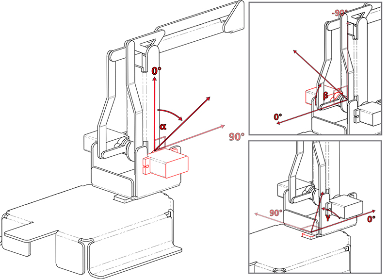
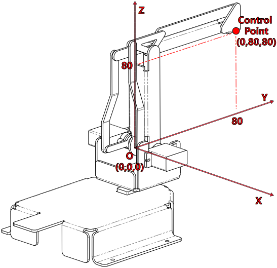

手臂
=================

PiArm 的手臂有两种方法可以控制: :ref:`arm_angle` 和 :ref:`arm_coor` 。

* :ref:`arm_angle`: 向手臂上的三个舵机写入一定的角度，从而使手臂转动到特定的位置。
* :ref:`arm_coor`: 为手臂建立空间直角坐标系并设置控制点，写入控制点的空间坐标，从而让手臂达到特定的位置。

.. _arm_angle:

角度模式
------------

手臂上有三个舵机控制它的上下、左右、前后，我们用 ``α``、 ``β`` 和 ``γ`` 来表示它们的旋转角度，如下图所示。

* ``α(alpha)``： 代表手臂的前后旋转角度，由于结构的限制，建议旋转范围为：-30 ~ 60。
* ``β(beta)``: 代表手臂的上下旋转角度，由于结构的限制，建议的旋转范围是：-60 ~ 30。
* ``γ(gamma)``: 代表手臂的左右旋转角度，范围是：-90 ~ 90。

.. _arm_coor:

坐标模式
-------------

PiArm有一个空间矩形坐标系，其原点位于两侧舵机输出轴的中心点。控制点(Control Point)位于手臂的顶部，刻度单位为毫米。在初始状态下，控制点(Control Point)的坐标为（0，80，80）。

需要注意的是，PiArm的臂长是有限的，如果坐标值的设置超过了其机械运动的极限，PiArm将旋转到一个不可预测的位置。

换句话说，PiArm的总臂长是160毫米，这意味着沿Y轴移动的控制点的极限值应该在（0,0,0）到（0,160,0）之间。但是，由于结构本身的限制，活动范围应该比这个范围小得多。

* X坐标的推荐范围是-80 ~ 80。
* Y坐标的推荐范围是30 ~ 130。
* Z坐标的建议范围是0 ~ 80。