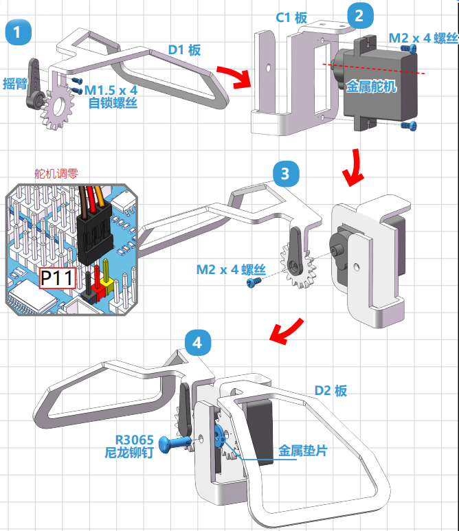
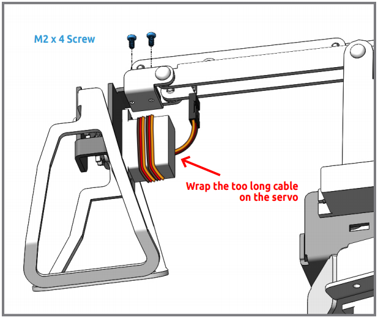

.. _clip:

竖直夹
==============

.. image:: img/clip_usage.jpg
    :width: 500
    :align: center

**组装**

按照下图组装竖直夹。

.. note::
    注意在第3步时需要先将舵机插入到P11进行调零后，再将D1板以垂直方向插入到舵机轴。

将竖直夹用M2x4的螺丝固定到到PiArm的末端。

竖直夹的角度范围是0-90°。

.. image:: img/clip2.png

**使用范围**

* 整个物体重量低于150g。
* 建议物体的可夹高度需低于4cm，宽度低于8.5cm，大于3cm。
* 细长的物体需要找对角度才能夹起。