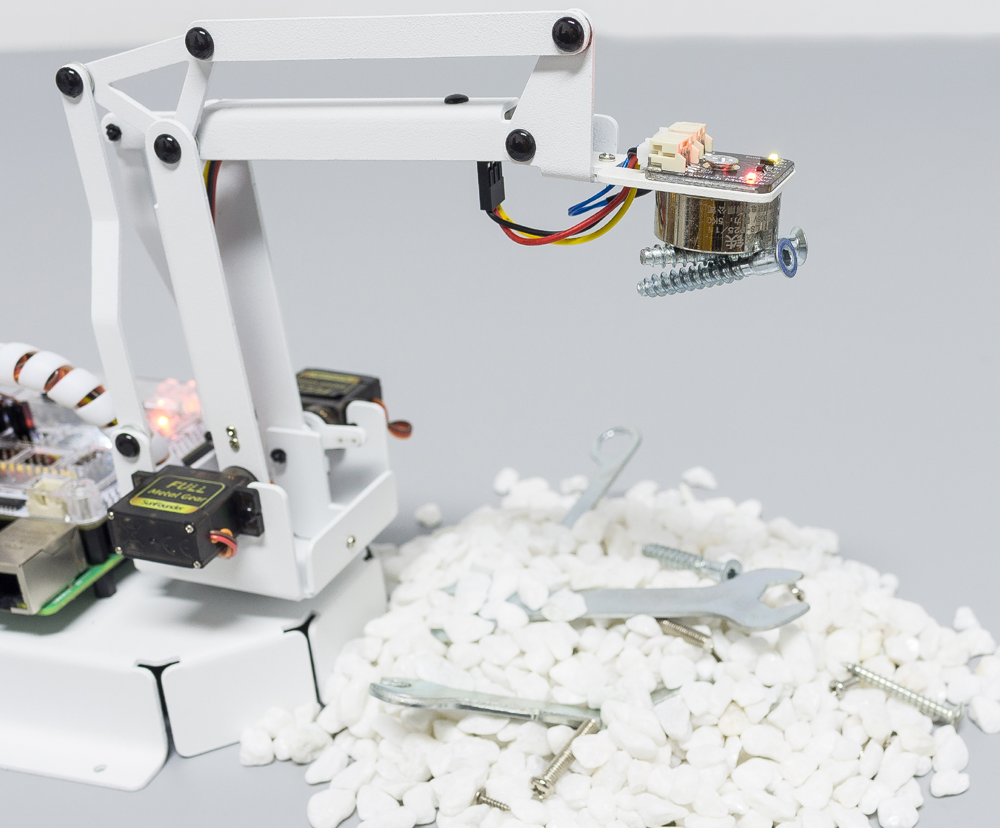
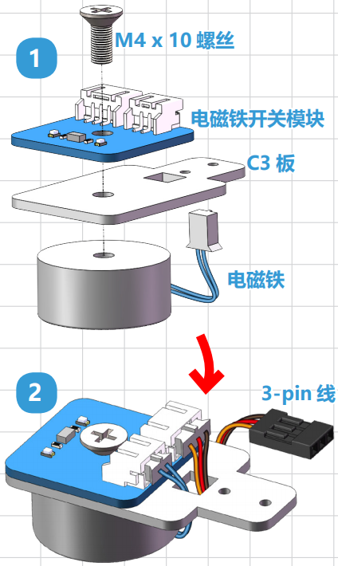
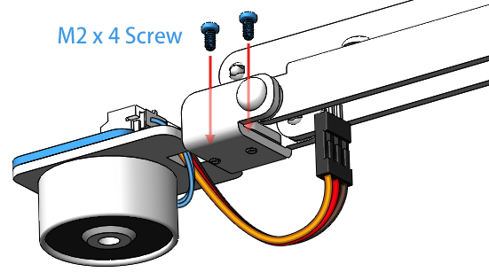

.. _electro:

Electromagnet
===================

**Assembly**

Assemble the electromagnet module according to the diagram below.

Then secure the electromagnet to the end of the **PiArm** with the M2x4 screws.

**Range of use**

* Can only be used to suck ferrous products.
* The larger the surface area of the iron product, the stronger the adsorption.
* It is recommended that the weight of iron objects is less than 150g.

