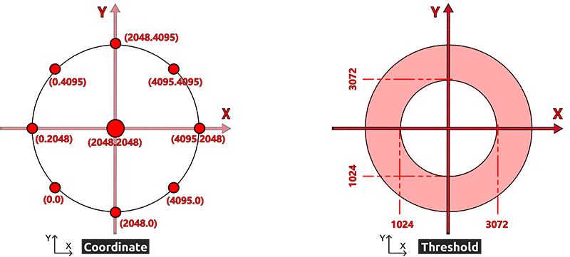

.. _dual_joystick:

双摇杆模块
==================

双摇杆模块，顾名思义，由两个摇杆组成，每个摇杆可以在X、Y和Z方向输出电信号。

.. image:: img/joystick.png
    :width: 600
    :align: center

在使用双摇杆模块之前，你需要把它的8根线连接到Robot HAT的相应引脚上，如下图所示。

.. image:: img/dual_joy.png
    :width: 800

摇杆读数范围在0~4095的平面坐标系中，原点(0,0)在左下角。

举个例子，不推动摇杆时的坐标值为（2048,2048）。如果将摇杆向左推动，坐标为 (0,2048)。当向下推动摇杆时，坐标为 (2048,0)，如下所示。

但是电信号容易波动，很难得到绝对稳定的读数，所以我们通常会设置一个数值区间来判断摇杆目前所处位置。

建议边界值设为3072和1024。当摇杆的读数大于3072时，认为摇杆是向上（或向右）推动；如果读数小于 1024，则认为摇杆杆向下（或向左）推动。

.. note::

    在用Python库中，已经将这些值处理成方向指示，如下图所示：

    .. image:: img/joystick2.png

Z轴按钮按下时输出低电平（0），松开时输出高电平（1）。

.. image:: img/joystick5.png