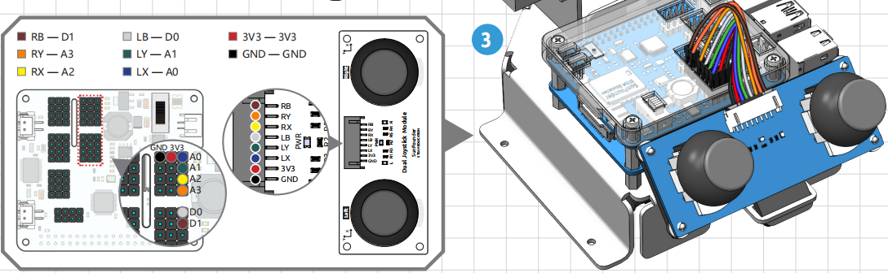

.. _dual_joystick:

Dual Joystick Module
=========================

Dual joystick module, as the name implies, consists of two joysticks, each of which can output electrical signals in X, Y and Z directions.

.. image:: img/joystick.png
    :width: 600
    :align: center

Before you can use the dual joystick module, you need to connect its 8 wires to the corresponding pins of the Robot HAT as shown in the picture below.

The joystick reads in a plane coordinate system from 0 to 4095, with the origin (0,0) in the lower left corner.

As an example, the coordinate value when the joystick is not pushed is (2048,2048). If the joystick is pushed to the left, the coordinates are (0,2048). When the joystick is pushed down, the coordinates are (2048,0), as shown below.

.. image:: img/joystick3.jpg

However, electrical signals tend to fluctuate and it is difficult to get an absolutely stable reading, so we usually set a value interval to determine where the joystick is currently located.

The recommended boundary values are set to 3072 and 1024. when the joystick reading is greater than 3072, the joystick is considered to be pushing up (or right); if the reading is less than 1024, the joystick is considered to be pushing down (or left).

.. note::

    In the Python library, these values have been processed into directional indications as follows.

    .. image:: img/joystick2.png

The Z-axis button outputs a low level (0) when pressed and a high level (1) when released.

.. image:: img/joystick5.png