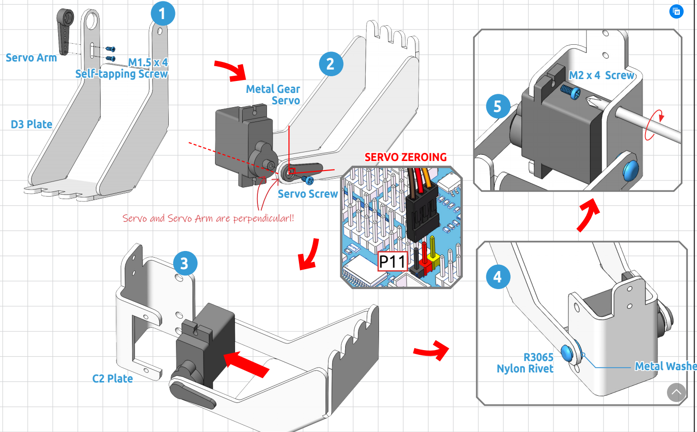

.. _shovel:

Shovel Bucket
================

.. image:: img/shovel_usage.jpg
    :width: 500
    :align: center

**Assembling the Shovel Bucket**

Assemble the Shovel Bucket as shown below.

.. note::
    In step 2 you need to insert the servo into P11 for zeroing before inserting the D3 plate into the servo shaft in a vertical orientation.

Assemble the Shovel Bucket to the end of the PiArm with M2x4 screws.

.. image:: img/bucket.png

The Shovel Bucket has a rotation range of -90 ~ 60.

**Use range**

Can't dig water, can be used to dig sand and gravel.