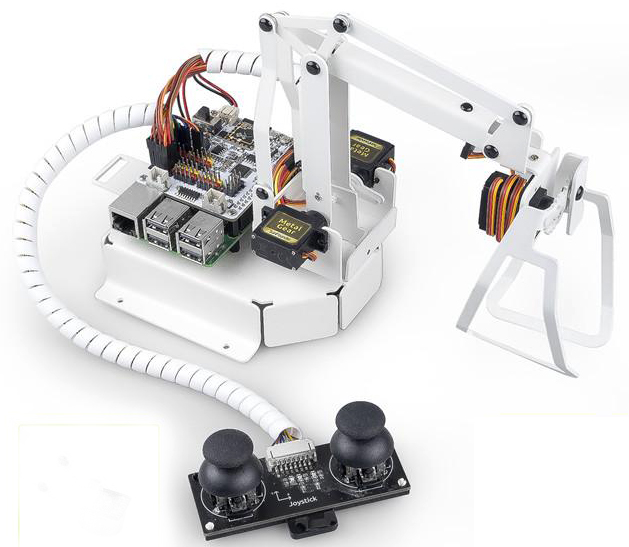

PiArm - SunFounder Robotic Arm for Raspberry Pi
====================================================

Thank you for choosing our PiArm.

PiArm is a three-degree-of-freedom robotic arm for Raspberry Pi. It has 3 interchangeable parts - bucket, hanging clip and solenoid - to help you perform different tasks.

In addition, PiArm offers both remote control and built-in dual joystick module control.

This tutorial includes several parts: device list, assembly guide, programming and appendices. The programming section is divided into two chapters: Playing in Ezblock and Playing in Python, each of which allows you to make PiArm work the way you want it to.

* :ref:`Play with Ezblock`

If you are new to programming, check out this chapter as it introduces Ezblock Studio, a block-based visual programming software that allows you to make PiArm move and implement some interesting projects by simply dragging and dropping blocks.

* :ref:`Play with Python`

If you prefer to program in a more popular programming language - python, you can refer to this section. The chapter covers starting from burning the Raspberry Pi OS, to configuring the Raspberry Pi and finally getting the code running to see the effects, even if you don't have any Python foundation, you can get PiArm working quickly.

.. toctree::
   :maxdepth: 2

   component_list_and_assembly_instructions
   about_robot_hat
   for_ezblock_user
   for_python_user
   appendix
   thank
   
Copyright Notice
--------------------------

All contents including but not limited to texts, images, and code in this manual are owned by the SunFounder Company. You should only use it for personal study,investigation, enjoyment, or other non-commercial or nonprofit purposes, under therelated regulations and copyrights laws, without infringing the legal rights of the author and relevant right holders. For any individual or organization that uses these for commercial profit without permission, the Company reserves the right to take legal action.

