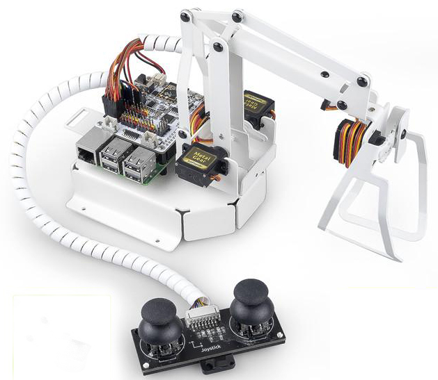

PiArm - 适用于 树莓派 的机械臂
=====================================================

感谢你选择我们的 PiArm。

PiArm 是用于 树莓派 的三自由度机械臂。它有 3 个可互换的工具 - 铲斗、竖直夹和电磁铁 - 可帮助你执行不同的任务。

此外，PiArm 提供远程控制和内置双摇杆模块控制。

本教程包括几个部分：器件列表、装配指南、编程和附录。编程部分分为两章：在 玩转EzBlock 和玩转Python，每一章都允许你让 PiArm 以你想要的方式工作。

* :ref:`play_ezblock`

如果你是编程新手，请查看本章介绍 EzBlock Studio，这是一种基于块的可视化编程软件，可让你通过简单的拖放块来使 PiArm 移动并实现一些有趣的项目。

* :ref:`play_python`

如果你更喜欢用更流行的编程语言——python 编程，你可以参考这一节。本章内容从烧录树莓派操作系统开始，到配置树莓派，最后运行代码看效果，即使没有Python基础也能快速上手PiArm。

.. toctree::
    :maxdepth: 2

    component_list_and_assembly_instructions
    hardware/hardware_intro
    ezblock/for_ezblock_user
    python/for_python_user
    appendix/appendix
    faq

版权声明
---------------

本手册中包括但不限于文字、图片、代码等所有内容均归Emakefun公司所有。根据相关规定和版权法，你只能将其用于个人学习、调查、欣赏或其他非商业或非营利目的，不得侵犯作者和相关权利人的合法权利。对于任何个人或组织未经许可将其用于商业利益，本公司保留采取法律行动的权利。