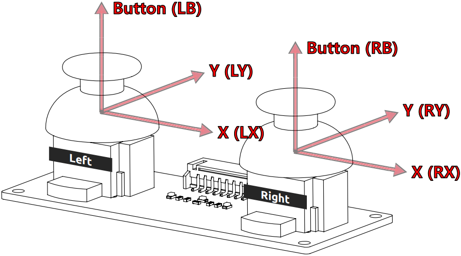
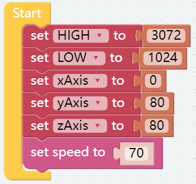
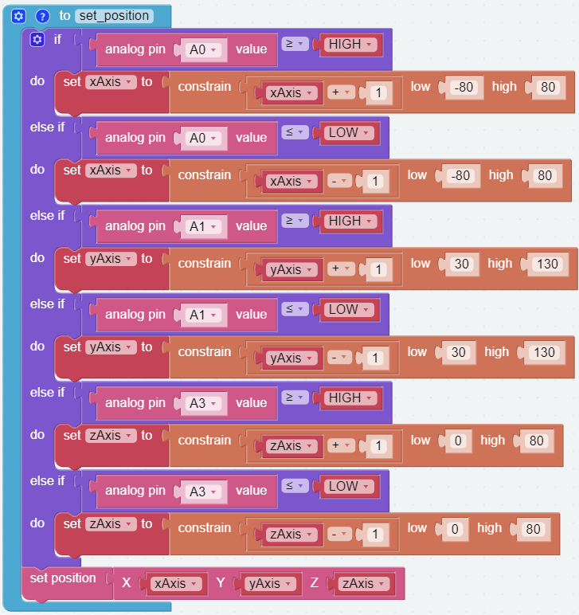
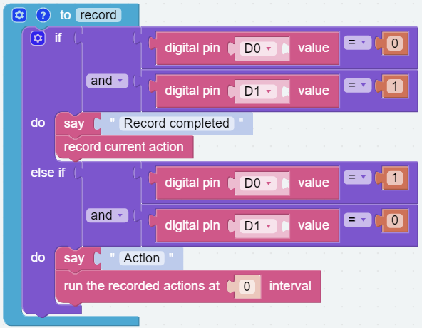
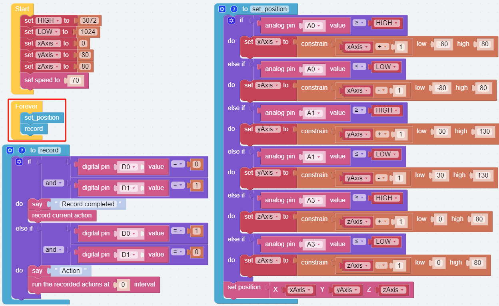

Memory Function
===================

Piarm provides a function of recording actions, which can be used to record the actions that PiArm has done.

In this project, we will use the Dual Joystick Module to control the movement of the Arm of PiArm in Coordinate Control mode, and record the motion trajectory of the Arm through the joystick buttons so that PiArm can move repeatedly along the recorded trajectory.

Programming
--------------------------

**Step 1** 

Create five variables (``HIGH``, ``LOW``, ``xAxis``, ``yAxis`` and ``zAxis``) and set their initial values.

**Step 2** 

Create a function named [set_position] to make the **Dual Joystick Module** move the PiArm in **Coordinate Control** mode.

* If the **left joystick** is toggled to the right, the Arm will turn right.
* If the **left joystick** is toggled to the left, the Arm will turn left.
* If the **left joystick** is toggled forward, the Arm will extend forward.
* If the **left joystick** is toggled backward, the Arm will retract backward.
* If the **right joystick** is toggled forward, the Arm will raise up.
* If the **right joystick** is toggled backward, the Arm will lower down.

.. note::

    * About X, Y, Z coordinate directions, please refer to: :ref:`Tips on Coordinates of the Arm`.
    * For the connection and direction of the dual joystick, refer to :ref:`Tips on Joystick Module`.
    * [constrain () low () high ()]: From Math category for setting the variation of a constant to a certain range.
    * [if else]: Conditional judgment block, you can create multiple conditional judgments by clicking the set icon and dragging [else] or [else if] to the right below the [if].

**Step 3** 

A new function, [record], is created to record the current actions and to allow PiArm to reproduce them.

* The left and right buttons of the Dual Joystick Module are connected to **D0 (Left Button)**, **D1 (Right Buttbon)** respectively.
* The buttons will output low level (0) when pressed and output high level (1) when released.
* When the **button of the left joystick** is pressed, the action of PiArm will be recorded at this time, and there will be a voice prompt to indicate the completion of recording.
* When the **button of the right joystick** is pressed, PiArm will reproduce these recorded actions.

.. note::

    * The [if else], [and] and [=] blocks are all from the **Logic** category.
    * Right-click on the [and] block and select **External Inputs** to make it top and bottom side-by-side.

    .. image:: media/and.png

    * [run the recorded actions at () internal]: This block is used to set the time interval for each set of recorded actions, if it is 0 it will reproduce each set of actions continuously.

**Step 4** 

Put the [set_position] and [record] functions into the [Forever] block to execute them sequentially, and finally click the **Download** button to run the code.

Now you can use the joystick to control PiArm, press the **button of the left joystick** to record the desired actions, and after recording a few groups, press the **button of the right joystick** to make PiArm reproduce these actions.

.. note::

    You can also find the code with the same name on the **Examples** page of **Ezblock Studio** and click **Run** or **Edit** directly to see the results.

What's More
-------------------

You can also add separate EoAT control code to this project, so that you can control the **Arm** and **EoAT** of the PiArm at the same time.

* If you want to control :ref:`Shovel Bucket`, please refer to :ref:`shovel_remote` to write the code.
* If you want to control :ref:`Hanging Clip`, please refer to :ref:`clip_remote` to write the code.
* If you want to control :ref:`Electromagnet`, please refer to :ref:`electro_remote` to write the code.

