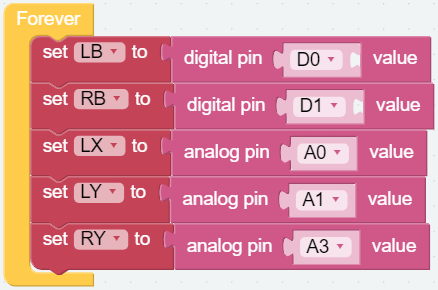
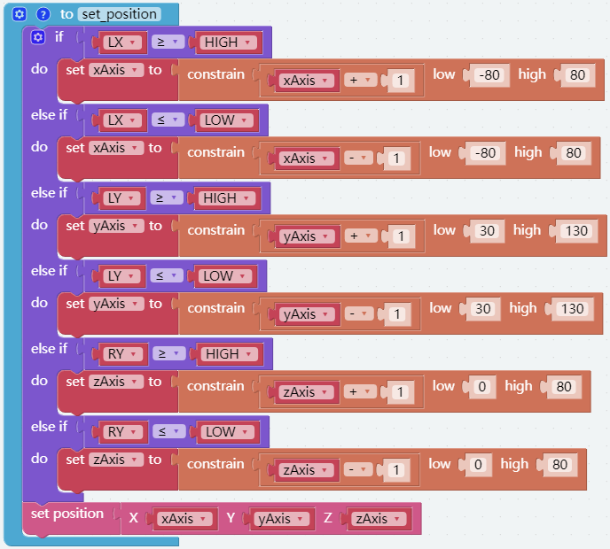

Memory Function
===================

Piarm provides a function of recording actions, which can be used to record the actions that piarm has done.

In this project, we plan to use the joystick to control the piarm, and record the movement trajectory of the piarm through the joystick buttons, so that the piarm can move repeatedly along the recorded trajectory.

Tips on memory block
-----------------------

[record current action] can record the status of each servo of the current piarm, and can record multiple groups through multiple calls.

[run the recorded actions at 0 interval] can make the piarm servo return to the previously recorded states in the order of recording, 0 interval means that the interval between each state is 0 seconds.

How to build code blocks
--------------------------

**Step 1** 

Create five variables (``HIGH``, ``LOW``, ``xAxis``, ``yAxis`` and ``zAxis``) and place them in the [Start] block to initialize their values, and use [set speed to 70] set the piarm movement speed to 70

.. image:: media/memory1.png

**Step 2** 

Create five variables to represent the values read by the joystick.

* [set LB to digital pin D0 value]: LB indicates the left joystic button.

* [set RB to digital pin D1 value]: RB indicates the right joystic button.
  
* [set LX to digital pin A0 value]: LX indicates the X-axis direction of the left joystic.

* [set LY to digital pin A1 value]: LY indicates the Y-axis direction of the left joystic.

* [set RY to digital pin A3 value]: RY indicates the Y-axis direction of the right joystic.

**Step 3** 

Create a [set_position] function to control the movement of the piarm. The code is similar to the previous project. Use the joystick and coordinates to move the piarm.

**Step 4** 

Use [LB = 0 and RB = 1] to press the left joystick button, [LB = 1 and RB = 0] to press the right joystick button.

**Step 5** 

[say "Record completed"] voice broadcast recording starts, and then use [record current action] to record the current coordinates of the robotic arm control points. [say "Action"] Voice broadcast action, and then use [run the recorded actions at 0 interval] to move to the previously recorded coordinates.

**Step 6** 

Use [if ... do ...] to link the joystick button with the memory function, and execute it cyclically in [Forever] block.

Complete Code
--------------------

After the program is running, the joystick can be used to control the movement of the piarm. When the left button of the joystick is pressed, the current coordinates will be recorded and there will be voice broadcast, and several sets of coordinates will be recorded.
After that, when you press the right button of the joystick, the piarm will move along the previously recorded motion trajectory.

The complete code is shown below.

