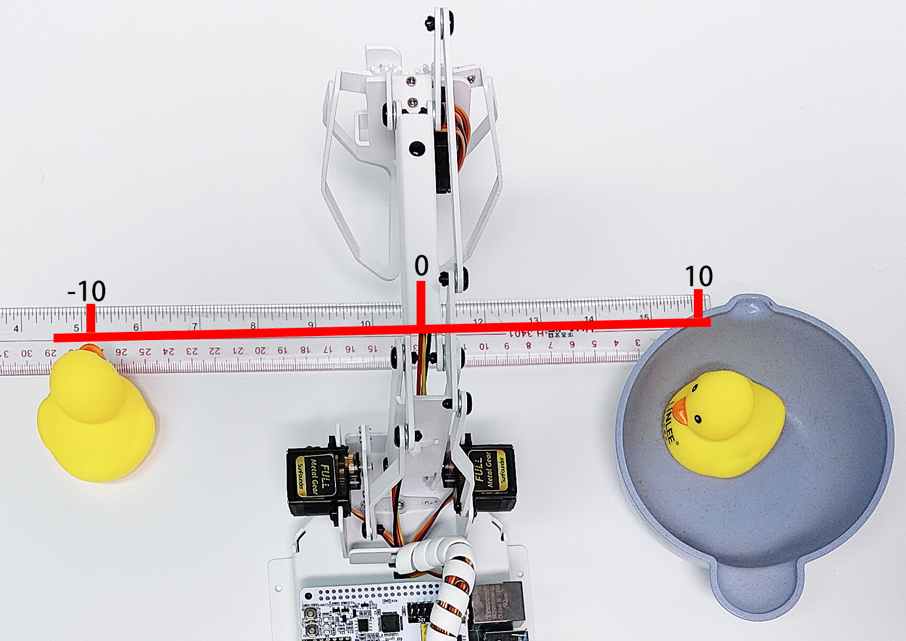

Coordinate Mode
======================

PiArm's arm has 2 control modes: :ref:`arm_angle` and :ref:`arm_coor`.

* :ref:`arm_angle`: Write a certain angle to the 3 servos of the arm to make the arm reach a specific position.
* :ref:`arm_coor`: Create a spatial coordinate system for the arm, set a control point, and write 3D coordinates to this control point to make the arm reach a specific position.

The :ref:`arm_coor` is used in this project.

This project sets 2 coordinate points by coordinate mode, and let the PiArm clip the rubber duck on the left to the bowl on the right. But you need to mount :ref:`clip` to the PiArm first.

Programming
----------------------------

**Run the code**

.. raw:: html

    <run></run>

.. code-block::

    cd /home/pi/piarm/examples
    sudo python3 coordinate_mode.py

After the code is run, after the code is run, you will be able to control the rotation of PiArm's Arm by toggling the left and right joystick, and control the angle of the Shovel Bucket by pressing the left and right joystick respectively.

But you need to assemble :ref:`clip` to PiArm first.

**Code**

.. raw:: html

    <run></run>

.. code-block:: python

    from re import M
    from robot_hat import PWM
    from robot_hat.utils import reset_mcu
    from time import sleep
    from piarm import PiArm

    reset_mcu()
    sleep(0.01)

    " Grab an object from one coordinate to another coordinate"

    arm = PiArm([1,2,3])
    arm.set_offset([0,0,0])
    arm.hanging_clip_init(PWM('P3'))

    if __name__ == "__main__":

        start_coord = [-100, 40, 20] # x,y,z
        end_coord = [100, 40, 30] # x,y,z
        

        arm.set_speed(60)
        arm.set_hanging_clip(20)
        arm.do_by_coord(start_coord)
        arm.set_hanging_clip(90)

        start_coord_up = [start_coord[0], start_coord[1], 80]
        arm.do_by_coord(start_coord_up)

        end_coord_up = [end_coord[0], end_coord[1], 80]
        arm.do_by_coord(end_coord_up)

        arm.do_by_coord(end_coord)
        arm.set_hanging_clip(20)
        arm.do_by_coord(end_coord_up)

**How it works?**

.. code-block:: python

    start_coord = [-100, 40, 20] # x,y,z
    end_coord = [100, 40, 30] # x,y,z

* ``start_coord``：The coordinates of the left rubber duck.
* ``end_coord``: The coordinates of the bowl.

.. note::

    * All coordinates here refer to the coordinates of the control points, but the actual distance between the X and Y coordinates is a little larger when the end-of-arm tool is mounted.
    * The tolerance distance is different for each end of arm tool. For example, 3-4cm for Hanging Clip and Electromagnet, 6-7cm for Shovel Bucket.
    * For example, here the X coordinate is written as 100, but the actual distance is 13-14cm.
    * It is generally recommended that the X coordinate is -80 ~ 80, but since the Y coordinate value here is small (the recommended range is 30~130), it is possible to reach to 100. However, if you increase the Y coordinate value, the X coordinate value needs to be reduced according to the actual situation due to the linkage action.

.. code-block:: python

        arm.set_speed(60)
        arm.set_hanging_clip(20)
        arm.do_by_coord(start_coord)
        arm.set_hanging_clip(90)

        start_coord_up = [start_coord[0], start_coord[1], 80]
        arm.do_by_coord(start_coord_up)

        end_coord_up = [end_coord[0], end_coord[1], 80]
        arm.do_by_coord(end_coord_up)

        arm.do_by_coord(end_coord)
        arm.set_hanging_clip(20)
        arm.do_by_coord(end_coord_up)

* PiArm opens the Hanging Clip (20°), then rotates to the left rubber duck position (``start_coord``), then closes the Hanging Clip (90°).
* PiArm raises his head (``start_coord_up``) and then turns to the right side above the bowl (``end_coord_up``).
* PiArm lowers his head (``end_coord_up``), then opens the Hanging Clip (20°) to let the rubber duck fall into the bowl, and finally raises his head again (``end_coord_up``).
