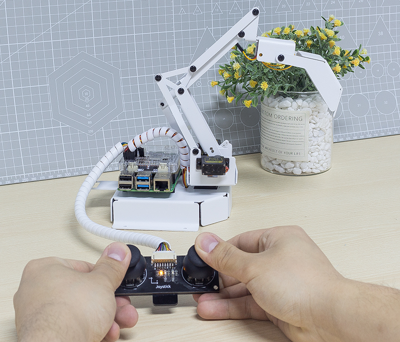

双摇杆模块
=======================

我们可以分两部分控制 PiArm，手臂和臂端工具。在第一个项目中，您已经学习了如何组装和测试PiArm的3个臂端工具。在这个项目中，我们将使用套件附带的双摇杆模块来控制 PiArm 的手臂。

* :ref:`py_shovel_joystick`
* :ref:`py_clip_joystick`
* :ref:`py_electro_joystick`

.. _py_shovel_joystick:

铲斗 - 摇杆控制
-----------------------------------------

.. raw:: html

    <run></run>

.. code-block::

    cd /home/pi/piarm/examples
    sudo python3 joystick_module1.py

代码运行后，你就能用拨动左右摇杆来控制PiArm的手臂的转动，分别按下左右摇杆来控制铲斗的开/合。

但你需要先将 :ref:`shovel` 安装到PiArm上。

**代码**

.. raw:: html

    <run></run>

.. code-block:: python

    from robot_hat import Servo,PWM,Joystick,ADC,Pin
    from robot_hat.utils import reset_mcu
    from time import sleep

    from piarm import PiArm

    reset_mcu()
    sleep(0.01)

    leftJoystick = Joystick(ADC('A0'),ADC('A1'),Pin('D0'))
    rightJoystick = Joystick(ADC('A2'),ADC('A3'),Pin('D1'))

    arm = PiArm([1,2,3])
    arm.bucket_init(PWM('P3'))
    arm.set_offset([0,0,0])

    def _angles_control():
        arm.speed = 100
        flag = False
        alpha,beta,gamma = arm.servo_positions
        bucket = arm.component_staus

        if leftJoystick.read_status() == "up":
            alpha += 1
            flag = True
        elif leftJoystick.read_status() == "down":
            alpha -= 1
            flag = True
        if leftJoystick.read_status() == "left":
            gamma += 1
            flag = True
        elif leftJoystick.read_status() == "right":
            gamma -= 1
            flag = True
        if rightJoystick.read_status() == "up":
            beta += 1
            flag = True
        elif rightJoystick.read_status() == "down":
            beta -= 1
            flag = True
        if leftJoystick.read_status() == "pressed": 	
            bucket += 2
            flag = True
        elif rightJoystick.read_status() == "pressed":
            bucket -= 2
            flag = True

        if flag == True:
            arm.set_angle([alpha,beta,gamma])
            arm.set_bucket(bucket)
            print('servo angles: %s , bucket angle: %s '%(arm.servo_positions,arm.component_staus))

    if __name__ == "__main__":
        while True:
            _angles_control()
            sleep(0.01)

**它是如何工作的？**

.. code-block:: python

    leftJoystick = Joystick(ADC('A0'),ADC('A1'),Pin('D0'))
    rightJoystick = Joystick(ADC('A2'),ADC('A3'),Pin('D1'))

定义左右摇杆的X,Y和Z的引脚连接。

.. code-block:: python

    def _angles_control():
        arm.speed = 100
        flag = False
        alpha,beta,gamma = arm.servo_positions
        bucket = arm.component_staus

        if leftJoystick.read_status() == "up":
            alpha += 1
            flag = True
        elif leftJoystick.read_status() == "down":
            alpha -= 1
            flag = True
        if leftJoystick.read_status() == "left":
            gamma += 1
            flag = True
        elif leftJoystick.read_status() == "right":
            gamma -= 1
            flag = True
        if rightJoystick.read_status() == "up":
            beta += 1
            flag = True
        elif rightJoystick.read_status() == "down":
            beta -= 1
            flag = True
        if leftJoystick.read_status() == "pressed": 	
            bucket += 2
            flag = True
        elif rightJoystick.read_status() == "pressed":
            bucket -= 2
            flag = True

        if flag == True:
            arm.set_angle([alpha,beta,gamma])
            arm.set_bucket(bucket)
            print('servo angles: %s , bucket angle: %s '%(arm.servo_positions,arm.component_staus))

在这个代码中，创建了 ``_angles_control()`` 函数用来控制PiArm。

* ``alpha``, ``beta`` 和 ``gamma`` 分别指的是手臂上的3个舵机的角度，参考： :ref:`arm_angle`。
* 左摇杆向上拨动， ``alpha`` 增加，让手臂向前伸。
* 左摇杆向下拨动， ``alpha`` 减小，让手臂向里缩。
* 左摇杆向左拨动， ``gamma`` 增加，让手臂向左转动。
* 左摇杆向右拨动， ``gamma`` 减小，让手臂向右转动。
* 右摇杆向上拨动， ``beta`` 增加，让手臂向上。
* 右摇杆向下拨动， ``beta`` 减小，让手臂向下。
* 最后，分别用左右摇杆的按键来控制铲斗的角度。

.. _py_clip_joystick:

竖直夹 - 摇杆控制
-------------------

**运行代码**

.. raw:: html

    <run></run>

.. code-block::

    cd /home/pi/piarm/examples
    sudo python3 joystick_module2.py

代码运行后，你就能用拨动左右摇杆来控制PiArm的手臂的转动，分别按下左右摇杆来控制竖直夹的开/合。

但你需要先将 :ref:`clip` 安装到PiArm上。

**代码**

.. raw:: html

    <run></run>

.. code-block:: python

    from robot_hat import Servo,PWM,Joystick,ADC,Pin
    from robot_hat.utils import reset_mcu
    from time import sleep

    from piarm import PiArm

    reset_mcu()
    sleep(0.01)

    leftJoystick = Joystick(ADC('A0'),ADC('A1'),Pin('D0'))
    rightJoystick = Joystick(ADC('A2'),ADC('A3'),Pin('D1'))

    arm = PiArm([1,2,3])
    arm.hanging_clip_init(PWM('P3'))
    arm.set_offset([0,0,0])

    def _angles_control():
        arm.speed = 100
        flag = False
        alpha,beta,gamma = arm.servo_positions
        clip = arm.component_staus

        if leftJoystick.read_status() == "up":
            alpha += 1
            flag = True
        elif leftJoystick.read_status() == "down":
            alpha -= 1
            flag = True
        if leftJoystick.read_status() == "left":
            gamma += 1
            flag = True
        elif leftJoystick.read_status() == "right":
            gamma -= 1
            flag = True
        if rightJoystick.read_status() == "up":
            beta += 1
            flag = True
        elif rightJoystick.read_status() == "down":
            beta -= 1
            flag = True
            
        if leftJoystick.read_status() == "pressed": 	
            clip += 2
            flag = True
        elif rightJoystick.read_status() == "pressed":	
            clip -= 2
            flag = True

        if flag == True:
            arm.set_angle([alpha,beta,gamma])
            arm.set_hanging_clip(clip)
            print('servo angles: %s , clip angle: %s '%(arm.servo_positions,arm.component_staus))

    if __name__ == "__main__":
        while True:
            _angles_control()
            sleep(0.01)

在这个代码中，创建了 ``_angles_control()`` 函数用来控制PiArm。

* ``alpha``, ``beta`` 和 ``gamma`` 分别指的是手臂上的3个舵机的角度，参考： :ref:`arm_angle`。
* 左摇杆向上拨动， ``alpha`` 增加，让手臂向前伸。
* 左摇杆向下拨动， ``alpha`` 减小，让手臂向里缩。
* 左摇杆向左拨动， ``gamma`` 增加，让手臂向左转动。
* 左摇杆向右拨动， ``gamma`` 减小，让手臂向右转动。
* 右摇杆向上拨动， ``beta`` 增加，让手臂向上。
* 右摇杆向下拨动， ``beta`` 减小，让手臂向下。
* 最后，分别用左右摇杆的按键来控制竖直夹的角度。

.. _py_electro_joystick:

电磁铁 - 摇杆控制
--------------------

**运行代码**

.. raw:: html

    <run></run>

.. code-block::

    cd /home/pi/piarm/examples
    sudo python3 joystick_module3.py

代码运行后，你就能用拨动左右摇杆来控制PiArm的手臂的转动，分别按下左右摇杆来控制电磁铁的开/关。

但你需要先将 :ref:`electro` 安装到PiArm上。

**代码**

.. raw:: html

    <run></run>

.. code-block:: python

    from robot_hat import Servo,PWM,Joystick,ADC,Pin
    from robot_hat.utils import reset_mcu
    from time import sleep

    from piarm import PiArm

    reset_mcu()
    sleep(0.01)

    leftJoystick = Joystick(ADC('A0'),ADC('A1'),Pin('D0'))
    rightJoystick = Joystick(ADC('A2'),ADC('A3'),Pin('D1'))

    arm = PiArm([1,2,3])
    arm.electromagnet_init(PWM('P3'))
    arm.set_offset([0,0,0])

    def _angles_control():
        arm.speed = 100
        flag = False
        alpha,beta,gamma = arm.servo_positions
        status = ""
        
        if leftJoystick.read_status() == "up":
            alpha += 1
            flag = True
        elif leftJoystick.read_status() == "down":
            alpha -= 1
            flag = True                        
        if leftJoystick.read_status() == "left":
            gamma += 1
            flag = True
        elif leftJoystick.read_status() == "right":
            gamma -= 1
            flag = True
        if rightJoystick.read_status() == "up":
            beta += 1
            flag = True
        elif rightJoystick.read_status() == "down":
            beta -= 1
            flag = True
        if leftJoystick.read_status() == "pressed": 
            arm.set_electromagnet('on')
            status = "electromagnet is on" 	
        elif rightJoystick.read_status() == "pressed":
            arm.set_electromagnet('off')
            status = "electromagnet is off"	

        if flag == True:
            arm.set_angle([alpha,beta,gamma])
            print('servo angles: %s , electromagnet status: %s '%(arm.servo_positions,status))

    if __name__ == "__main__":
        while True:
            _angles_control()
            sleep(0.01)

在这个代码中，创建了 ``_angles_control()`` 函数用来控制PiArm。

* ``alpha``, ``beta`` 和 ``gamma`` 分别指的是手臂上的3个舵机的角度，参考： :ref:`arm_angle`。
* 左摇杆向上拨动， ``alpha`` 增加，让手臂向前伸。
* 左摇杆向下拨动， ``alpha`` 减小，让手臂向里缩。
* 左摇杆向左拨动， ``gamma`` 增加，让手臂向左转动。
* 左摇杆向右拨动， ``gamma`` 减小，让手臂向右转动。
* 右摇杆向上拨动， ``beta`` 增加，让手臂向上。
* 右摇杆向下拨动， ``beta`` 减小，让手臂向下。
* 最后，分别用左右摇杆的按键来控制电磁铁的开/关。