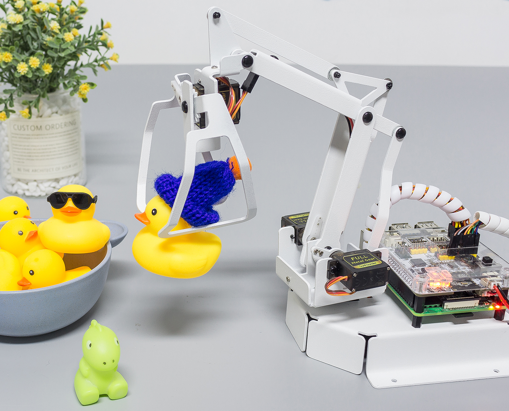

GAME - Catching Dolls
==============================

Now let's play a game of catching dolls and see who can catch more dolls with PiArm in the given time.
In order to play this game, we need to implement two functions, the first one is to control PiArm with the dual joystick module, and the second one is to timing, when the countdown is over, we can't control PiArm anymore. These two parts must be executed simultaneously.

**Run the code**

.. raw:: html

    <run></run>

.. code-block::

    cd /home/pi/piarm/examples
    sudo python3 game_catching_dolls.py

After the code runs, press the left and right joystick at the same time to start the game. Then you can use the dual joystick module to control PiArm to catch the doll, please pay attention to the time, after 60 seconds, PiArm will tell the game is over and you will not be able to continue to control PiArm.

**Code**

.. raw:: html

    <run></run>

.. code-block:: python 

    from robot_hat import Servo,PWM,Joystick,ADC,Pin
    from robot_hat.utils import reset_mcu
    from time import sleep
    from robot_hat import TTS
    import threading

    from piarm import PiArm

    reset_mcu()
    sleep(0.01)
    t = TTS()

    leftJoystick = Joystick(ADC('A0'),ADC('A1'),Pin('D0'))
    rightJoystick = Joystick(ADC('A2'),ADC('A3'),Pin('D1'))

    arm = PiArm([1,2,3])
    arm.hanging_clip_init(PWM('P3'))
    arm.set_offset([0,0,0])
    arm.speed = 100
    game_flag = 0

    def control():

        alpha,beta,gamma = arm.servo_positions
        clip = arm.component_staus

        if leftJoystick.read_status() == "up":
            alpha += 1
        elif leftJoystick.read_status() == "down":
            alpha -= 1
        if leftJoystick.read_status() == "left":
            gamma += 1
        elif leftJoystick.read_status() == "right":
            gamma -= 1
        if rightJoystick.read_status() == "up":
            beta += 1
        elif rightJoystick.read_status() == "down":
            beta -= 1
        if leftJoystick.read_status() == "pressed":  	
            clip += 1
        elif rightJoystick.read_status() == "pressed":	
            clip -= 1

        # if key_flag == True:
        arm.set_angle([alpha,beta,gamma])
        arm.set_hanging_clip(clip)
            # print('coord: %s , servo angles: %s , clip angle: %s '%(arm.current_coord,arm.servo_positions,arm.component_staus))

    def timing():
        sleep(60)
        t.say("three")
        sleep(1)
        t.say("two")
        sleep(1)
        t.say("one")	
        sleep(1)
        t.say("game over")	
        global game_flag
        game_flag = 0	

    if __name__ == "__main__":

        thread1 = threading.Thread(target = timing)	
        thread1.start()	
        print("Press two joysticks at the same time to start the game")
        
        while True:
            if 	leftJoystick.read_status() == "pressed" and rightJoystick.read_status() == "pressed":
                t.say("timing begins")
                game_flag = 1		
            if game_flag == 1:
                control()

**How it works?**

This code adds timing to the :ref:`py_clip_joystick` project.

.. code-block:: python

    def timing():
        sleep(60)
        t.say("three")
        sleep(1)
        t.say("two")
        sleep(1)
        t.say("one")	
        sleep(1)
        t.say("game over")	
        global game_flag
        game_flag = 0	

Use the ``sleep()`` function to count down in 60 seconds, then let PiArm count down to 3, 2, 1, and when the time is over, let ``game_flag`` be 0, then PiArm will no longer be controlled.

.. code-block:: python

    if __name__ == "__main__":

        thread1 = threading.Thread(target = timing)	
        thread1.start()	
        print("Press two joysticks at the same time to start the game")

Let the ``timing()`` function run in a separate thread so that it can be timed while controlling PiArm.

.. code-block:: python

        while True:
            if 	leftJoystick.read_status() == "pressed" and rightJoystick.read_status() == "pressed":
                t.say("timing begins")
                game_flag = 1		
            if game_flag == 1:
                control()

This is the main flow of the code, when the left and right joysticks are pressed at the same time, PiArm says the timer starts, let ``game_flag`` be 1, then you can call ``control()`` function to control PiArm.

