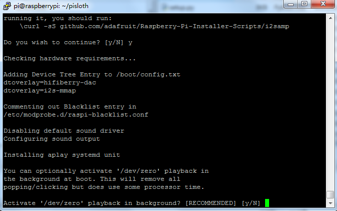
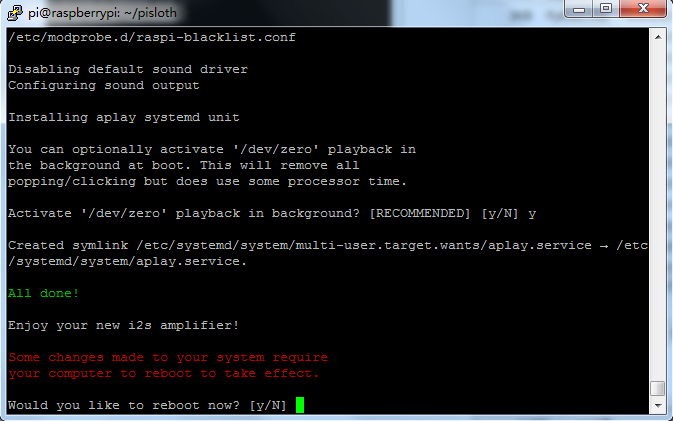

Download and Run the Code
============================

First download and run the ``robot-hat`` module.

.. raw:: html

    <run></run>

.. code-block::

    cd /home/pi/
    git clone https://github.com/sunfounder/robot-hat.git
    cd robot-hat
    sudo python3 setup.py install

.. note::
    Running ``setup.py`` will download some necessary components. Due to network problems, you may not be able to download successfully. You may need to download it again.

    In this case, type Y and press Enter.
	
	.. image:: img/dowload_code.png

Then download the code and install the ``piarm`` library.

.. raw:: html

    <run></run>

.. code-block::

    cd /home/pi/
    git clone -b 2.0.0 https://github.com/sunfounder/piarm.git
    cd piarm
    sudo python3 setup.py install

This step will take a little time, so please be patient.

Finally you need to run the script ``i2samp.sh`` to install the components needed for the i2s amplifier, otherwise it may not have sound.

.. raw:: html

    <run></run>

.. code-block::

    cd /home/pi/piarm
    sudo bash i2samp.sh
	
.. image:: img/i2s.png

Type ``y`` and press ``Enter`` to continue running the script.

Type ``y`` and press ``Enter`` to make ``/dev/zero`` run in the background.

Enter ``y`` and press ``Enter`` to restart the robot.

.. note::

    If there is no sound after a restart, you may need to run the i2samp.sh script several times.
