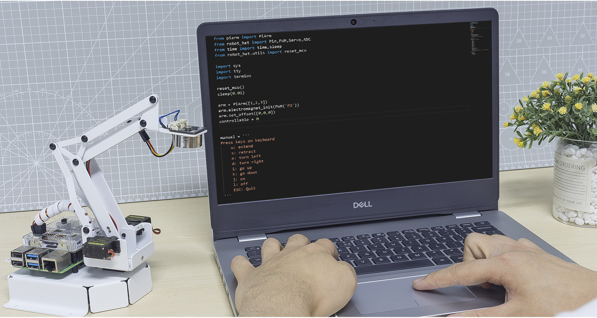

Keyboard Control
==================

In this project, we will use ``w``, ``s``, ``a``, ``d``, ``i``, ``k``, ``j`` and ``l`` on the keyboard to control the PiArm.

* :ref:`py_shovel_keyboard`
* :ref:`py_clip_keyboard`
* :ref:`py_electro_keyboard`

.. _py_shovel_keyboard:

Shovel Bucket - Keyboard Coboardntrol
---------------------------------------

**Run the code**

.. raw:: html

    <run></run>

.. code-block::

    cd /home/pi/piarm/examples
    sudo python3 keyboard_control1.py

After running the code, follow the prompts and press the keys on the keyboard to control the PiArm's arm and Shovel Bucket.

But you need to assemble :ref:`shovel` on the PiArm first.

.. note::

    * To switch the keyboard to lowercase English input.
    * ``w``, ``s``, ``a``, ``d``, ``i`` and ``k`` are used to control the rotation of the arm.
    * ``j`` and ``l`` are used to control the angle of the Shovel Bucket.

**Code**

.. code-block:: python

    from piarm import PiArm
    from robot_hat import Pin,PWM,Servo,ADC
    from time import time,sleep
    from robot_hat.utils import reset_mcu

    import sys
    import tty
    import termios

    reset_mcu()
    sleep(0.01)

    arm = PiArm([1,2,3])
    arm.bucket_init(PWM('P3'))
    arm.set_offset([0,0,0])
    controllable = 0

    manual = '''
    Press keys on keyboard
        w: extend
        s: retract    
        a: turn left
        d: turn right
        i: go up
        k: go down
        j: open
        l: close
        ESC: Quit
    '''

    def readchar():
        fd = sys.stdin.fileno()
        old_settings = termios.tcgetattr(fd)
        try:
            tty.setraw(sys.stdin.fileno())
            ch = sys.stdin.read(1)
        finally:
            termios.tcsetattr(fd, termios.TCSADRAIN, old_settings)
        return ch

    def control(key):

        arm.speed = 100
        flag = False
        alpha,beta,gamma = arm.servo_positions	
        bucket = arm.component_staus

        if key == 'w':
            alpha += 3
            flag = True
        elif key == 's':
            alpha -= 3		
            flag = True
        if key == 'a':
            gamma += 3		
            flag = True
        elif key == 'd':
            gamma -= 3		
            flag = True	
        if key == 'i':
            beta += 3		
            flag = True
        elif key == 'k':
            beta -= 3		
            flag = True
        if key == 'j':
            bucket -= 1
            flag = True		
        elif key == 'l':
            bucket += 1
            flag = True	

        if flag == True:
            arm.set_angle([alpha,beta,gamma])
            arm.set_bucket(bucket)		
            print('servo angles: %s , bucket angle: %s '%(arm.servo_positions,arm.component_staus))

        
    if __name__ == "__main__":

        print(manual)

        while True:
            key = readchar().lower()
            control(key)
            if key == chr(27):
                break		

**How it works?**

.. code-block:: python

    def readchar():
        fd = sys.stdin.fileno()
        old_settings = termios.tcgetattr(fd)
        try:
            tty.setraw(sys.stdin.fileno())
            ch = sys.stdin.read(1)
        finally:
            termios.tcsetattr(fd, termios.TCSADRAIN, old_settings)
        return ch

This function references the standard input stream and returns the first character of the read data stream.

* ``tty.setraw(sys.stdin.fileno)`` is to change the standard input stream to raw mode, i.e. all characters will not be escaped during transmission, including special characters.
* ``old_settings = termios.tcgetattr(fd)`` and ``termios.tcsetattr(fd, termios.TCSADRAIN, old_settings)`` and acts as a backup and restore.

.. code-block:: python

    def control(key):

        arm.speed = 100
        flag = False
        alpha,beta,gamma = arm.servo_positions	
        bucket = arm.component_staus

        if key == 'w':
            alpha += 3
            flag = True
        elif key == 's':
            alpha -= 3		
            flag = True
        if key == 'a':
            gamma += 3		
            flag = True
        elif key == 'd':
            gamma -= 3		
            flag = True	
        if key == 'i':
            beta += 3		
            flag = True
        elif key == 'k':
            beta -= 3		
            flag = True
        if key == 'j':
            bucket -= 1
            flag = True		
        elif key == 'l':
            bucket += 1
            flag = True	

        if flag == True:
            arm.set_angle([alpha,beta,gamma])
            arm.set_bucket(bucket)		
            print('servo angles: %s , bucket angle: %s '%(arm.servo_positions,arm.component_staus))

In this code, the ``control()`` function is created to control the PiArm by reading the key values on the keyboard.

* ``alpha``, ``beta`` and ``gamma`` refer to the angles of the 3 servos on the arm respectively, refer to: :ref:`arm_angle`.
* Press the ``w`` key on the keyboard, the ``alpha`` increases and the Arm will extend forward.
* Press the ``s`` key on the keyboard, the ``alpha`` decreases and the Arm will retract backward.
* Press the ``a`` key on the keyboard, the ``gamma`` increases and the Arm will turn left.
* Press the ``d`` key on the keyboard, the ``gamma`` decreases and the Arm will turn right.
* Press the ``i`` key on the keyboard, the ``beta`` increases and the Arm will raise up.
* Press the ``k`` key on the keyboard, the ``beta`` decreases and the Arm will lower down.
* Finally, use the ``k`` and ``l`` keys to control the angle of the Shovel Bucket respectively.

.. code-block:: python

    while True:
        key = readchar().lower()
        control(key)
        if key == chr(27):
            break

Call ``readchar()`` in the main program to read the key value, then pass the read key value into the ``control()`` function so that PiArm will move according to the different keys.
``key == chr(27)`` represents the key ``Esc`` key press.

.. _py_clip_keyboard:

Hanging Clip  - Keyboard Control
-----------------------------------------

**Run the code**

.. raw:: html

    <run></run>

.. code-block::

    cd /home/pi/piarm/examples
    sudo python3 keyboard_control2.py

After running the code, follow the prompts and press the keys on the keyboard to control the Arm and Hanging Clip of PiArm.

But you need to assemble :ref:`clip` to PiArm first.

.. note::

    * To switch the keyboard to lowercase English input.
    * ``w``, ``s``, ``a``, ``d``, ``i`` and ``k`` are used to control the rotation of the arm.
    * ``j`` and ``l`` are used to control the opening and closing of the Hanging Clip.

**Code**

.. code-block:: python

    from piarm import PiArm
    from robot_hat import Pin,PWM,Servo,ADC
    from time import time,sleep
    from robot_hat.utils import reset_mcu

    import sys
    import tty
    import termios

    reset_mcu()
    sleep(0.01)

    arm = PiArm([1,2,3])
    arm.hanging_clip_init(PWM('P3'))
    arm.set_offset([0,0,0])
    controllable = 0

    manual = '''
    Press keys on keyboard
        w: extend
        s: retract    
        a: turn left
        d: turn right
        i: go up
        k: go down
        j: open
        l: close
        ESC: Quit
    '''

    def readchar():
        fd = sys.stdin.fileno()
        old_settings = termios.tcgetattr(fd)
        try:
            tty.setraw(sys.stdin.fileno())
            ch = sys.stdin.read(1)
        finally:
            termios.tcsetattr(fd, termios.TCSADRAIN, old_settings)
        return ch

    def control(key):

        arm.speed = 100
        flag = False
        alpha,beta,gamma = arm.servo_positions	
        clip = arm.component_staus

        if key == 'w':
            alpha += 3
            flag = True
        elif key == 's':
            alpha -= 3		
            flag = True
        if key == 'a':
            gamma += 3		
            flag = True
        elif key == 'd':
            gamma -= 3		
            flag = True	
        if key == 'i':
            beta += 3		
            flag = True
        elif key == 'k':
            beta -= 3		
            flag = True
        
        if key == 'j':
            clip -= 1
            flag = True		
        elif key == 'l':
            clip += 1
            flag = True	
        
        if flag == True:
            arm.set_angle([alpha,beta,gamma])
            arm.set_hanging_clip(clip)		
            print('servo angles: %s , clip angle: %s '%(arm.servo_positions,arm.component_staus))

        
    if __name__ == "__main__":

        print(manual)

        while True:
            key = readchar().lower()
            control(key)
            if key == chr(27):
                break	

In this code, the ``control()`` function is created to control the PiArm by reading the key values on the keyboard.

* ``alpha``, ``beta`` and ``gamma`` refer to the angles of the 3 servos on the arm respectively, refer to: :ref:`arm_angle`.
* Press the ``w`` key on the keyboard, the ``alpha`` increases and the Arm will extend forward.
* Press the ``s`` key on the keyboard, the ``alpha`` decreases and the Arm will retract backward.
* Press the ``a`` key on the keyboard, the ``gamma`` increases and the Arm will turn left.
* Press the ``d`` key on the keyboard, the ``gamma`` decreases and the Arm will turn right.
* Press the ``i`` key on the keyboard, the ``beta`` increases and the Arm will raise up.
* Press the ``k`` key on the keyboard, the ``beta`` decreases and the Arm will lower down.
* Finally, use the ``k`` and ``l`` keys to control the opening and closing of the Hanging Clip respectively.

.. _py_electro_keyboard:

Electromagnet - Keyboard Control
----------------------------------

**Run the code**

.. raw:: html

    <run></run>

.. code-block::

    cd /home/pi/piarm/examples
    sudo python3 keyboard_control1.py

After running the code, follow the prompts and press the keys on the keyboard to control the PiArm's arms and Electromagnet.

But you need to assemble :ref:`electro` to PiArm first.

.. note::

    * To switch the keyboard to lowercase English input.
    * ``w``, ``s``, ``a``, ``d``, ``i`` and ``k`` are used to control the rotation of the arm.
    * ``j`` and ``l`` are used to control the ON and OFF of the Electromagnet.

**Code**

.. code-block:: python

    from piarm import PiArm
    from robot_hat import Pin,PWM,Servo,ADC
    from time import time,sleep
    from robot_hat.utils import reset_mcu

    import sys
    import tty
    import termios

    reset_mcu()
    sleep(0.01)

    arm = PiArm([1,2,3])
    arm.electromagnet_init(PWM('P3'))
    arm.set_offset([0,0,0])
    controllable = 0

    manual = '''
    Press keys on keyboard
        w: extend
        s: retract    
        a: turn left
        d: turn right
        i: go up
        k: go down
        j: on
        l: off
        ESC: Quit
    '''

    def readchar():
        fd = sys.stdin.fileno()
        old_settings = termios.tcgetattr(fd)
        try:
            tty.setraw(sys.stdin.fileno())
            ch = sys.stdin.read(1)
        finally:
            termios.tcsetattr(fd, termios.TCSADRAIN, old_settings)
        return ch

    def control(key):

        arm.speed = 100
        flag = False
        alpha,beta,gamma = arm.servo_positions	
        status = ""

        if key == 'w':
            alpha += 3
            flag = True
        elif key == 's':
            alpha -= 3		
            flag = True
        if key == 'a':
            gamma += 3		
            flag = True
        elif key == 'd':
            gamma -= 3		
            flag = True	
        if key == 'i':
            beta += 3		
            flag = True
        elif key == 'k':
            beta -= 3		
            flag = True

        if key == 'j':
            arm.set_electromagnet('on')		
        elif key == 'l':
            arm.set_electromagnet('off')
            
        if flag == True:
            arm.set_angle([alpha,beta,gamma])	
            print('servo angles: %s , electromagnet status: %s '%(arm.servo_positions,status))

        
    if __name__ == "__main__":

        print(manual)

        while True:
            key = readchar().lower()
            control(key)
            if key == chr(27):
                break		

In this code, the ``control()`` function is created to control the PiArm by reading the key values on the keyboard.

* ``alpha``, ``beta`` and ``gamma`` refer to the angles of the 3 servos on the arm respectively, refer to: :ref:`arm_angle`.
* Press the ``w`` key on the keyboard, the ``alpha`` increases and the Arm will extend forward.
* Press the ``s`` key on the keyboard, the ``alpha`` decreases and the Arm will retract backward.
* Press the ``a`` key on the keyboard, the ``gamma`` increases and the Arm will turn left.
* Press the ``d`` key on the keyboard, the ``gamma`` decreases and the Arm will turn right.
* Press the ``i`` key on the keyboard, the ``beta`` increases and the Arm will raise up.
* Press the ``k`` key on the keyboard, the ``beta`` decreases and the Arm will lower down.
* Finally, use the ``k`` and ``l`` keys to control the ON and OFF of the Electromagnet respectively.