Remote Control
==================

We can use the widgets on **Remote Control** page of **EzBlock Studio** to make **PiArm** move.

* `How to Use the Remote Control Function? <https://docs.sunfounder.com/projects/ezblock3/en/latest/remote.html>`_

In this project, the arm of PiArm is first controlled in **Angle Control** mode with widgets, and the last 3 projects are based on it by adding 3 EoATs control codes respectively. This way you can control both the Arm and the EoAT  of PiArm using the widgets in the **Remote Control** page.

* :ref:`arm_remote`
* :ref:`Create a Library`
* :ref:`shovel_remote`
* :ref:`clip_remote`
* :ref:`electro_remote`

.. _arm_remote:

Arm - Remote Control
---------------------------------------

The Arm of PiArm has 2 control modes: **Angle Control** and **Coordinate Control**.

* **Angle Control** mode: Write a certain angle to each of the 3 servos on the Arm to make the Arm achieve a specific position.
* **Coordinate Control** mode: Set up a spatial coordinate system for the Arm and set a control point, write 3D coordinates to this control point to make the Arm achieve a specific position.

The **Angle Control** mode is used here.

**Step 1** 

To use the remote control function, you need to enter the **Remote Control** page from the left side of main page, and then drag one D-pad and 3 buttons to the central area.

.. image:: media/control3.png

Back in the programming page, you will see an additional Remote category, and the D-pad and Button block appear in it.

* [Button () get value]: This block is used to read the value of the button, press is 1, release is 0.
* [Button () is (press/release)]: This block and ``Button () get value = (0/1)`` have the same effect and can be used directly to determine whether a button is pressed or not.
* [D-pad () get () value]: This block is used to read the up/down/left/right (selected through the drop-down menu) pad values, press for 1 and release for 0.

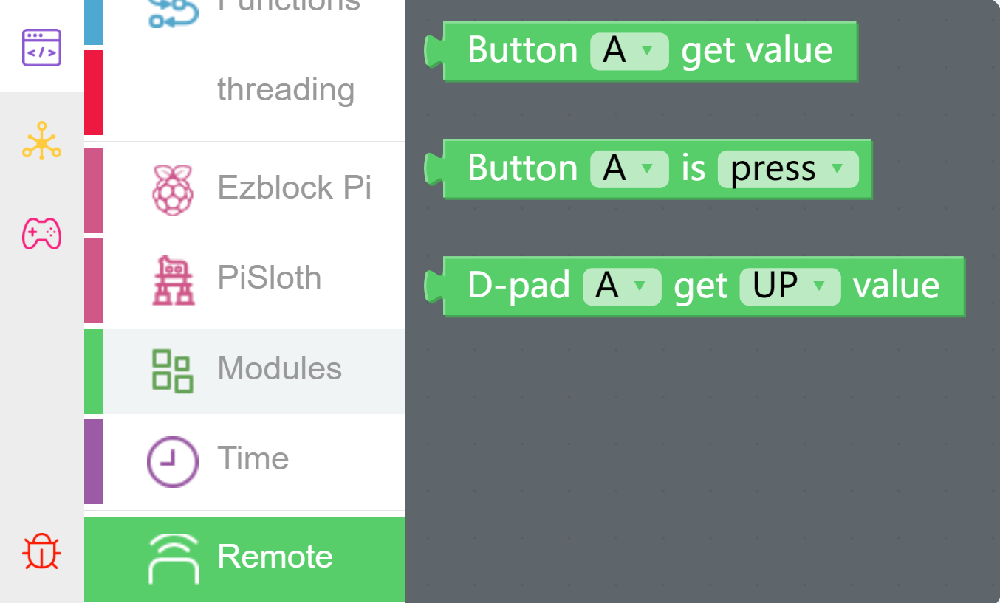

**Step 2** 

Set the rotation speed of PiArm to 70%.

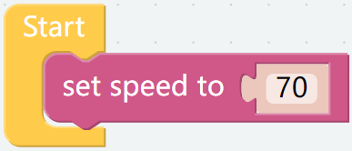

**Step 3** 

Create a function named [arm control] to set the rotation effect of PiArm based on the D-pad and button values.

* If the UP button (▲) of D-pad is pressed, the Arm will extend forward.
* If the Down button (▼) of D-pad is pressed, the Arm will retract backward.
* If the LEFT button (◀) of D-pad is pressed, the Arm will turn left.
* If the RIGHT button (▶) of D-pad is pressed, the Arm will turn right.
* If Button A is pressed, the Arm will lower down.
* If Button B is pressed, the Arm will raise up.

.. note::

    * ``α``, ``β`` and ``γ`` represent the 3 servo rotation ranges on PiArm, refer to: :ref:`Tips on the Angle of the Arm`.
    * [constrain () low () high ()]: From Math category for setting the variation of a constant to a certain range.
    * [if else]: Conditional judgment block, you can create multiple conditional judgments by clicking the set icon and dragging [else] or [else if] to the right below the [if].

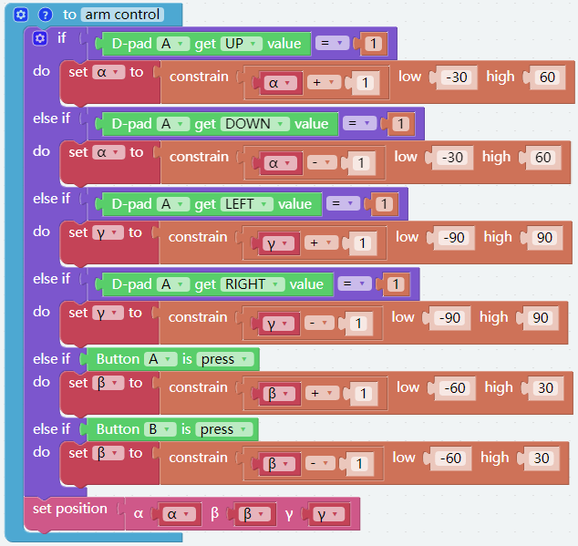

**Step 4** 

Put the function [arm control] into [Forever] for loop execution, and finally click the **Download** button to run the code.

After that you can use the D-pad and Button A/B on the **Remote Control** page to control the movement of the Arm.

.. note::

    You can also find the code with the name of **Arm - Remote Control** on the **Examples** page of **Ezblock Studio** and click **Run** or **Edit** directly to see the results.

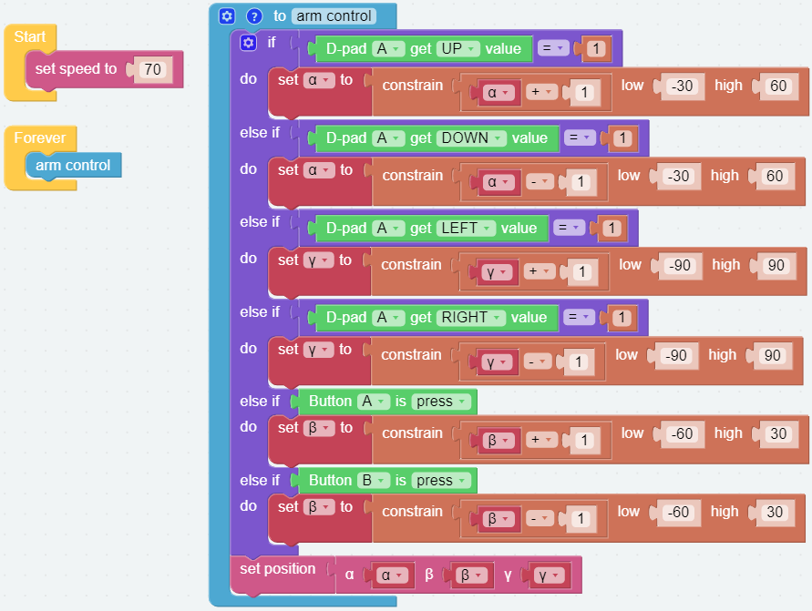

Create a Library
-------------------------

To be able to use the function - [arm control] in other code later, you can create it as a library and import it when you need to use it.

**Step 1**

Open the menu icon in the upper right corner and select **Create Library**.

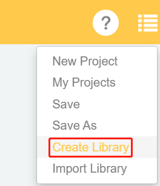

**Step 2**

Select the function, there is only one function here, so **arm control** is selected by default.

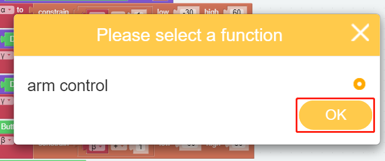

**Step 3**

Name the library and fill in the description so that it can be better distinguished later.

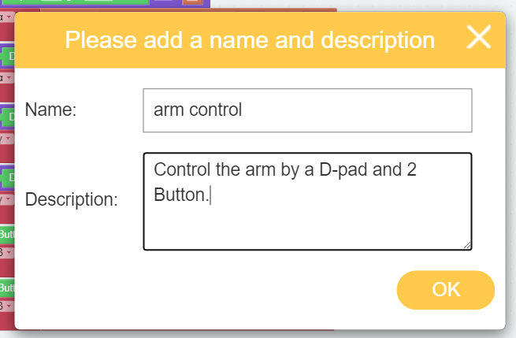

**Step 4**

Wait for the prompt to save successfully and the library will be saved in **My Library** on your personal page. You can also see it when you click **Import Library**.

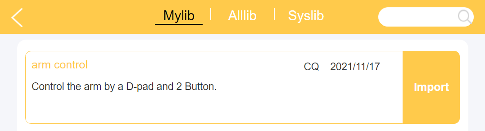

.. _shovel_remote:

Shovel Bucket - Remote Control
-----------------------------------

Create a new project and write code for it so that we can control the :ref:`Shovel Bucket` while controlling the arm.

**Step 1** 

Import [arm control] library, if you have not created this library before, please refer to: :ref:`Create a Library`.

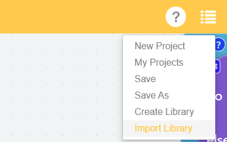

In the **Mylib** page, select the library you created and click **Import**.

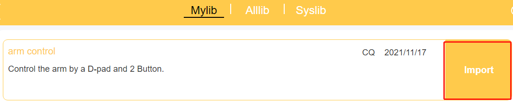

After importing, this library is in a collapsed style. You can right-click on it and click **Expand Block**, so that you can see its internal code.

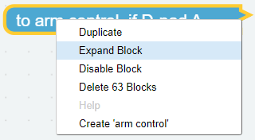

**Step 2** 

Initialize the PiArm rotation speed and **Shovel Bucket** pin.

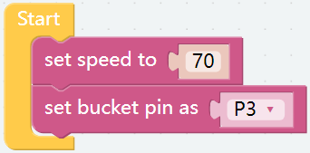

**Step 3** 

Create a new function [shovel], and write code for it as the following steps, so that you can control **Shovel Bucket** by button.

* Add one more button C from **Remote Control** page.
* Create a variable named [angle].
* Use the [if else] block as a judgment condition. If button C is pressed, let the value of variable [angle] be added by 5; if button C is released, let the value of variable [angle] be subtracted by 5.
* Use the [constain () low () high ()] block to limit the value of the variable [angle] to 0-90, since the **Shovel Bucket** works from 0-90.
* Set the angle of the **Shovel Bucket** according to the variable [angle].

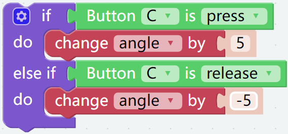

**Step 4** 

Drag the [arm control] and [shovel] functions from the **Functions** category to the [Forever] block respectively.

After you click the **Download** button, press and hold **Button C**, the Shovel Bucket slowly digs inward, and when released, slowly extends forward. At the same time, you can use the D-pad and Button A/B on the **Remote Control** page to control the movement of the Arm.

.. note::

    You can also find the code with the name of **Shovel Bucket - Remote Control** on the **Examples** page of **Ezblock Studio** and click **Run** or **Edit** directly to see the results.

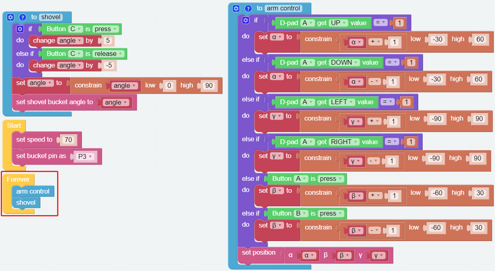

.. _clip_remote:

Hanging Clip - Remote Control
-------------------------------

Create a new project and write code for it so that we can control the :ref:`Hanging Clip` while controlling the arm.

**Step 1** 

Import [arm control] library, if you have not created this library before, please refer to: :ref:`Create a Library`.

In the **Mylib** page, select the library you created and click **Import**.

After importing, this library is in a collapsed style. You can right-click on it and click **Expand Block**, so that you can see its internal code.

**Step 2** 

Initialize the PiArm rotation speed and **Hanging Clip** pin.

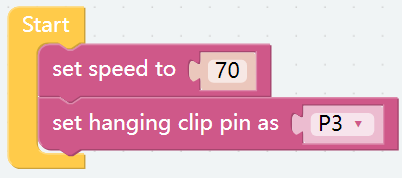

**Step 3** 

Create a new function [clip], and write code for it as the following steps, so that you can control **Hanging Clip** by button.

* Add one more button C from **Remote Control** page.
* Create a variable named [angle].
* Use the [if else] block as a judgment condition. If button C is pressed, let the value of variable [angle] be added by 5; if button C is released, let the value of variable [angle] be subtracted by 5.
* Use the [constain () low () high ()] block to limit the value of the variable [angle] to 0-90, since the **Hanging Clip** works from 0-90.
* Set the angle of the **Hanging Clip** according to the variable [angle].

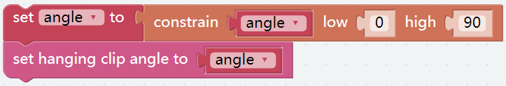

**Step 4** 

Drag the [arm control] and [clip] functions from the **Functions** category to the [Forever] block respectively.

After you click the **Download** button, press and hold button C, the hanging clip slowly closes; when you release it, it slowly opens. At the same time, you can use the D-pad and Button A/B on the **Remote Control** page to control the movement of the Arm.

.. note::

    You can also find the code with the name of **Hanging Clip - Remote Control** on the **Examples** page of **Ezblock Studio** and click **Run** or **Edit** directly to see the results.

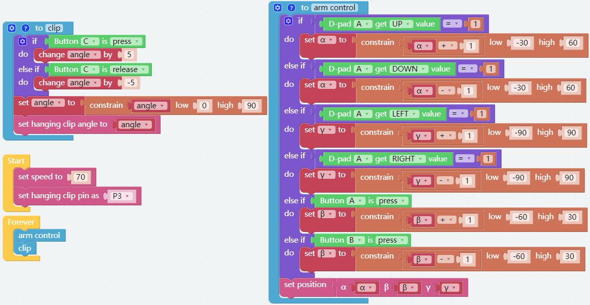

.. _electro_remote:

Electromagnet - Remote Control
--------------------------------------

Create a new project and write code for it so that we can control the :ref:`Electromagnet` while controlling the arm.

**Step 1** 

Import [arm control] library, if you have not created this library before, please refer to: :ref:`Create a Library`.

In the **Mylib** page, select the library you created and click **Import**.

After importing, this library is in a collapsed style. You can right-click on it and click **Expand Block**, so that you can see its internal code.

**Step 2** 

Initialize the PiArm rotation speed and **Electromagnet** pin.

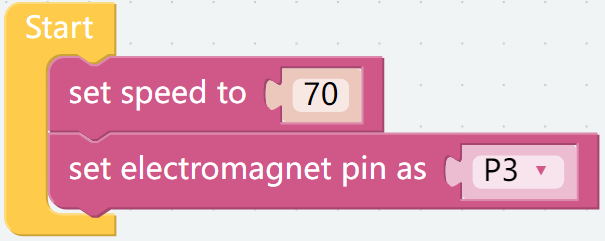

**Step 3** 

Create a new function [electromagnet], and write code for it as the following steps, so that you can control **Electromagnet** by button.

* Add one more button C from **Remote Control** page.
* Use the [if else] block as a judgment condition. If button C is pressed, turn on the electromagnet; otherwise, let the electromagnet turn off.

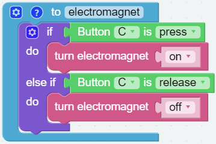

**Step 4** 

Drag the [arm control] and [electromagnet] functions from the **Functions** category to the [Forever] block respectively.

After you click the **Download** button, when Button C is pressed, Electromagnet is closed (it is magnetic at this time and can adsorb materials with iron); when Button C is released, Electromagnet is demagnetized. At the same time, you can use the D-pad and Button A/B on the **Remote Control** page to control the movement of the Arm.

.. note::

    You can also find the code with the name of **Electromagnet - Remote Control** on the **Examples** page of **Ezblock Studio** and click **Run** or **Edit** directly to see the results.

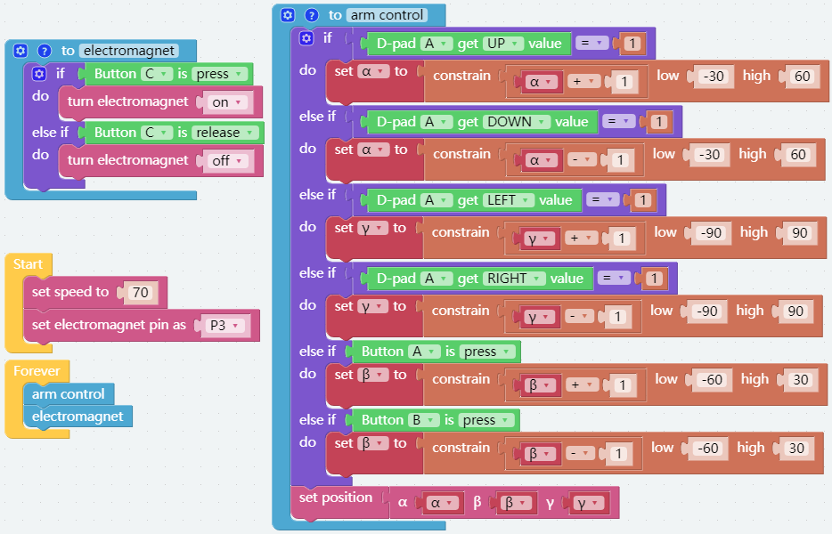

