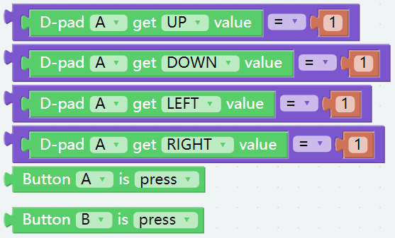

Remote Control
==================

We can use the widgets on Ezblock Studio to make PiArm move.

* `How to Use the Remote Control Function? <https://docs.sunfounder.com/projects/ezblock3/en/latest/remote.html>`_

Tips on Blocks
-------------------

To use the remote control function, you need to enter the **Remote Control** page from the left side of main page, and then drag one D-pad and 3 buttons to the central area.

.. image:: media/control3.png

Back in the programming page, you will see an additional Remote category, and the D-pad and Button block appear in it.

* [Button () get value]: This block is used to read the value of the buttons, if the button is pressed, the value is 1, otherwise it is 0.
* [Button () is (press/release)]: This block and ``Button () get value = (0/1)`` have the same effect and can be used directly to determine whether a button is pressed or not.
* [D-pad () get () value]: This block is used to read the up/down/left/right (selected through the drop-down menu) pad values, press for 1 and release for 0.

.. image:: media/control4.png
  :width: 500

Arm - Remote Control
---------------------------------------

**Step 1** 

Put the block [set speed to 70] into [Start] to initialize the speed of the robot arm to 70.

.. image:: media/remote01.png

**Step 2** 

Create a function [arm control] and start matching code blocks.

* [D-pad A get UP value = 1] indicates to click the ▲ of the ezblock D-pad control.

* [D-pad A get DOWN value = 1] indicates to click the ▼ of the ezblock D-pad control.

* [D-pad A get LEFT value = 1] indicates to click the ◀ of the ezblock D-pad control.

* [D-pad A get RIGHT value = 1] indicates to click the ▶ of the ezblock D-pad control.

* [Button A is press] indicates to click button A.

* [Button B is press] indicates to click button B.

**Step 3** 

Matching code block.

* [set α to constrain (α+1) low -30 high 60] indicates to reduce the angle of the servo C so that it rotates clockwise.

* [set α to constrain (α-1) low -30 high 60] indicates to increase the angle of the servo C so that it rotates counterclockwise.

* [set γ to constrain (γ+1) low -90 high 90] indicates to increase the angle of the servo B so that it rotates counterclockwise.

* [set γ to constrain (γ-1) low -90 high 90] indicates to reduce the angle of the servo B so that it rotates clockwise.

* [set β to constrain (β+1) low -60 high 30] indicates to increase the angle of the servo A so that it rotates counterclockwise.

* [set β to constrain (β-1) low -60 high 30] indicates to reduce the angle of the servo A so that it rotates clockwise.

.. note::
    The above code block needs to cooperate with [set position α=α β=β γ=γ] to make the servo angle change effective.

**Step 4** 

Use [if ... do ...] to link the sliding of the joystick with the movement of the piarm and put it into the function [arm control].

.. image:: media/remote04.png

**Step 5** 

Package the function [arm control] into a library.

To be able to use the function - **arm control** in other code later, you can create it as a library and import it when you need to use it.

Open the menu icon in the upper right corner and select **Create Library**.

.. image:: media/create_libr.png

Select the function, there is only one function here, so **arm control** is selected by default.

.. image:: media/arm_control.png

Name the library and fill in the description so that it can be better distinguished later.

Wait for the prompt to save successfully and the library will be saved in **My Library** on your personal page. You can also see it when you click **Import Library**.

.. image:: media/import.png

**Step 6** 

Put the function [arm control] into [Forever] for loop execution, and finally click the download icon to run the code.

After that you can use the D-pad and Button A/B on the **Remote Control** page to control the movement of the Arm.

* Click ▲ and ▼ of D-pad, the Arm will turn to the left or right.
  
* Click ◀ and ▶ of D-pad, the arm will reach forward or retract.

* Click Button A, the arm will go up.

* Click Button B, the arm will drop down.

.. note::
    For an introduction to ``α``, ``β`` and ``γ``, please refer to :ref:`Tips on PiArm Angles`.

.. image:: media/remote_control5.png
    :width: 800

Shovel Bucket - Remote Control
-----------------------------------

**Step 1** 

Create a new project and initialize the piarm speed and Shovel Bucket pin in the [Start] block.

.. image:: media/remote11.png

**Step 2** 

Import library function [arm control].

.. image:: media/remote12ii.png

**Step 3** 

Create a sub function [shovel], and then execute the functions [arm control] and [shovel] in [Forever] block.

**Step 4** 

Create additional button c in ezblock remote control to control Shovel Bucket.

**Step 5** 

Create the variable angle in the sub-function [shovel] to represent the rotation angle of the Shovel Bucket servo,
and use [if ... do ...] to associate with button C.

.. image:: media/remote13.png

**Step 6** 

Use [set angle to constrain angle low 0 high 90] to limit the angle to the range of 0-90
and use [set shovel bucket angle to angle] to make the changed servo angle take effect.

Finally run the code,press and hold Button C, the Shovel Bucket slowly digs inward, and when released, slowly extends forward.

.. image:: media/remote_control6.png
    :width: 800

Play Hanging Clip
--------------------------

**Step 1** 

Create a new project and initialize the piarm speed and Shovel Bucket pin in the [Start] block.

.. image:: media/remote21.png

**Step 2** 

Import library function [arm control].

**Step 3** 

Create a sub-function [clip], and then execute the functions [arm control] and [clip] in [Forever] block.

**Step 4** 

Create an additional button c in the ezblock remote control to control Hanging Clip.

**Step 5** 

Create a variable angle in the sub-function [clip] to represent the rotation angle of the Hanging Clip servo
and use [if ... do ...] to associate with button C.

.. image:: media/remote13.png

**Step 6** 

Use [set angle to constrain angle low 0 high 90] to limit the angle to the range of 0-90 and use [set hanging clip angle to angle] to make the changed servo angle take effect.

.. image:: media/remote22.png

Finally run the code,press and hold button C, the hanging clip slowly closes; when you release it, it slowly opens.

.. image:: media/remote_control7.png
    :width: 800

Play Electromagnet
------------------------

**Step 1** 

Create a new project, initialize the piarm speed and Electromagnet pins in the [Start] block.

.. image:: media/remote31.png

**Step 2** 

Import library function [arm control].

**Step 3** 

Create a sub-function [Electromagnet], and then execute the functions [arm control] and [Electromagnet] in [Forever] block.

**Step 4** 

Create an additional button c in the ezblock remote control.

**Step 5** 

Use [if ... do ...] in the [Electromagnet] function to connect the electromagnet energization switch with button C.

.. image:: media/remote32.png

Finally run the code,when Button C is pressed, Electromagnet is closed (it is magnetic at this time and can adsorb materials with iron); when Button C is released, Electromagnet is demagnetized.

.. image:: media/remote_control8.png
    :width: 800

