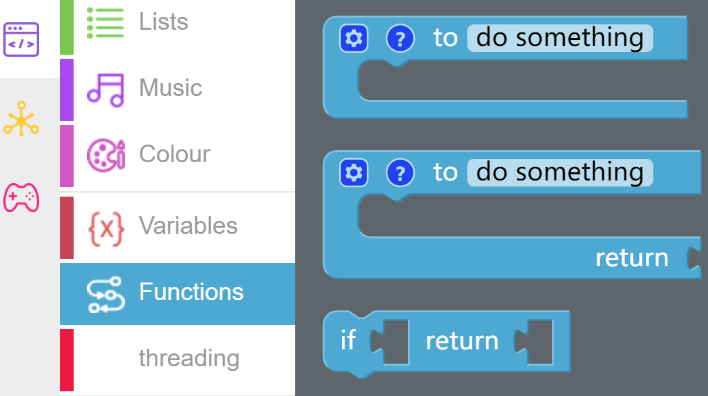
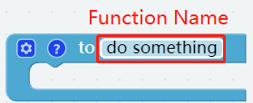
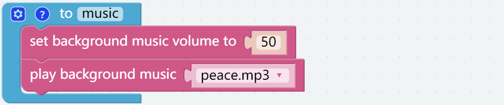
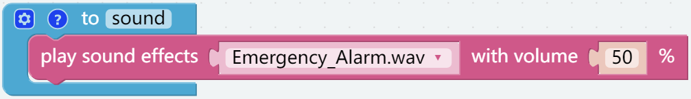
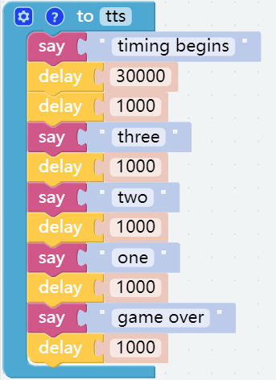
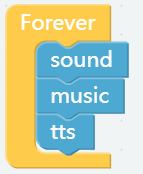
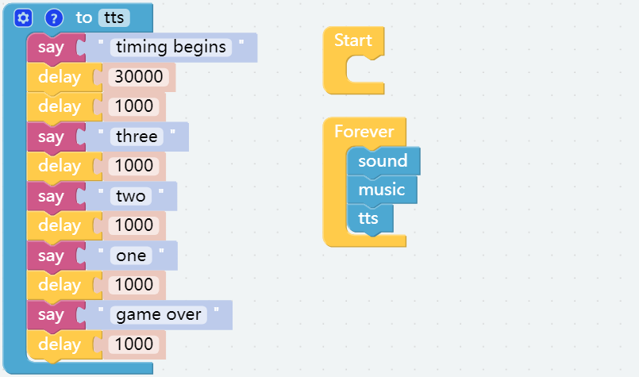

Sound Effects
================

There is a built-in speaker in Robot HAT that can be used to play some music and sound effects, as well as to implement TTS functions.

Tips on Blocks
-------------------

* This block is a separate thread and can play some built-in background music.

* This block can play some built-in sound effects.

* You can write some text in this block and let PiArm speak them.

Programming
--------------------------

**Step 1**

You may want to simplify the program with **Functions**, especially when you perform the same operation multiple times. Putting these operations into a newly declared function can greatly facilitate your use.

Click on the **Functions** category and select the appropriate function block, the function you created will also appear here.

The **Function** block without output is used here.

**Step 2**

Create a function named [music], after creating it you will see it in the **Functions** category.

Now let the [music] function implement playing background music at 50% volume.

* [set background music volume to ()]: Used to set the volume of the background music, in the range of 0%-100%.
* [play background music ()]: This block is a separate thread and can play some built-in background music.

**Step 3**

Create a function called [sound] to make PiArm play a specific sound effect at a certain volume.

* [play sound effects () with volume to () %]: This block can be used to play built-in sound effects with a volume range of 0%-100%.

**Step 4**

Similarly create a function called [tts] that will be used to make PiArm say something.

* [say ()]: This block converts the text you type into speech for PiArm to speak.

**Step 5**

From the **Functions** category, drag out these 3 functions into the [Forever] block to have them executed in order.

**Step 6**

Once the code is written, click the **Download** button in the bottom right corner to download it to the PiArm.

Now you will find that piarm first plays the sound effect in the sound function, and then plays the background music in the [music] function. When the background music is played, the [tts] function is run for timing, and the countdown voice broadcast will be performed after 30 seconds.

.. note::

    You can also find the code with the same name on the **Examples** page of **Ezblock Studio** and click **Run** or **Edit** directly to see the results.

