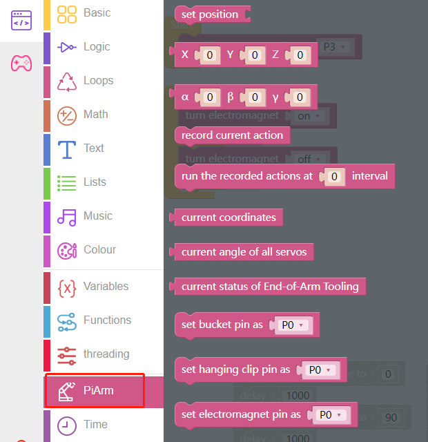
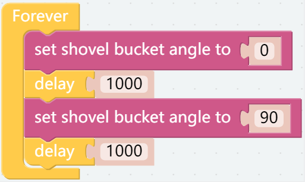
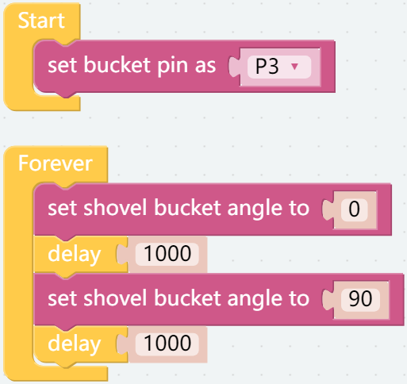
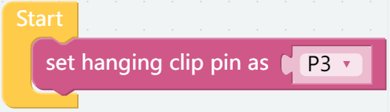
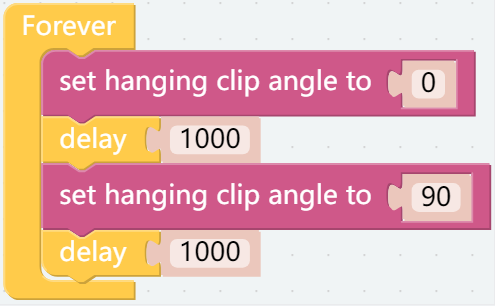
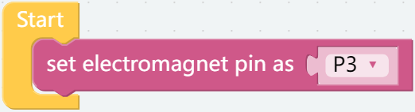
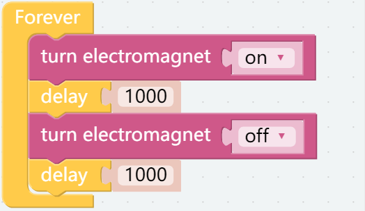
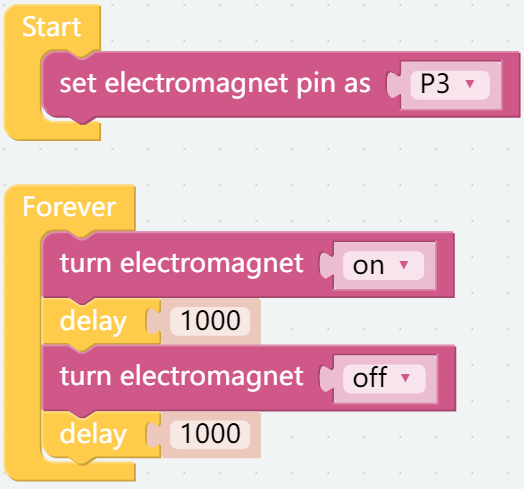

Assemble and Test 3 EoATs
================================

This is the first program and the one you must see.

In this project, you will learn how to assemble and use PiArm's 3 End of Arm Tooling (EoAT, replaced by this abbreviation later.).

Before programming, you need to learn the basic usage of Ezblock Studio from here.

* `Quick User Guide for Ezblock 3 <https://docs.sunfounder.com/projects/ezblock3/en/latest/quick_user_guide_for_ezblock3.html>`_

* `How to Create a New Project? <https://docs.sunfounder.com/projects/ezblock3/en/latest/create_new.html>`_

Tips on basic blocks
----------------------------

* This is the basic structure of the program, the [Start] block is used to do some initialization (even if no block is placed, it cannot be deleted) and the [Forever] block is, as the name suggests, a continuous loop that allows your program to change and respond.

.. image:: media/move8.png

* This block is used to set an interval time in milliseconds.

.. image:: media/delay.png

Tips on PiArm blocks
----------------------

Here you can find some blocks needed to make PiArm work.

Shovel Bucket
--------------------------

**Step 1**

Assemble the **Shovel Bucket** to the end of **PiArm**.

.. image:: media/bucket.png

The rotation range of shovel is as follows.

.. image:: media/bucket2.png

**Step 2**

Now start writing the code to make Shovel Bucket work.

Put [set bucket pin as ()] in the [Start] block to initialize the bucket pin as P3.

.. note::
    Because in the assembly diagram above, it is connected to the Transfer Module, which is already connected to P3 during the PiArm assembly. Of course you can also connect it to other spare pins.

**Step 3**

Toggles the angle of the Shovel Bucket between 0° and 90° with an interval of 1s.

* [set shovel bucket angle to ()]: Used to set the angle of Shovel Bucket, the range is 0-90.
* [delay ()]: From the **Basic** category, used to set the time interval between 2 block runs, in: ms.

**Step 4**

Once the code is written, click the **Download** button in the bottom right corner to download it to the PiArm.

Now you will see the **Shovel Bucket** moving back and forth, and you can click the **Run** button to stop the code from running.

Hanging Clip
------------------------

**Step 1**

Assemble **Hanging Clip** to the end of **PiArm**.

.. image:: media/clip.png

The working direction of Hanging Clip is as follows.

.. image:: media/clip2.png

**Step 2**

Now start writing the code to make Shovel Bucket work.

Put [set hanging clip pin as ()] in the [Start] block to initialize the hanging clip pin as P3.

.. note::
    Because in the assembly diagram above, it is connected to the Transfer Module, which is already connected to P3 during the PiArm assembly. Of course you can also connect it to other spare pins.

**Step 3**

Toggles the angle of the **Hanging Clip** between 0° and 90° with an interval of 1s.

* [set hanging clip angle to ()]: Used to set the angle of **Hanging Clip**, the range is 0-90.
* [delay ()]: From the **Basic** category, used to set the time interval between 2 block runs, in: ms.

**Step 4**

Once the code is written, click the **Download** button in the bottom right corner to download it to the PiArm.

Now you will see the **Hanging Clip** repeatedly open/close, and you can click the **Run** button to stop the code from running.

.. image:: media/clip3.png

Electromagnet
-------------------------

**Step 1**

Assemble **Electromagnet** to the end of **PiArm**.

.. image:: media/electromagnet.png

**Step 2**

Now start writing the code to make Shovel Bucket work.

Put [set electromagnet pin as ()] in the [Start] block to initialize the electromagnet pin as P3.

.. note::
    Because in the assembly diagram above, it is connected to the Transfer Module, which is already connected to P3 during the PiArm assembly. Of course you can also connect it to other spare pins.

**Step 3**

Let the electromagnet be repeatedly energized and de-energized at 1 second intervals.

* [turn electromagnet (on/off)]: Used to energize (on) or de-energize (off) the Electromagnet.
* [delay ()]: From the **Basic** category, used to set the time interval between 2 block runs, in: ms.

**Step 4**

Once the code is written, click the **Download** button in the bottom right corner to download it to the PiArm.

Now you will find that the **Electromagnet** is energized every second (the LED (D2) on the electromagnet lights up, indicating that it is energized, at which time it can be used to adsorb some materials with iron.).

