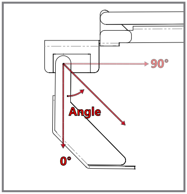
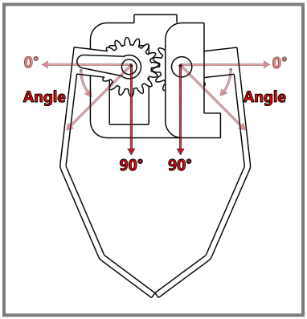
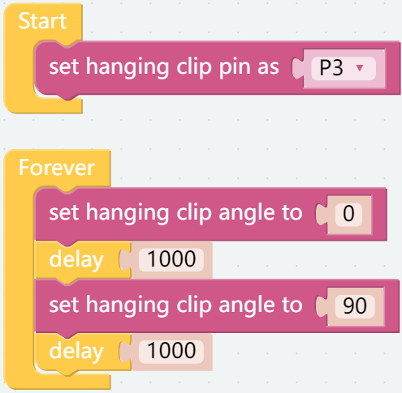

Assemble and Test 3 EoATs
================================

This is the first program and the one you must see.

In this project, you will learn how to assemble and use PiArm's 3 End of Arm Tooling (EoAT, replaced by this abbreviation later.).

Before programming, you need to learn the basic usage of Ezblock Studio from here.

* `Quick User Guide for Ezblock 3 <https://docs.sunfounder.com/projects/ezblock3/en/latest/quick_user_guide_for_ezblock3.html>`_

* `How to Create a New Project? <https://docs.sunfounder.com/projects/ezblock3/en/latest/create_new.html>`_

Tips on basic blocks
----------------------------

This is the basic structure of the program, the [Start] block is used to do some initialization (even if no block is placed, it cannot be deleted) and the [Forever] block is, as the name suggests, a continuous loop that allows your program to change and respond.

This block is used to set an interval time in milliseconds.

Tips on PiArm blocks
----------------------

Here you can find some code blocks needed to make piarm work.

.. image:: media/piarm_block.png

Shovel Bucket
--------------------------

Assemble the Shovel Bucket according to the figure below.

.. image:: media/bucket.png

The rotation range of shovel is as follows.

**Step 1** 

Put [set bucket pin as P3] in the [Start] block to initialize the bucket pin as P3.

.. image:: media/bucket31.png

**Step 2** 

Put [set shovel bucket angle to 0],[delay1000] in the [Forever] block,
[set shovel bucket angle to 90] makes the bucket swing back and forth in the angle range of 0-90 at intervals of one second.

.. image:: media/bucket32.png

**Step 3** 

After setting up the complete code, click the download icon in the lower right corner to see that shovel start to work.

.. image:: media/bucket3.png

Hanging Clip
------------------------

Assemble Hanging Clip according to the picture below.

.. image:: media/clip.png

The working direction of Hanging Clip is as follows.

**Step 1** 

Put [set hanging clip pin as P3] in the [Start] block to initialize the pin of the hanging clip to P3.

.. image:: media/clip31.png

**Step 2** 

Put [set hanging clip angle to 0],[delay1000] in the [Forever] block,
[set hanging clip angle to 90] makes the hanging clip swing back and forth in the angle range of 0-90 at intervals of one second

.. image:: media/clip32.png

**Step 3** 

After setting up the complete code, click the download icon in the lower right corner to see that the hanging clip start to work.

Electromagnet
-------------------------

Assemble Electromagnet according to the figure below.

.. image:: media/electromagnet.png

**Step 1** 

Put [set electromagnet pin as P3] in the [Start] block to initialize the pin of the hanging clip to P3.

.. image:: media/electromagnet21.png

**Step 2** 

Put [turn electromagnet on], [delay1000] in the [Forever] block
[turn electromagnet off] makes the electromagnet energized and de-energized at intervals of one second

.. image:: media/electromagnet22.png

**Step 3** 

After setting up the complete code, click the download icon in the bottom right corner, you will find that the electromagnet is energized every second (the LED (D2) on the electromagnet lights up, indicating that it is energized, at which time it can be used to adsorb some materials with iron.).

.. image:: media/electromagnet2.png
